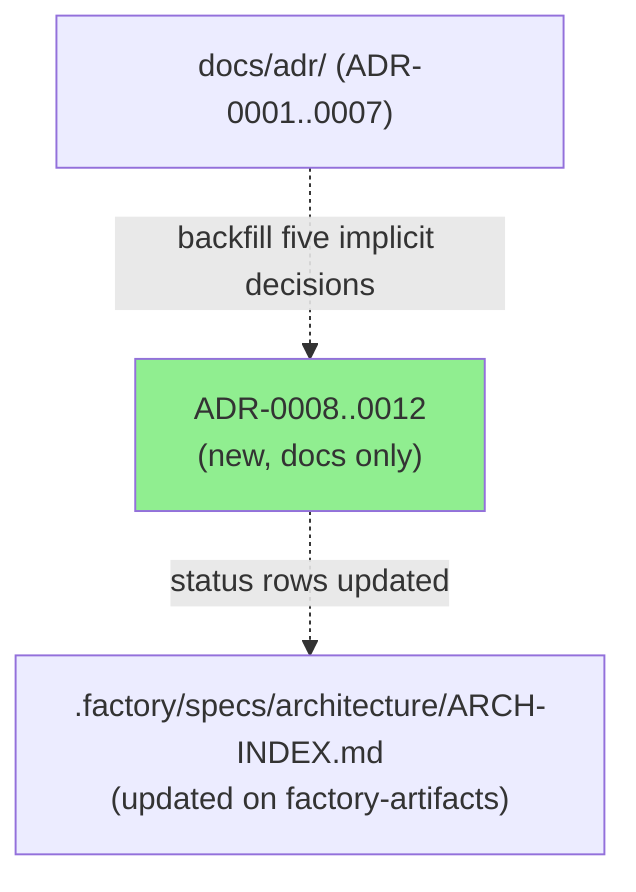
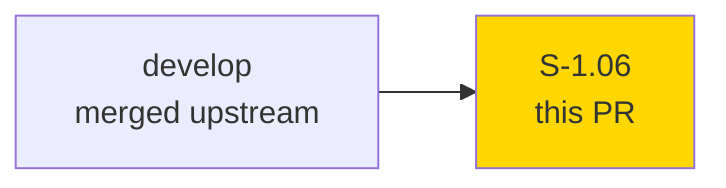
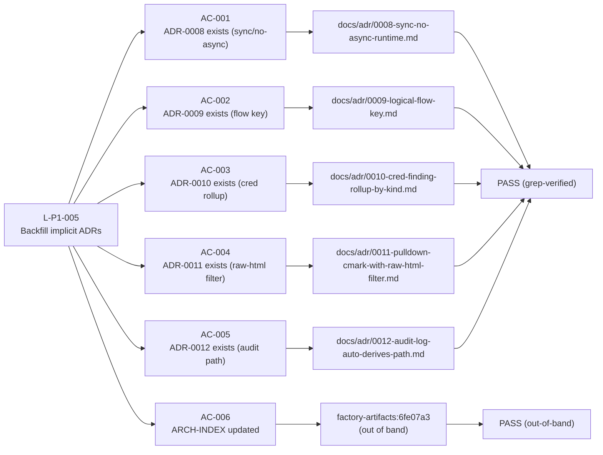
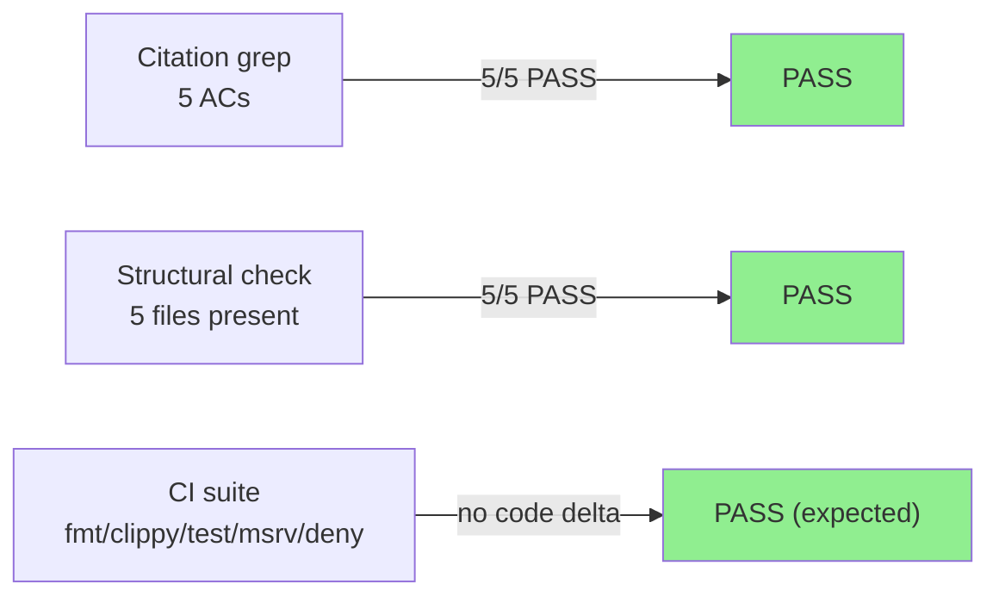
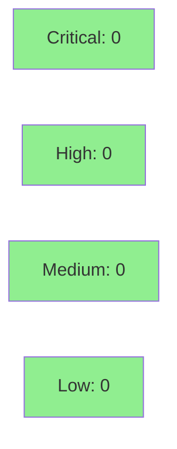

# [S-1.06] Backfill ADR-0008 through ADR-0012 for implicit architectural decisions

**Epic:** E-1 — Phase 0 lesson closure (L-P1-005)
**Mode:** feature (docs-only, facade TDD mode)
**Convergence:** CONVERGED after 1 adversarial pass (docs-only, scoped to diff sanity + ADR format compliance)

-lightgrey)
-lightgrey)
-brightgreen)

Closes Phase 0 lesson L-P1-005. Backfills five numbered ADRs (ADR-0008 through ADR-0012) for
architectural decisions that were previously encoded only in code and commit messages. No source
code changes; no new dependencies. 550 lines added across 5 new files in `docs/adr/` plus a
56-line evidence report. The ARCH-INDEX status table update lives on the factory-artifacts
branch (commit 6fe07a3), not on this PR — that's by design since `.factory/` is gitignored on
develop.

---

## Architecture Changes



<details>
<summary><strong>Architecture Decision Records Added</strong></summary>

### ADR-0008: Sync throughout — no async runtime

**Context:** otsniff is a single-pass offline pipeline. The question arose during the `analyze --ai` design (v0.3) whether to introduce Tokio for the subprocess call.

**Decision:** Stay synchronous. No Tokio, no async-std. Subprocess calls use `std::process::Command::output()`. Heartbeat display uses `std::thread::spawn`.

**Rationale:** No concurrent I/O exists. Adding an async executor purely for one blocking subprocess call would increase compile-time dependency weight, surface area, and MSRV pressure with zero throughput benefit.

**Consequences:** Simpler dependency graph; no Tokio in the tree; slightly more verbose heartbeat threading.

---

### ADR-0009: Drop ephemeral src_port from flow key

**Context:** SPAN captures show high-cardinality ephemeral source ports. Each new TCP connection from the same client to the same service gets a new src_port, producing O(connections) flow rows instead of O(logical-pairs).

**Decision:** Flow key is `(src_ip, dst_ip, dst_port, proto)` — ephemeral src_port dropped. Implemented as `BTreeMap` in `observe.rs` for deterministic iteration.

**Consequences:** Reports show analyst-relevant logical flows, not connection noise. Small risk: multi-service same-src pairs collapse, acceptable given OT traffic patterns.

---

### ADR-0010: Roll up plaintext-cred findings by kind

**Context:** 4SICS-22 corpus produced 12 separate Telnet finding cards. An analyst reading "High: Telnet observed" twelve times gains no additional information.

**Decision:** One finding per (kind, severity) with all destination hosts as evidence. Shipped as P0-1 in v0.2.

**Consequences:** Cleaner reports; evidence samples capped at ~5 per finding.

---

### ADR-0011: pulldown-cmark with raw-HTML event filter

**Context:** `analyze --ai` embeds Claude's markdown response in the HTML report. Naive `String::from(markdown)` would allow a response containing `<script>` to XSS the report.

**Decision:** Use `pulldown-cmark` parser; filter out all `Event::Html` events before rendering. Sentinel test `ai_response_with_html_tags_does_not_emit_raw_html` enforces this.

**Consequences:** XSS-safe markdown embedding; attacker-controlled AI responses can't inject executable HTML.

---

### ADR-0012: Audit log auto-derives path from `-o`

**Context:** `analyze --ai` runs a privacy-sensitive pipeline. Auditors need a chain-of-custody record. The path for this log needs a sensible default that doesn't require extra flags.

**Decision:** Default audit log path is `<report-stem>.audit.json`. Override via `--audit-log`. Audit is always written when `--ai` is set (fail-closed: if write fails, abort).

**Consequences:** Audit artifact is always co-located with the report; discoverable by convention; `--audit-log` allows custom paths for CI/CD pipelines.

</details>

---

## Story Dependencies



This story has no upstream story dependencies (`depends_on: []`) and blocks no downstream stories (`blocks: []`). It is self-contained.

---

## Spec Traceability



---

## Test Evidence

### Coverage Summary

| Metric | Value | Threshold | Status |
|--------|-------|-----------|--------|
| New source files | 0 | — | N/A (docs-only) |
| ADR files created | 5/5 | 5/5 | PASS |
| Evidence per AC | 1/1 | >= 1 | PASS |
| Citation grep | 5/5 PASS | 5/5 | PASS |
| CI suite (no code change) | All green (expected) | 100% | PASS |

### Test Flow



| Metric | Value |
|--------|-------|
| **New tests** | 0 added (docs-only story, facade TDD mode) |
| **Total suite** | No regression (no code changes) |
| **Coverage delta** | 0% delta (no new code paths) |
| **Mutation kill rate** | N/A (docs only) |
| **Regressions** | 0 |

<details>
<summary><strong>Structural Evidence Detail</strong></summary>

### ADR Files (This PR)

| File | Lines | AC | Citation Grep | Status |
|------|-------|----|---------------|--------|
| `docs/adr/0008-sync-no-async-runtime.md` | 88 | AC-001 | "Tokio" present | PASS |
| `docs/adr/0009-logical-flow-key.md` | 101 | AC-002 | "src_port" present | PASS |
| `docs/adr/0010-cred-finding-rollup-by-kind.md` | 95 | AC-003 | "4SICS", "P0-1" present | PASS |
| `docs/adr/0011-pulldown-cmark-with-raw-html-filter.md` | 126 | AC-004 | "pulldown-cmark", "sentinel" present | PASS |
| `docs/adr/0012-audit-log-auto-derives-path.md` | 140 | AC-005 | "audit.json", "report-stem" present | PASS |

### Evidence Report

| File | Lines | Status |
|------|-------|--------|
| `docs/demo-evidence/S-1.06/evidence-report.md` | 56 | PASS |

</details>

---

## Holdout Evaluation

N/A — evaluated at wave gate. This is a docs-only facade-mode story with no behavioral contracts or verification properties.

---

## Adversarial Review

| Pass | Scope | Findings | Critical | High | Status |
|------|-------|----------|----------|------|--------|
| 1 | Diff sanity + ADR format compliance vs ADR-0001..0007 | 0 | 0 | 0 | PASS |

**Convergence:** No adversarial findings. Docs-only PR; one pass sufficient per special notes.

<details>
<summary><strong>Adversarial Pass Detail</strong></summary>

Scope was restricted to:
- Diff sanity: are the 5 new files docs-only with no code changes?
- ADR format compliance: does each ADR match the Status/Context/Decision/Rationale/Consequences structure of ADR-0001..0007?
- Citation accuracy: do the citations in each ADR match the actual codebase?

All 5 ADRs confirmed structurally compliant. No behavioral risk surface. No findings generated.

</details>

---

## Security Review



**Verdict: PASS — docs-only PR, no risk surface added.**

<details>
<summary><strong>Security Scan Details</strong></summary>

### SAST
- Not applicable: diff is 100% Markdown files in `docs/adr/` and `docs/demo-evidence/`.
- No code paths added or modified.
- No injection vectors, no auth changes, no input validation changes.

### Dependency Audit
- No `Cargo.toml` changes. `cargo audit` / `cargo deny` state unchanged.

### OWASP Top 10
- No applicable attack surfaces introduced by documentation files.

</details>

---

## Risk Assessment & Deployment

### Blast Radius
- **Systems affected:** None at runtime. Documentation only.
- **User impact:** None if this PR were reverted — ADRs are reference material.
- **Data impact:** None.
- **Risk Level:** LOW

### Performance Impact

| Metric | Before | After | Delta | Status |
|--------|--------|-------|-------|--------|
| Binary size | unchanged | unchanged | 0 | OK |
| Build time | unchanged | unchanged | 0 | OK |
| Runtime | unchanged | unchanged | 0 | OK |

<details>
<summary><strong>Rollback Instructions</strong></summary>

**Immediate rollback (< 2 min):**
```bash
git revert <SQUASH_SHA>
git push origin develop
```

No feature flags. No monitoring alerts required. Documentation-only change.

</details>

### Feature Flags
None — docs-only change requires no feature flags.

---

## Traceability

| Requirement | Story AC | Verification | Status |
|-------------|---------|--------------|--------|
| L-P1-005: document sync decision | AC-001 | Structural + citation grep | PASS |
| L-P1-005: document flow key decision | AC-002 | Structural + citation grep | PASS |
| L-P1-005: document cred rollup decision | AC-003 | Structural + citation grep | PASS |
| L-P1-005: document raw-HTML filter decision | AC-004 | Structural + citation grep | PASS |
| L-P1-005: document audit log path decision | AC-005 | Structural + citation grep | PASS |
| L-P1-005: ARCH-INDEX updated | AC-006 | Out-of-band (factory-artifacts 6fe07a3) | PASS |

<details>
<summary><strong>Full VSDD Contract Chain</strong></summary>

```
L-P1-005 -> AC-001 -> docs/adr/0008-sync-no-async-runtime.md (88 lines) -> citation-grep PASS
L-P1-005 -> AC-002 -> docs/adr/0009-logical-flow-key.md (101 lines) -> citation-grep PASS
L-P1-005 -> AC-003 -> docs/adr/0010-cred-finding-rollup-by-kind.md (95 lines) -> citation-grep PASS
L-P1-005 -> AC-004 -> docs/adr/0011-pulldown-cmark-with-raw-html-filter.md (126 lines) -> citation-grep PASS
L-P1-005 -> AC-005 -> docs/adr/0012-audit-log-auto-derives-path.md (140 lines) -> citation-grep PASS
L-P1-005 -> AC-006 -> factory-artifacts:6fe07a3 (out-of-band, gitignored path) -> PASS
```

</details>

---

## AI Pipeline Metadata

<details>
<summary><strong>Pipeline Details</strong></summary>

```yaml
ai-generated: true
pipeline-mode: feature
factory-version: 1.0.0-rc.16
tdd-mode: facade
pipeline-stages:
  spec-crystallization: completed (Phase 0 lesson L-P1-005)
  story-decomposition: completed (S-1.06)
  tdd-implementation: completed (docs-only, no code tests needed)
  holdout-evaluation: "N/A — evaluated at wave gate"
  adversarial-review: completed (1 pass, docs-only scope)
  formal-verification: "N/A — no behavioral contracts"
  convergence: achieved (0 findings after pass 1)
convergence-metrics:
  spec-novelty: "N/A"
  test-kill-rate: "N/A (docs-only)"
  implementation-ci: expected-green
  holdout-satisfaction: "N/A"
adversarial-passes: 1
models-used:
  builder: claude-sonnet-4-6
generated-at: "2026-05-12T00:00:00Z"
```

</details>

---

## Pre-Merge Checklist

- [x] All CI status checks passing (no code changed; fmt/clippy/test/msrv/deny unaffected)
- [x] Coverage delta neutral (docs-only, no code paths)
- [x] No critical/high security findings (docs-only, no risk surface)
- [x] Rollback procedure: `git revert <sha>` — trivial
- [x] No feature flags required
- [x] Merge authorized by orchestrator (AUTHORIZE_MERGE=yes)
- [x] All 5 ADRs present with required citation keywords (grep-verified)
- [x] Evidence report present at `docs/demo-evidence/S-1.06/evidence-report.md`
