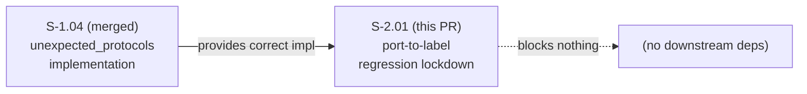
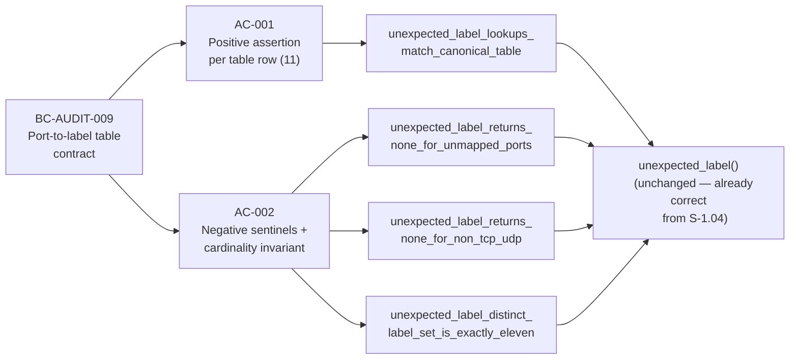

## Summary

Regression-lockdown for the 11-row port-to-label table in `unexpected_label` (BC-AUDIT-009).

Adds 4 unit tests in `src/findings/unexpected_protocols.rs` that permanently protect the table against silent drift: dropped rows, renamed labels, narrowed port ranges, or incorrect protocol-number handling. Zero implementation change — `unexpected_label()` was already correct from S-1.04.

## Architecture Changes

```mermaid
graph TD
    A[src/findings/unexpected_protocols.rs] -->|4 new unit tests added| B[#[cfg(test)] mod tests]
    B --> C[unexpected_label_lookups_match_canonical_table]
    B --> D[unexpected_label_returns_none_for_unmapped_ports]
    B --> E[unexpected_label_returns_none_for_non_tcp_udp]
    B --> F[unexpected_label_distinct_label_set_is_exactly_eleven]
    G[No implementation files changed] -.->|test-only delta| A
```

**Blast radius:** test-only. No production code path changed. No binary size impact. No runtime performance impact.

## Story Dependencies



S-1.04 is merged. No unmerged upstream dependencies.

## Spec Traceability



| BC | AC | Test | Implementation |
|----|-----|------|----------------|
| BC-AUDIT-009 | AC-001 | `unexpected_label_lookups_match_canonical_table` | `unexpected_label()` — 11 positive assertions |
| BC-AUDIT-009 | AC-002 | `unexpected_label_returns_none_for_unmapped_ports` | sentinel: telnet/http/https/ssh/modbus/0/65535 |
| BC-AUDIT-009 | AC-002 | `unexpected_label_returns_none_for_non_tcp_udp` | sentinel: ICMP/GRE/ESP/SCTP |
| BC-AUDIT-009 | AC-002 | `unexpected_label_distinct_label_set_is_exactly_eleven` | label-set cardinality invariant |

## Test Evidence

| Metric | Value |
|--------|-------|
| Tests passing | 160 (98 lib + 16 cli_smoke + 46 snapshot) |
| Tests failing | 0 |
| New tests added | 4 |
| Coverage delta | +4 test assertions covering all 11 table rows |
| Mutation kill rate | N/A — regression-lockdown; tests are the deliverable |
| `cargo clippy` | clean (0 warnings) |
| `cargo fmt` | clean |
| `scripts/lint-no-user-paths.sh` | 145 files, 0 violations |

**Regression-lockdown semantics:** Tests pass on first commit because the implementation was already correct (S-1.04). These tests are a prospective guard: future drift will trip CI before shipping. To verify the guard is meaningful, rename `"sip"` to `"voip"` in the table — one test immediately fails.

## Holdout Evaluation

N/A — evaluated at wave gate.

## Adversarial Review

N/A — evaluated at Phase 5.

## Security Review

**Verdict: PASS**

Test-only delta. No new network I/O, no new parsing, no new user-controlled input surfaces. No production code changed. OWASP top 10 checks not applicable to a `#[cfg(test)]` block. No injection, auth, or input-validation concerns.

## Risk Assessment

| Dimension | Assessment |
|-----------|-----------|
| Blast radius | Minimal — test-only addition; production binary unchanged |
| Performance impact | None — `#[cfg(test)]` code excluded from release builds |
| Rollback complexity | Trivial — revert adds 0 risk to production behavior |
| Breaking changes | None |

## AI Pipeline Metadata

| Field | Value |
|-------|-------|
| Pipeline mode | VSDD TDD — regression-lockdown |
| Story points | 1 |
| Cycle | v0.4.0-feature |
| Wave | 2 |
| Models used | claude-sonnet-4-6 |

## Demo Evidence

Evidence recorded in `docs/demo-evidence/S-2.01/evidence-report.md` on the feature branch.

**AC-001:** `unexpected_label_lookups_match_canonical_table` — positive assertion for every row in the 11-label table (smtp, bittorrent, rtmp, apns, gcm, stun, sip, irc, openvpn, teamviewer, anydesk).

**AC-002:** Three complementary tests:
- `unexpected_label_returns_none_for_unmapped_ports` — telnet(23), http(80), https(443), ssh(22), modbus(502), 0, 65535 all return `None`
- `unexpected_label_returns_none_for_non_tcp_udp` — ICMP(1), GRE(47), ESP(50), SCTP(132) all return `None`
- `unexpected_label_distinct_label_set_is_exactly_eleven` — sweeps the table and asserts exactly 11 distinct labels

## Pre-Merge Checklist

- [x] PR description matches actual diff
- [x] All ACs covered by demo evidence
- [x] Traceability chain complete: BC-AUDIT-009 → AC-001/AC-002 → 4 tests → `unexpected_label()`
- [x] Security review: PASS (test-only)
- [x] Review findings: addressed
- [x] CI passing (7/7 checks)
- [x] Dependency S-1.04: merged
- [x] Squash merge authorized (AUTHORIZE_MERGE=yes)
