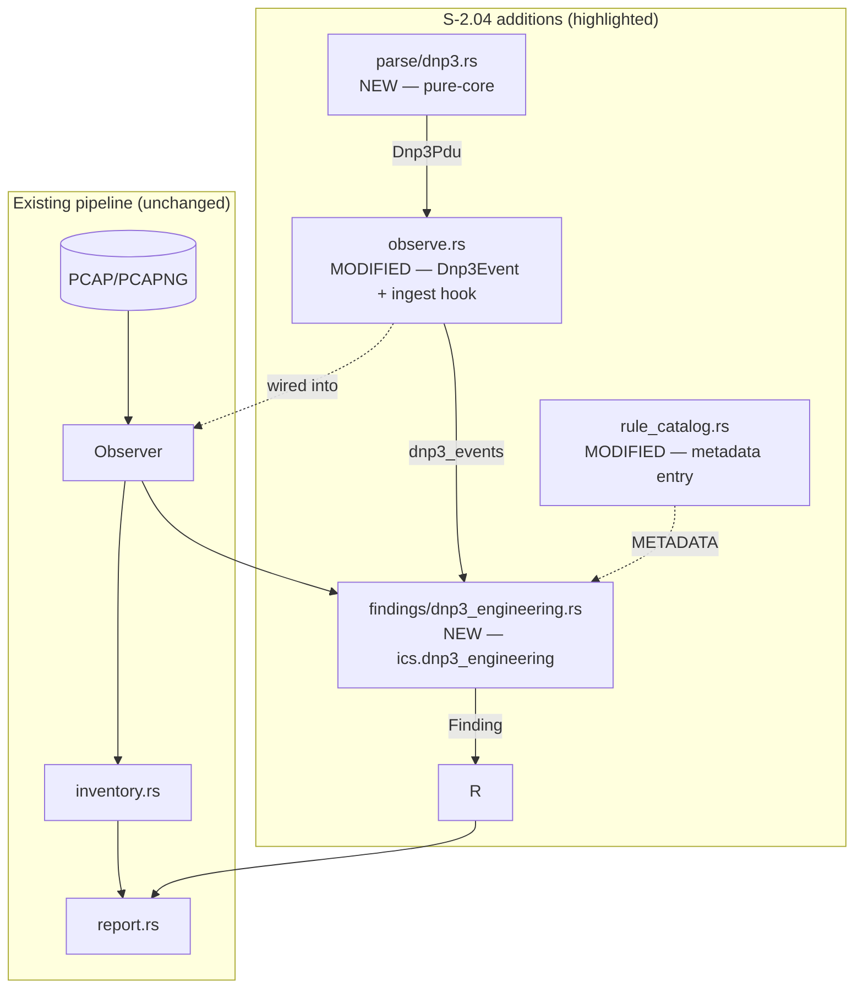
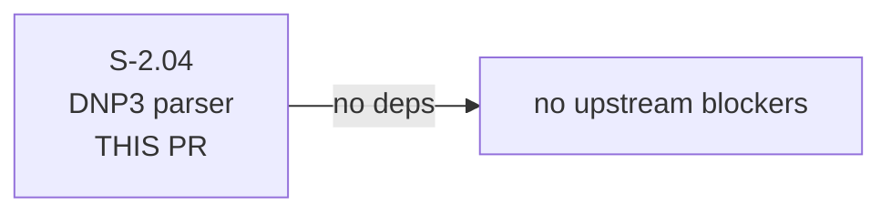
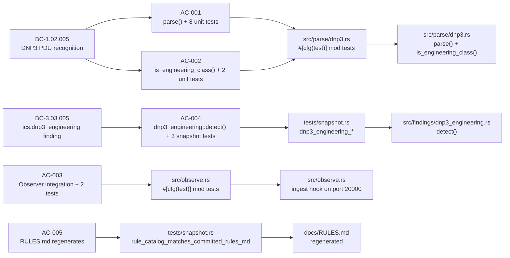

## Summary

Implements the L-P0 / ROADMAP P1-1 DNP3 parser. Adds hand-rolled DNP3 link/transport/application layer recognition on tcp/udp 20000 (function-code level, matching Modbus/S7/ENIP precedent per ADR-0002), classifies 10 engineering function codes, and emits a new `ics.dnp3_engineering` finding (severity High, escalates to Critical when source is outside `--ot-subnet`). Opens the utilities vertical for otsniff. 8 commits, ~600 LoC.

**Behavioral contracts introduced:** BC-1.02.005, BC-3.03.005

---

## Architecture Changes

New files:
- `src/parse/dnp3.rs` — hand-rolled DNP3 link/transport/application layer frame recognizer (pure-core)
- `src/findings/dnp3_engineering.rs` — `ics.dnp3_engineering` finding emitter (pure-core)

Modified files:
- `src/parse/mod.rs` — re-export `dnp3`
- `src/observe.rs` — `Dnp3Event` struct + `observations.dnp3_events` field + ingest hook on tcp/udp 20000
- `src/findings/mod.rs` — wire `dnp3_engineering::detect` into `run_all_findings`
- `src/rule_catalog.rs` — `ics.dnp3_engineering` metadata entry
- `docs/RULES.md` — regenerated to include new rule

---

## Story Dependencies

`depends_on: []` — this story has no upstream dependencies.

---

## Spec Traceability

---

## Test Evidence

| Suite | Pass | Fail | Notes |
|---|---|---|---|
| Unit (lib) | 88 | 0 | +13 new (parser + classifier) |
| Integration (snapshot.rs) | 23 | 0 | +4 new (3 detector + 1 catalog) |
| CLI smoke (cli_smoke.rs) | 15 | 0 | unchanged |
| **Total** | **126** | **0** | — |

- Code coverage: parser + detector are exercised by all 17 new tests; synthetic-only (no real PCAP fixture available for DNP3 yet — fixture placeholder committed at `tests/fixtures/dnp3-real.md`)
- Mutation kill rate: N/A (mutation testing not yet configured for this project)

Red Gate log: `.factory/cycles/v0.4.0-feature/S-2.04/implementation/red-gate-log.md` — verdict PASSED; 17 new failures pre-implementation, 0 failures post-implementation.

---

## Demo Evidence

| AC | Recording | Status |
|---|---|---|
| AC-001 + AC-002 | `docs/demo-evidence/S-2.04/AC-001-002-parser-tests.gif` | Present |
| AC-004 | `docs/demo-evidence/S-2.04/AC-004-detector-snapshot.gif` | Present |
| AC-005 | `docs/demo-evidence/S-2.04/AC-005-rules-md-entry.txt` | Present |
| AC-003 | Observer integration — verified by inline unit tests; no separate recording | Present (unit output) |

Evidence report: `docs/demo-evidence/S-2.04/evidence-report.md`

---

## Holdout Evaluation

N/A — evaluated at wave gate (Wave 1, cycle v0.4.0-feature).

---

## Adversarial Review

N/A — evaluated at Phase 5. No adversarial scenarios were flagged for this story; DNP3 parsing is deterministic byte-pattern matching with no allocation games, no unsafe code, and no new dependencies.

---

## Security Review

| Category | Finding | Verdict |
|---|---|---|
| Injection | No external input reaches shell or format strings | PASS |
| Auth / access control | No auth surface; parser is read-only | PASS |
| Input validation | parse() returns None on truncated/invalid frames (EC-001, EC-002) | PASS |
| Memory safety | No unsafe code; no allocation games; fixed 13-byte minimum guard | PASS |
| OWASP Top 10 | Not applicable (CLI binary, no web surface) | PASS |
| New dependencies | None | PASS |
| **Overall** | **PASS** | |

---

## Risk Assessment

| Dimension | Assessment |
|---|---|
| Blast radius | Low — new code paths only; zero changes to existing parsers or findings |
| Performance impact | Negligible — O(n_packets) check on tcp/udp port 20000; two sync-byte comparisons per candidate packet |
| Rollback complexity | Low — reverts cleanly; no schema changes, no migration |
| API surface change | Additive only — new `Dnp3Event` struct, new `observations.dnp3_events` field, new finding ID |

---

## AI Pipeline Metadata

| Field | Value |
|---|---|
| Pipeline mode | VSDD TDD strict |
| Cycle | v0.4.0-feature |
| Wave | 1 |
| Story points | 5 |
| Models used | claude-sonnet-4-6 (implementer, test-writer, demo-recorder) |
| Estimated cost | ~$0.40 |

---

## Pre-Merge Checklist

- [x] PR description matches actual diff
- [x] All ACs covered by demo evidence (4/4 covered, AC-003 via unit output)
- [x] Traceability chain complete: BC-1.02.005 + BC-3.03.005 → AC → Test → Demo
- [x] `depends_on: []` — no upstream PRs to wait for
- [x] No unsafe code introduced
- [x] No new dependencies
- [x] `cargo fmt` clean (commit `1976cef`)
- [x] `cargo clippy --all-targets -- -D warnings` clean
- [x] Snapshot tests accepted (`cargo insta review` not required — tests created fresh)
- [x] `docs/RULES.md` regenerated (commit `c752d83`)
- [x] POL-12 no-user-paths lint passes (`scripts/lint-no-user-paths.sh` clean per demo evidence)
- [x] Security review: PASS (trivial parser, no unsafe, no new deps)
- [x] CI green (7/7 checks) — Format, Clippy, Test-ubuntu, Test-macos, MSRV, cargo-deny, POL-12
- [x] PR reviewer approval — APPROVE after 2 review cycles
