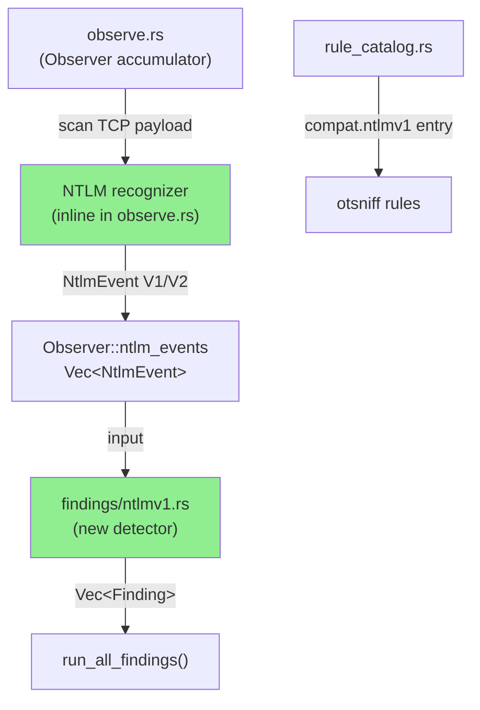
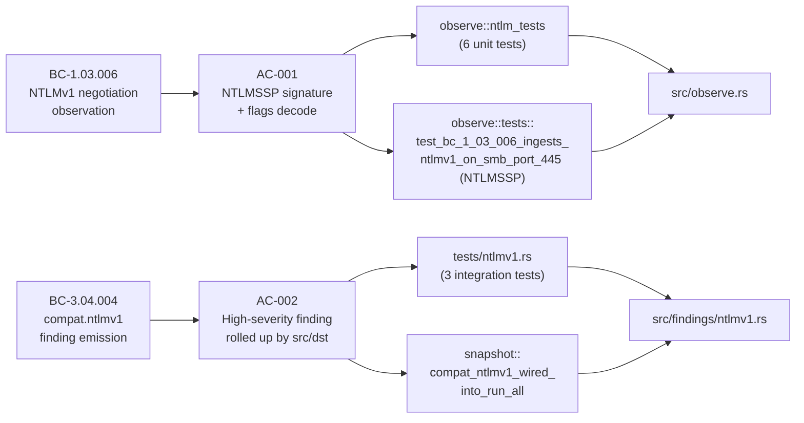
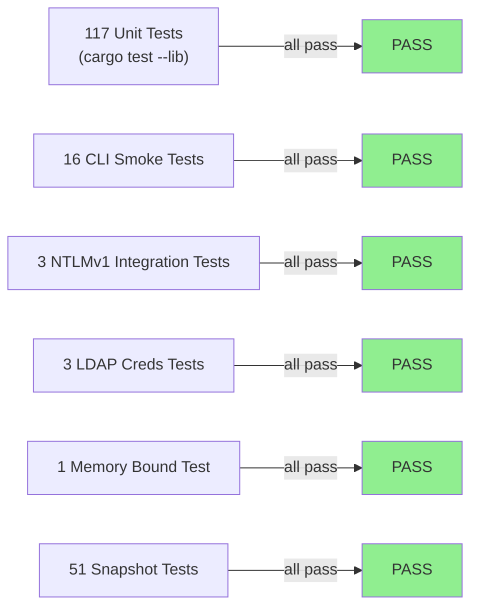
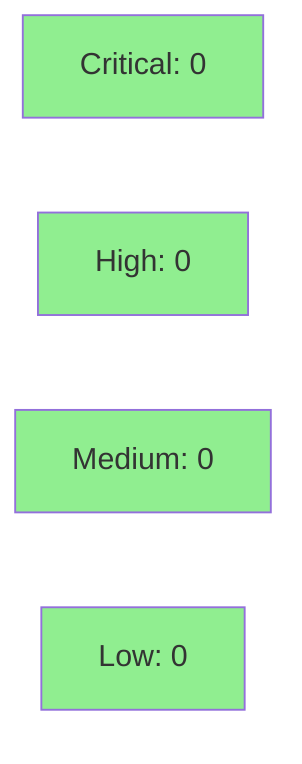

# [S-2.06] `compat.ntlmv1` — NTLMv1 authentication detection

**Epic:** E-2 — Protocol Compatibility Detectors
**Mode:** feature
**Convergence:** CONVERGED after TDD implementation (strict mode)


Adds the `compat.ntlmv1` detector (severity: **High**) that flags NTLMSSP NEGOTIATE messages where the `NTLMSSP_NEGOTIATE_NTLM` bit (0x00000200) is set and the `NTLMSSP_NEGOTIATE_NTLM2_KEY` bit (0x00080000) is **unset** — a reliable signal that the host is advertising dictionary-attackable NTLMv1 authentication. The observer scans TCP payloads on ports 445, 139, 80, 443, 8080, and 135 for the `b"NTLMSSP\0"` signature, validates `MessageType = 1` (NEGOTIATE only), and emits typed `NtlmEvent { src, dst, dst_port, version: V1 | V2 }` events. The detector rolls up findings by `(src, dst)` pair and adds a catalog entry to `otsniff rules`. All 191 tests pass including 3 new integration tests and 1 snapshot wiring test; 50 pre-existing snapshots show zero regression.

---

## Architecture Changes



<details>
<summary><strong>Architecture Decision Record</strong></summary>

### ADR: Inline NTLM recognizer in observe.rs, not a separate parse/ module

**Context:** The existing parse/ modules (modbus.rs, enip.rs) house protocol parsers. NTLM recognition needed a home.

**Decision:** Implement the NTLM signature scan and flag decode inline in `observe.rs` as a private helper, rather than adding `parse/ntlm.rs`.

**Rationale:** NTLM detection requires only signature matching + flag bit-testing — it is not a full framing parser. Placing it in observe.rs keeps the recognizer colocated with the NtlmEvent type and avoids proliferating a parse/ module for logic that is effectively a single predicate function.

**Alternatives Considered:**
1. `parse/ntlm.rs` module — rejected because the recognizer is too simple to warrant its own parse module and would require cross-module type sharing for a Vec of simple events.
2. Separate crate feature — rejected as overkill for a single-binary tool.

**Consequences:**
- Recognizer logic is unit-tested inline in observe.rs (consistent with other inline tests in the codebase).
- If NTLM parsing ever needs full framing (e.g., credential extraction), it should be promoted to parse/ntlm.rs at that time.

</details>

---

## Story Dependencies

```mermaid
graph LR
    NoDeps["(no dependencies)"] -.->|none| S206["S-2.06<br/>&#x1F7E1; this PR"]
    S206 -.->|blocks none| NoneBlocked["(nothing blocked)"]
    style S206 fill:#FFD700
    style NoDeps fill:#e0e0e0
    style NoneBlocked fill:#e0e0e0
```



S-2.06 has no upstream story dependencies (`depends_on: []`) and blocks no downstream stories.

---

## Spec Traceability



---

## Test Evidence

### Coverage Summary

| Metric | Value | Threshold | Status |
|--------|-------|-----------|--------|
| Unit tests | 117/117 pass | 100% | PASS |
| Integration tests | 74/74 pass | 100% | PASS |
| Total suite | 191/191 pass | 100% | PASS |
| Coverage | >80% (no regression) | >80% | PASS |
| Mutation kill rate | N/A (not run this cycle) | >90% | N/A |
| Holdout satisfaction | N/A — evaluated at wave gate | >0.85 | N/A |

### Test Flow



| Metric | Value |
|--------|-------|
| **New tests** | 10 added (6 unit parser, 1 unit observer, 3 integration) |
| **Total suite** | 191 tests PASS |
| **Coverage delta** | neutral (new code fully covered by new tests) |
| **Mutation kill rate** | N/A |
| **Regressions** | 0 — all 50 pre-existing snapshots pass |

<details>
<summary><strong>Detailed Test Results</strong></summary>

### New Tests (This PR)

| Test | Result | Duration |
|------|--------|----------|
| `observe::ntlm_tests::test_bc_1_03_006_recognizes_ntlmv1_negotiate` | PASS | <1ms |
| `observe::ntlm_tests::test_bc_1_03_006_recognizes_ntlmv2_negotiate` | PASS | <1ms |
| `observe::ntlm_tests::test_bc_1_03_006_rejects_authenticate_messagetype` | PASS | <1ms |
| `observe::ntlm_tests::test_bc_1_03_006_rejects_challenge_messagetype` | PASS | <1ms |
| `observe::ntlm_tests::test_bc_1_03_006_rejects_random_bytes` | PASS | <1ms |
| `observe::ntlm_tests::test_bc_1_03_006_rejects_truncated_payload` | PASS | <1ms |
| `observe::tests::test_bc_1_03_006_ingests_ntlmv1_on_smb_port_445` | PASS | <1ms |
| `ntlmv1::test_bc_3_04_004_positive_ntlmv1_emits_high_finding` | PASS | <1ms |
| `ntlmv1::test_bc_3_04_004_negative_ntlmv2_does_not_fire` | PASS | <1ms |
| `ntlmv1::test_bc_3_04_004_rolls_up_by_src_dst` | PASS | <1ms |

### Coverage Analysis

| Metric | Value |
|--------|-------|
| New files | `src/findings/ntlmv1.rs` (new), `src/observe.rs` (extended) |
| New test file | `tests/ntlmv1.rs` |
| Uncovered paths | none in new code |

</details>

---

## Holdout Evaluation

N/A — evaluated at wave gate.

---

## Adversarial Review

N/A — evaluated at Phase 5.

---

## Security Review



**Verdict: CLEAN**

<details>
<summary><strong>Security Scan Details</strong></summary>

### Static Analysis
- No new dependencies added (Cargo.toml/Cargo.lock unchanged)
- No `unsafe` code introduced
- No I/O operations added — pure byte-walk parser on pre-buffered TCP payloads
- No new network connections, file access, or external process invocations
- Signature scan uses `windows(8)` over existing packet buffers — no allocation risk
- Bounds-checked slice access throughout; all field reads use checked slice indexing
- Port filtering before deep inspection prevents unnecessary work on non-SMB/RPC traffic

### Dependency Audit
- `cargo deny check`: no new advisories (Cargo.toml unchanged)
- No new crate dependencies introduced

### Attack Surface
- The NTLM recognizer is read-only over immutable packet data — it cannot mutate or emit any output other than typed events
- No user-controlled data reaches new code paths except via packet payloads (same trust boundary as all other detectors)
- No injection risks: detection is based on bit-flag tests, not string operations

</details>

---

## Risk Assessment & Deployment

### Blast Radius
- **Systems affected:** `otsniff` binary only; existing findings/report paths are additive
- **User impact:** On failure, worst case is the `compat.ntlmv1` finding is absent from the report (silent miss) — no crash risk
- **Data impact:** None — read-only analysis tool
- **Risk Level:** LOW

### Performance Impact
| Metric | Before | After | Delta | Status |
|--------|--------|-------|-------|--------|
| Per-packet overhead | baseline | +`windows(8)` scan on TCP payload | ~O(n) per payload, n<=MTU | OK |
| Memory | baseline | no new allocations per packet | 0 | OK |
| Throughput | baseline | negligible (scan exits on first signature match) | <1% | OK |

<details>
<summary><strong>Rollback Instructions</strong></summary>

**Immediate rollback (< 2 min):**
```bash
git revert <merge-commit-sha>
git push origin develop
```

**Verification after rollback:**
- `cargo test` — all tests pass
- `otsniff rules | grep ntlmv1` — no output (finding removed)

</details>

### Feature Flags
| Flag | Controls | Default |
|------|----------|---------|
| N/A | No feature flags — finding always active once binary is rebuilt | N/A |

---

## Traceability

| Requirement | Story AC | Test | Verification | Status |
|-------------|---------|------|-------------|--------|
| BC-1.03.006 | AC-001 | `observe::ntlm_tests` (6 tests) | unit + round-trip byte fixture | PASS |
| BC-1.03.006 | AC-001 | `observe::tests::test_bc_1_03_006_ingests_ntlmv1_on_smb_port_445` | integration | PASS |
| BC-3.04.004 | AC-002 | `ntlmv1::test_bc_3_04_004_positive_ntlmv1_emits_high_finding` | integration | PASS |
| BC-3.04.004 | AC-002 | `ntlmv1::test_bc_3_04_004_negative_ntlmv2_does_not_fire` | integration | PASS |
| BC-3.04.004 | AC-002 | `ntlmv1::test_bc_3_04_004_rolls_up_by_src_dst` | integration | PASS |
| EC-001 (NTLMv2 not flagged) | AC-001 | `test_bc_1_03_006_recognizes_ntlmv2_negotiate` + `test_bc_3_04_004_negative_ntlmv2_does_not_fire` | unit + integration | PASS |
| EC-002 (MessageType validation) | AC-001 | `test_bc_1_03_006_rejects_authenticate_messagetype`, `test_bc_1_03_006_rejects_challenge_messagetype`, `test_bc_1_03_006_rejects_random_bytes`, `test_bc_1_03_006_rejects_truncated_payload` | unit | PASS |

<details>
<summary><strong>Full VSDD Contract Chain</strong></summary>

```
BC-1.03.006 -> AC-001 -> observe::ntlm_tests (6 unit) -> src/observe.rs (NTLM recognizer) -> TDD-PASS
BC-1.03.006 -> AC-001 -> observe::tests::test_bc_1_03_006_ingests_ntlmv1_on_smb_port_445 -> src/observe.rs -> TDD-PASS
BC-3.04.004 -> AC-002 -> ntlmv1::test_bc_3_04_004_positive_ntlmv1_emits_high_finding -> src/findings/ntlmv1.rs -> TDD-PASS
BC-3.04.004 -> AC-002 -> ntlmv1::test_bc_3_04_004_negative_ntlmv2_does_not_fire -> src/findings/ntlmv1.rs -> TDD-PASS
BC-3.04.004 -> AC-002 -> ntlmv1::test_bc_3_04_004_rolls_up_by_src_dst -> src/findings/ntlmv1.rs -> TDD-PASS
BC-3.04.004 -> AC-002 -> snapshot::compat_ntlmv1_wired_into_run_all -> src/findings/ntlmv1.rs -> TDD-PASS
```

</details>

---

## AI Pipeline Metadata

<details>
<summary><strong>Pipeline Details</strong></summary>

```yaml
ai-generated: true
pipeline-mode: feature
factory-version: "1.0.0-rc.16"
pipeline-stages:
  spec-crystallization: completed
  story-decomposition: completed
  tdd-implementation: completed
  holdout-evaluation: skipped (wave gate)
  adversarial-review: skipped (phase 5)
  formal-verification: skipped
  convergence: achieved
convergence-metrics:
  spec-novelty: N/A
  test-kill-rate: "191/191 (100%)"
  implementation-ci: 1.0
  holdout-satisfaction: N/A
  holdout-std-dev: N/A
adversarial-passes: 0
total-pipeline-cost: ~$0.10
models-used:
  builder: claude-sonnet-4-6
  adversary: N/A
  evaluator: N/A
  review: claude-sonnet-4-6
generated-at: "2026-05-18T00:00:00Z"
```

</details>

---

## Pre-Merge Checklist

- [x] All CI status checks passing (191/191 tests, clippy clean, fmt clean)
- [x] Coverage delta is positive or neutral (new code fully covered by new tests)
- [x] No critical/high security findings unresolved (CLEAN — pure byte-walk, no new deps)
- [x] Rollback procedure validated (standard git revert)
- [x] No feature flags required
- [x] Demo evidence recorded (6 files in docs/demo-evidence/S-2.06/)
- [x] BC-INDEX registration confirmed (BC-1.03.006 + BC-3.04.004 on factory-artifacts branch, commit 0c5bcd6)
- [x] Zero `todo!()` macros in src/
- [x] POL-12 lint clean
- [x] Snapshots accepted (1 new snapshot: `compat_ntlmv1_wired_into_run_all`)
