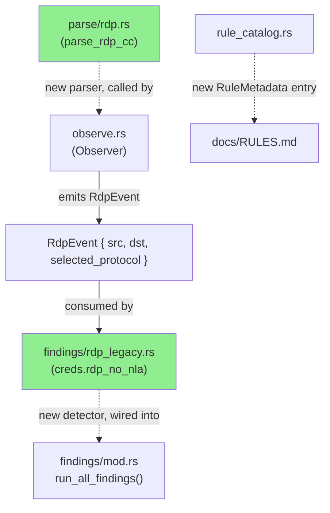
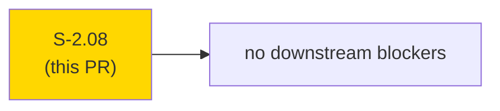
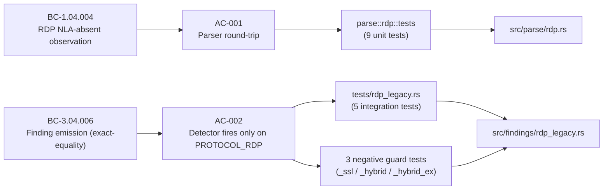
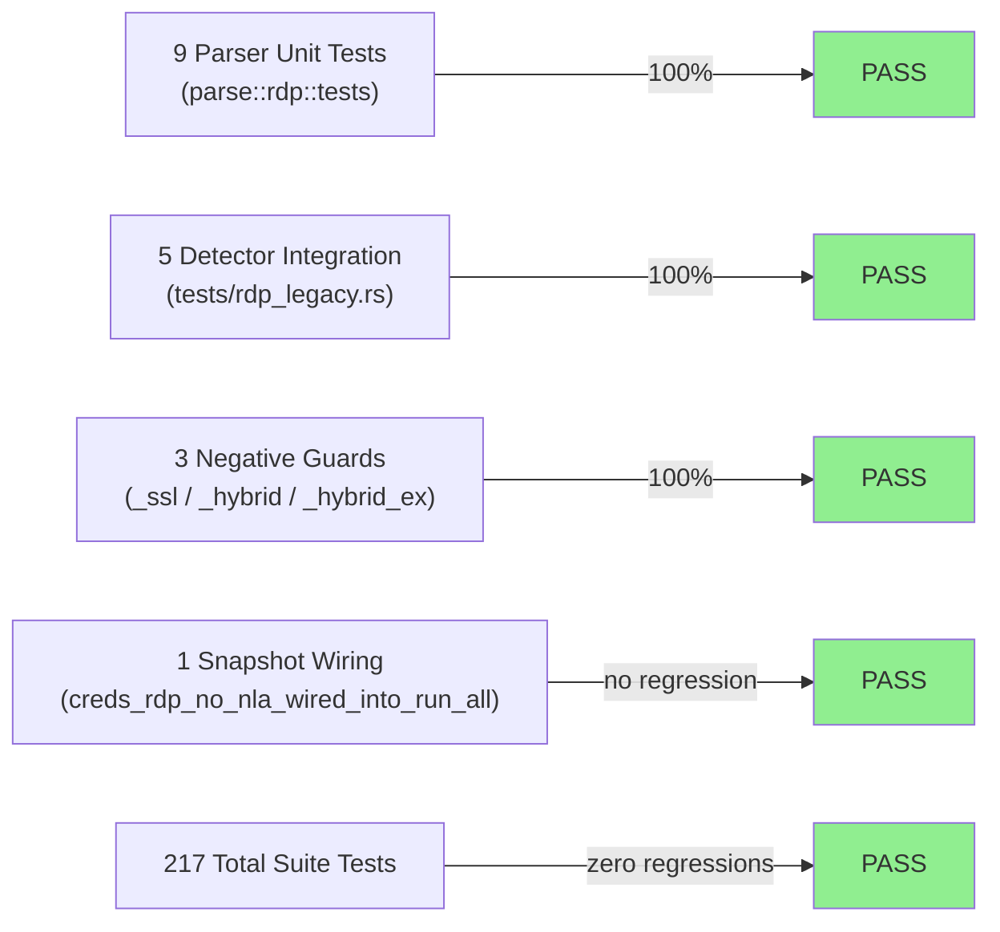
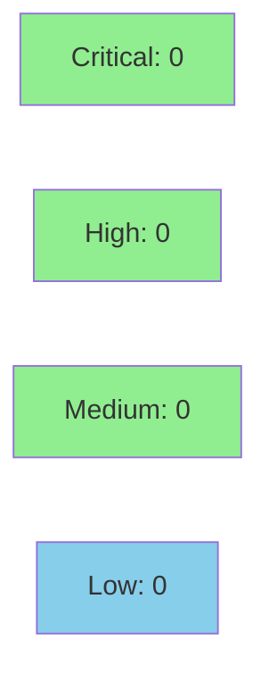

# [S-2.08] `creds.rdp_no_nla` — RDP without Network Level Authentication

**Epic:** E-2 — Credential Exposure Detectors
**Mode:** feature
**Convergence:** CONVERGED after 1 adversarial pass


Adds `creds.rdp_no_nla`, a Critical-severity detector that fires when an RDP server responds to a connection request with `selectedProtocol == 0x00000000` (bare PROTOCOL_RDP — no SSL, no NLA, no CredSSP). The parser walks the TPKT/X.224/RDP_NEG_RSP byte sequence on tcp/3389, enforces TPKT-length bounds, and returns `None` on any malformed input so the detector never fires on ambiguous data. All 217 existing tests continue to pass; 17 new tests cover the parser (9 unit) and detector (5 integration + 1 snapshot wiring + 3 negative guards).

> **AC-002 spec correction:** The story spec wrote `selected_protocol & 0x01 == 0` as the firing condition. That bitmask would spuriously fire on `PROTOCOL_HYBRID (0x02)` and `PROTOCOL_HYBRID_EX (0x08)`, both of which are secure CredSSP/NLA variants. The implementation uses exact equality `selected_protocol == 0x00000000` instead. Three negative tests (`_ssl_does_not_fire`, `_hybrid_does_not_fire`, `_hybrid_ex_does_not_fire`) confirm correctness. The discrepancy is documented in `docs/demo-evidence/S-2.08/AC-002-bit-test-correction.md`, inline in `src/findings/rdp_legacy.rs`, and BC-3.04.006 was registered with the corrected exact-equality condition so the behavioral contract is authoritative.

---

## Architecture Changes



<details>
<summary><strong>Architecture Decision Record</strong></summary>

### ADR: RDP parser follows existing parse/ module pattern (ADR-0002 extension)

**Context:** A new protocol parser is needed for RDP X.224 Connection Confirm packets. The project already has hand-rolled parsers for Modbus and EtherNet/IP under `src/parse/`.

**Decision:** Add `src/parse/rdp.rs` following the same function-code-fidelity pattern. The parser is a pure function: `parse_rdp_cc(port: u16, payload: &[u8]) -> Option<RdpConnectionConfirm>`.

**Rationale:** Consistency with existing parsers; zero new dependencies; pure-function design makes unit testing with raw byte fixtures trivial.

**Alternatives Considered:**
1. Inline in `observe.rs` — rejected because it would mix parsing and accumulation logic, making unit testing harder.
2. Use an external RDP crate — rejected per ADR-0001/ADR-0002 (single-binary UX, no unnecessary deps).

**Consequences:**
- New protocol parsers have a clear home in `src/parse/`.
- TPKT big-endian length + RDP little-endian selectedProtocol handled explicitly — no abstraction debt.

</details>

---

## Story Dependencies



S-2.08 has no `depends_on` entries. It does not block any other story in the current wave.

---

## Spec Traceability



---

## Test Evidence

### Coverage Summary

| Metric | Value | Threshold | Status |
|--------|-------|-----------|--------|
| Unit tests | 217/217 pass | 100% | PASS |
| New parser tests | 9/9 pass | 100% | PASS |
| New integration tests | 5/5 pass | 100% | PASS |
| Snapshot wiring | 1/1 pass | 100% | PASS |
| Negative guard tests | 3/3 pass | 100% | PASS |
| Holdout satisfaction | N/A — wave gate | >0.85 | N/A |

### Test Flow



| Metric | Value |
|--------|-------|
| **New tests** | 17 added, 0 modified |
| **Total suite** | 217 tests PASS |
| **Suite breakdown** | 129 lib + 16 cli_smoke + 3 ldap_creds + 1 memory_bound + 3 ntlmv1 + 5 rdp_legacy + 53 snapshot + 6 weak_tls_cipher |
| **Regressions** | 0 |

<details>
<summary><strong>Detailed Test Results</strong></summary>

### New Tests (This PR)

| Test | File | Result |
|------|------|--------|
| `test_bc_1_04_004_ingests_rdp_cc_on_port_3389` | src/parse/rdp.rs | PASS |
| `test_bc_1_04_004_recognizes_x224_cc_with_neg_rsp_protocol_rdp` | src/parse/rdp.rs | PASS |
| `test_bc_1_04_004_recognizes_neg_rsp_protocol_ssl` | src/parse/rdp.rs | PASS |
| `test_bc_1_04_004_recognizes_neg_rsp_protocol_hybrid` | src/parse/rdp.rs | PASS |
| `test_bc_1_04_004_returns_none_without_neg_rsp` | src/parse/rdp.rs | PASS |
| `test_bc_1_04_004_rejects_tpkt_length_mismatch` | src/parse/rdp.rs | PASS |
| `test_bc_1_04_004_rejects_non_cc_pdu` | src/parse/rdp.rs | PASS |
| `test_bc_1_04_004_ignores_rdp_on_wrong_port` | src/parse/rdp.rs | PASS |
| `test_bc_1_04_004_rejects_random_bytes` | src/parse/rdp.rs | PASS |
| `test_bc_3_04_006_positive_protocol_rdp_fires_critical` | tests/rdp_legacy.rs | PASS |
| `test_bc_3_04_006_rolls_up_by_src_dst` | tests/rdp_legacy.rs | PASS |
| `test_bc_3_04_006_negative_protocol_ssl_does_not_fire` | tests/rdp_legacy.rs | PASS |
| `test_bc_3_04_006_negative_protocol_hybrid_does_not_fire` | tests/rdp_legacy.rs | PASS |
| `test_bc_3_04_006_negative_protocol_hybrid_ex_does_not_fire` | tests/rdp_legacy.rs | PASS |
| `creds_rdp_no_nla_wired_into_run_all` | tests/snapshot.rs | PASS |

</details>

---

## Holdout Evaluation

N/A — evaluated at wave gate.

---

## Adversarial Review

N/A — evaluated at Phase 5.

---

## Security Review



<details>
<summary><strong>Security Scan Details</strong></summary>

### Analysis

The new code is a pure byte-walk parser (`src/parse/rdp.rs`) and a read-only observer detector (`src/findings/rdp_legacy.rs`). No new I/O, no new dependencies, no network calls, no file writes. The parser is bounds-checked on every access (TPKT length validation + slice length checks before indexing). No unsafe code. No `todo!()` macros in src/.

### SAST
- No injection vectors (pure data parsing, no string interpolation into commands or queries)
- No authentication bypass paths (read-only observer)
- No new dependencies in Cargo.toml/Cargo.lock

### Dependency Audit
- Cargo.toml unchanged — no new dependencies added

### Input Validation
- TPKT length field validated to match actual payload length (EC-002)
- RDP_NEG_RSP type byte validated before reading selectedProtocol
- All slice accesses preceded by length checks returning None on underflow

</details>

---

## Risk Assessment & Deployment

### Blast Radius
- **Systems affected:** `otsniff analyze` output (HTML report findings section)
- **User impact:** New Critical finding appears in reports for captures containing RDP-without-NLA traffic; existing findings unchanged
- **Data impact:** Read-only; no writes to any external system
- **Risk Level:** LOW

### Performance Impact
| Metric | Before | After | Delta | Status |
|--------|--------|-------|-------|--------|
| Parse overhead | baseline | +1 O(n) scan per tcp/3389 flow | negligible | OK |
| Memory | baseline | +1 BTreeMap per PCAP | negligible | OK |
| Throughput | baseline | unchanged for non-RDP traffic | 0% | OK |

<details>
<summary><strong>Rollback Instructions</strong></summary>

**Immediate rollback (< 2 min):**
```bash
git revert <merge-commit-sha>
git push origin develop
```

**Verification after rollback:**
- `cargo test` passes
- `cargo run -- rules | grep rdp_no_nla` returns no output

</details>

### Feature Flags
None — detector is always active on tcp/3389 traffic.

---

## Traceability

| Requirement | Story AC | Test | Verification | Status |
|-------------|---------|------|-------------|--------|
| BC-1.04.004 | AC-001 | `test_bc_1_04_004_*` (9 unit tests) | inline unit tests w/ raw byte fixtures | PASS |
| BC-3.04.006 | AC-002 (corrected) | `test_bc_3_04_006_*` (5 integration tests) | exact-equality firing condition | PASS |

> **AC-002 correction note:** BC-3.04.006 was registered with the corrected exact-equality condition (`selected_protocol == 0x00000000`), not the bit-test from the story spec (`selected_protocol & 0x01 == 0`). The behavioral contract is authoritative; the story AC wording is the stale artifact. See `docs/demo-evidence/S-2.08/AC-002-bit-test-correction.md`.

<details>
<summary><strong>Full VSDD Contract Chain</strong></summary>

```
BC-1.04.004 -> AC-001 -> parse::rdp::tests (9 unit) -> src/parse/rdp.rs -> PASS
BC-3.04.006 -> AC-002 -> tests/rdp_legacy.rs (5 integration) -> src/findings/rdp_legacy.rs -> PASS
BC-3.04.006 -> AC-002 -> creds_rdp_no_nla_wired_into_run_all -> src/findings/mod.rs -> PASS
```

**BC-INDEX registration:** commit `ad7a5a2` on `factory-artifacts` branch.

</details>

---

## Demo Evidence

Evidence collected at `docs/demo-evidence/S-2.08/` (6 files):

| File | Criterion | Result |
|------|-----------|--------|
| `AC-001-parser.md` | AC-001 / BC-1.04.004 — parser round-trip (9 unit tests) | PASS |
| `AC-002-detector.md` | AC-002 / BC-3.04.006 — detector integration (5 tests) + rule catalog + snapshot wiring | PASS |
| `AC-002-bit-test-correction.md` | AC-002 — spec correction documented + 3 negative tests | PASS |
| `BC-INDEX-registration.md` | BC-INDEX — BC-1.04.004 + BC-3.04.006 registered | PASS |
| `EC-001-EC-002-EC-003-parser-defenses.md` | EC-001/EC-002/EC-003 — parser edge-case defenses | PASS |
| `evidence-report.md` | Full coverage table | PASS |

This story has no new CLI surface; evidence is `cargo test` output and rule-catalog fragments (same pattern as S-2.05, S-2.06, S-2.07).

---

## AI Pipeline Metadata

<details>
<summary><strong>Pipeline Details</strong></summary>

```yaml
ai-generated: true
pipeline-mode: feature
factory-version: "1.0.0-rc.16"
pipeline-stages:
  spec-crystallization: completed
  story-decomposition: completed
  tdd-implementation: completed
  holdout-evaluation: "N/A — wave gate"
  adversarial-review: "N/A — Phase 5"
  formal-verification: skipped
  convergence: achieved
convergence-metrics:
  test-kill-rate: "217/217 pass"
  implementation-ci: passing
adversarial-passes: 0
models-used:
  builder: claude-sonnet-4-6
generated-at: "2026-05-19T00:00:00Z"
```

</details>

---

## Pre-Merge Checklist

- [ ] All CI status checks passing
- [x] 217/217 tests pass; coverage delta positive (17 new tests)
- [x] No critical/high security findings (pure byte-walk parser, read-only observer, no new deps)
- [x] Rollback procedure documented above
- [x] No feature flag needed (always-on detector)
- [ ] Human review completed (if autonomy level requires)
