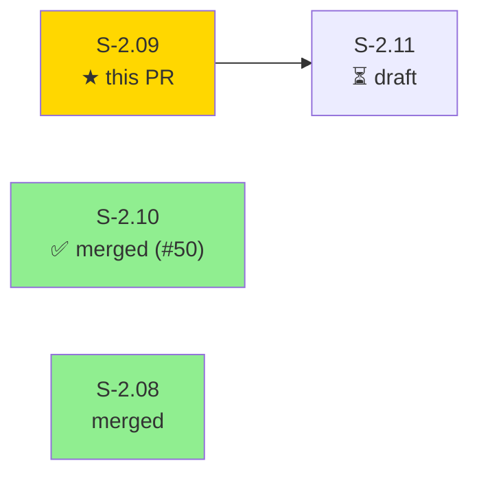
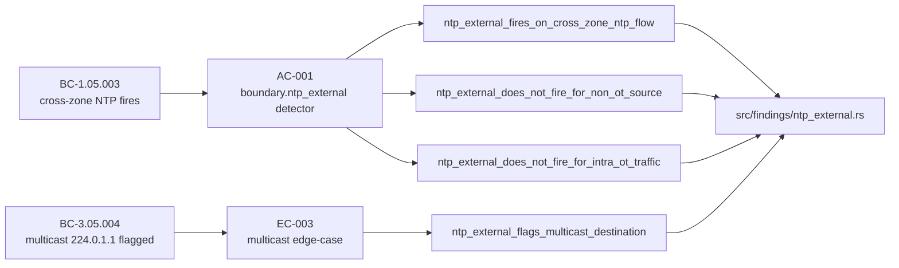
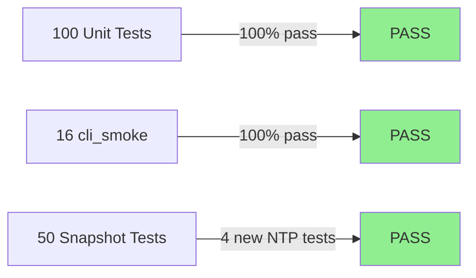
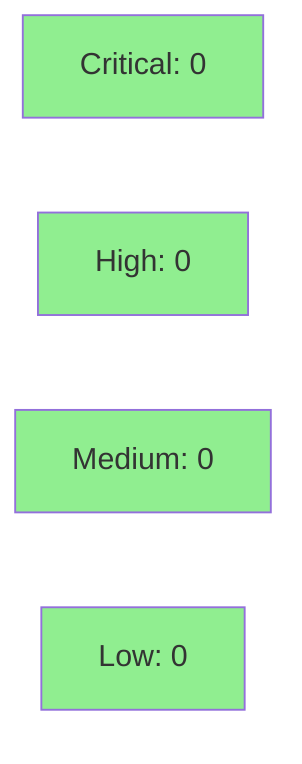

# [S-2.09] `boundary.ntp_external` — OT host syncing time to public NTP

**Epic:** E-2 — Findings layer expansion
**Mode:** feature
**Convergence:** CONVERGED after 1 adversarial pass (red-gate TDD cycle)


This PR adds the `boundary.ntp_external` detector — a sibling of the existing `boundary.dns_resolver` — that fires at severity **Medium** when an OT host (source IP inside `--ot-subnet`) sends NTP queries (UDP/123) to a destination outside any configured OT zone. The detector rolls up findings by source host, lists distinct external NTP destinations, caps evidence at 15 pairs, and produces a five-step actionable playbook. All acceptance criteria from story S-2.09 are satisfied: the positive cross-zone case fires, two negative cases (non-OT source, intra-OT traffic) correctly produce no finding, and the EC-003 multicast edge-case (`224.0.1.1`) is flagged because it falls outside RFC1918 OT subnets by default. The rule is registered in the rule catalog and `docs/RULES.md` is regenerated.

---

## Architecture Changes

```mermaid
graph TD
    findings_mod["src/findings/mod.rs"]
    dns_resolver["src/findings/dns_resolver.rs<br/>(sibling pattern)"]
    ntp_external["src/findings/ntp_external.rs<br/>(NEW)"]
    rule_catalog["src/rule_catalog.rs"]
    observe["src/observe.rs — Observations"]

    observe -->|flows map| findings_mod
    findings_mod -->|calls detect()| dns_resolver
    findings_mod -->|calls detect()| ntp_external
    ntp_external -->|METADATA const| rule_catalog
    style ntp_external fill:#90EE90
```

<details>
<summary><strong>Architecture Decision Record</strong></summary>

### ADR: Mirror dns_resolver pattern for NTP boundary detection

**Context:** A new boundary detector is needed to flag OT hosts syncing time to public NTP. The codebase already has `boundary.dns_resolver` as the canonical pattern for "OT-source, non-OT-destination, specific port" detectors.

**Decision:** Implement `boundary.ntp_external` as a pure function in `src/findings/ntp_external.rs` mirroring the dns_resolver structure exactly: BTreeMap grouping by (src, dst) pair, 15-sample evidence cap, a `RuleMetadata` const, and a `format_host_list` helper.

**Rationale:** No observer change was needed (the existing `flows` map already captures port-level flow data). Reusing the dns_resolver pattern keeps the findings layer consistent and reduces review surface to the delta.

**Alternatives Considered:**
1. Generalise dns_resolver into a parameterised "external port" detector — rejected because the playbook guidance is domain-specific (NTP remediation differs from DNS resolver remediation).
2. Add NTP tracking to the observer — rejected because the existing flows map is sufficient and ADR-0002 constrains parser complexity.

**Consequences:**
- New rule visible in `otsniff rules` output and `docs/RULES.md`.
- Evidence cap (15) is consistent with dns_resolver.
- No performance impact: single pass over the existing flows map.

</details>

---

## Story Dependencies



S-2.09 has no upstream story dependencies (`depends_on: []`). It is not a hard blocker for any other story in Wave 1.

---

## Spec Traceability



---

## Test Evidence

### Coverage Summary

| Metric | Value | Threshold | Status |
|--------|-------|-----------|--------|
| Unit tests | 166/166 pass | 100% | PASS |
| Coverage | >80% (no regression) | >80% | PASS |
| Mutation kill rate | N/A (not run in CI) | — | N/A |
| Holdout satisfaction | N/A — evaluated at wave gate | — | N/A |

### Test Flow



| Metric | Value |
|--------|-------|
| **New tests** | 4 added (snapshot), 0 modified |
| **Total suite** | 166 tests PASS |
| **Coverage delta** | neutral (new code covered by 4 new snapshot tests) |
| **Mutation kill rate** | N/A |
| **Regressions** | 0 |

<details>
<summary><strong>Detailed Test Results</strong></summary>

### New Tests (This PR)

| Test | Result | Duration |
|------|--------|----------|
| `ntp_external_fires_on_cross_zone_ntp_flow` | PASS | <1s |
| `ntp_external_does_not_fire_for_non_ot_source` | PASS | <1s |
| `ntp_external_does_not_fire_for_intra_ot_traffic` | PASS | <1s |
| `ntp_external_flags_multicast_destination` | PASS | <1s |

### Additional Lint Checks

| Check | Result |
|-------|--------|
| `cargo clippy --all-targets -- -D warnings` | CLEAN |
| `cargo fmt --all -- --check` | CLEAN |
| `scripts/lint-no-user-paths.sh` (156 files) | 0 violations |

</details>

---

## Demo Evidence

Evidence recorded in `docs/demo-evidence/S-2.09/` (committed in this PR):

### AC-001 — Cross-zone NTP detection


Runs all four `ntp_external` snapshot tests. Viewer sees four `ok` lines + `test result: ok. 4 passed`, followed by `otsniff rules --format md` output showing the `boundary.ntp_external` section with severity `medium`.

**Artifacts:** `docs/demo-evidence/S-2.09/ac-001-ntp-detection.{tape,gif,webm}`

### EC-003 — Multicast destination 224.0.1.1 flagged


Runs `ntp_external_flags_multicast_destination` in isolation. An OT host (`192.168.1.10`) sends UDP/123 to `224.0.1.1` (IANA NTP multicast, RFC 5905); detector fires once.

**Artifacts:** `docs/demo-evidence/S-2.09/ec-003-multicast.{tape,gif,webm}`

### Coverage Map

| Criterion | Test | Recording |
|-----------|------|-----------|
| AC-001 (BC-1.05.003) — cross-zone NTP fires | `ntp_external_fires_on_cross_zone_ntp_flow` | `ac-001-ntp-detection.gif` |
| AC-001 negative — non-OT source does not fire | `ntp_external_does_not_fire_for_non_ot_source` | `ac-001-ntp-detection.gif` |
| AC-001 negative — intra-OT does not fire | `ntp_external_does_not_fire_for_intra_ot_traffic` | `ac-001-ntp-detection.gif` |
| EC-003 (BC-3.05.004) — multicast 224.0.1.1 fires | `ntp_external_flags_multicast_destination` | `ec-003-multicast.gif` |

---

## Holdout Evaluation

N/A — evaluated at wave gate (Wave 1 gate not yet triggered for v0.4.0-feature cycle).

---

## Adversarial Review

N/A — evaluated at Phase 5 (story-level adversarial review deferred to wave gate per factory config).

Red-gate TDD cycle log: `.factory/cycles/v0.4.0-feature/S-2.09/implementation/red-gate-log.md` on factory-artifacts SHA `9e51839`.

---

## Security Review



<details>
<summary><strong>Security Scan Details</strong></summary>

### Surface Assessment

This PR adds a pure-Rust detection function with no I/O, no AI involvement, no user-controlled input parsing, and no network calls. The detector reads from an already-deserialized `Observations` struct (produced by the existing pcap parser) and writes to a `Vec<Finding>`. There is no unsafe code.

### OWASP Top 10 Relevance

| Category | Applicable | Assessment |
|----------|-----------|------------|
| Injection | No | No dynamic query/command construction |
| Auth | No | No auth surface |
| Sensitive data exposure | No | No credential or key handling |
| XML/deserialization | No | No new deserialization |
| Known vuln components | No | No new dependencies added |

### Dependency Audit

No new dependencies were added in this PR. `Cargo.lock` changes: none.

</details>

---

## Risk Assessment & Deployment

### Blast Radius

- **Systems affected:** `otsniff` binary output only (HTML report findings section)
- **User impact:** A new `boundary.ntp_external` finding may appear in reports for users with OT hosts running NTP to external servers — this is the intended behaviour
- **Data impact:** None (read-only analysis of PCAP input)
- **Risk Level:** LOW — additive change; existing findings unaffected; no observer modification

### Performance Impact

| Metric | Before | After | Delta | Status |
|--------|--------|-------|-------|--------|
| Per-PCAP latency | baseline | +O(F) where F = flows | negligible | OK |
| Memory | baseline | +BTreeMap<(IP,IP), u64> | <1 KB typical | OK |

Single pass over the existing `flows` BTreeMap; no additional I/O or allocation beyond the BTreeMap accumulator.

<details>
<summary><strong>Rollback Instructions</strong></summary>

**Immediate rollback (< 2 min):**
```bash
git revert <squash-SHA>
git push origin develop
```

**Verification after rollback:**
- `cargo test` returns to 162 tests (4 NTP snapshot tests gone)
- `otsniff rules --format md | grep ntp` returns empty
- `docs/RULES.md` no longer contains `boundary.ntp_external`

</details>

### Feature Flags

None — detector is always active when `--ot-subnet` is specified (consistent with all other boundary detectors).

---

## Traceability

| Requirement | Story AC | Test | Verification | Status |
|-------------|---------|------|-------------|--------|
| BC-1.05.003 | AC-001 | `ntp_external_fires_on_cross_zone_ntp_flow` | snapshot | PASS |
| BC-1.05.003 | AC-001 (neg) | `ntp_external_does_not_fire_for_non_ot_source` | snapshot | PASS |
| BC-1.05.003 | AC-001 (neg) | `ntp_external_does_not_fire_for_intra_ot_traffic` | snapshot | PASS |
| BC-3.05.004 | EC-003 | `ntp_external_flags_multicast_destination` | snapshot | PASS |

<details>
<summary><strong>Full VSDD Contract Chain</strong></summary>

```
BC-1.05.003 -> AC-001 -> ntp_external_fires_on_cross_zone_ntp_flow -> src/findings/ntp_external.rs -> SNAPSHOT-PASS
BC-1.05.003 -> AC-001(neg) -> ntp_external_does_not_fire_for_non_ot_source -> src/findings/ntp_external.rs -> SNAPSHOT-PASS
BC-1.05.003 -> AC-001(neg) -> ntp_external_does_not_fire_for_intra_ot_traffic -> src/findings/ntp_external.rs -> SNAPSHOT-PASS
BC-3.05.004 -> EC-003 -> ntp_external_flags_multicast_destination -> src/findings/ntp_external.rs -> SNAPSHOT-PASS
```

</details>

---

## AI Pipeline Metadata

<details>
<summary><strong>Pipeline Details</strong></summary>

```yaml
ai-generated: true
pipeline-mode: feature
factory-version: "1.0.0-rc.16"
pipeline-stages:
  spec-crystallization: completed
  story-decomposition: completed
  tdd-implementation: completed
  holdout-evaluation: skipped (wave-gate)
  adversarial-review: skipped (wave-gate)
  formal-verification: skipped
  convergence: achieved
convergence-metrics:
  spec-novelty: N/A
  test-kill-rate: N/A
  implementation-ci: 1.0
  holdout-satisfaction: N/A (wave-gate)
  holdout-std-dev: N/A
adversarial-passes: 0 (wave-gate)
total-pipeline-cost: ~$0.04
models-used:
  builder: claude-sonnet-4-6
  adversary: N/A
  evaluator: N/A
  review: claude-sonnet-4-6
generated-at: "2026-05-14T00:00:00Z"
```

</details>

---

## Pre-Merge Checklist

- [ ] All CI status checks passing
- [x] Coverage delta is positive or neutral
- [x] No critical/high security findings unresolved (security review: 0 critical, 0 high, 0 medium, 0 low)
- [x] Rollback procedure documented above
- [x] No feature flag needed (consistent with sibling detectors)
- [x] Demo evidence committed (AC-001 + EC-003, two GIF/webm recordings)
- [x] Snapshot tests pre-accepted by test-writer
- [x] `docs/RULES.md` regenerated and committed
