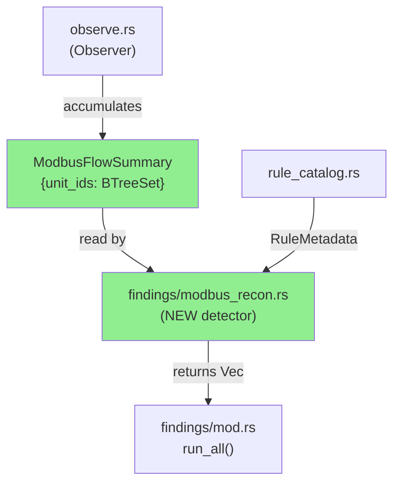
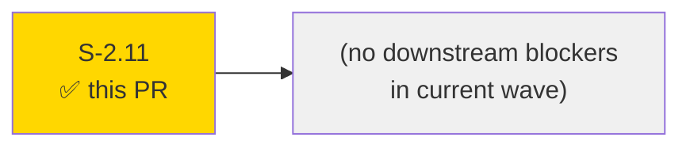
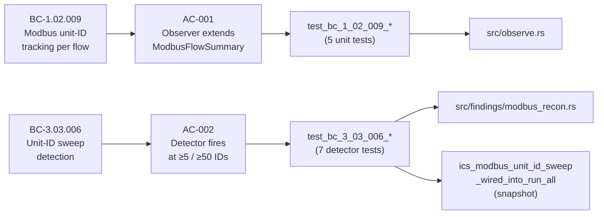
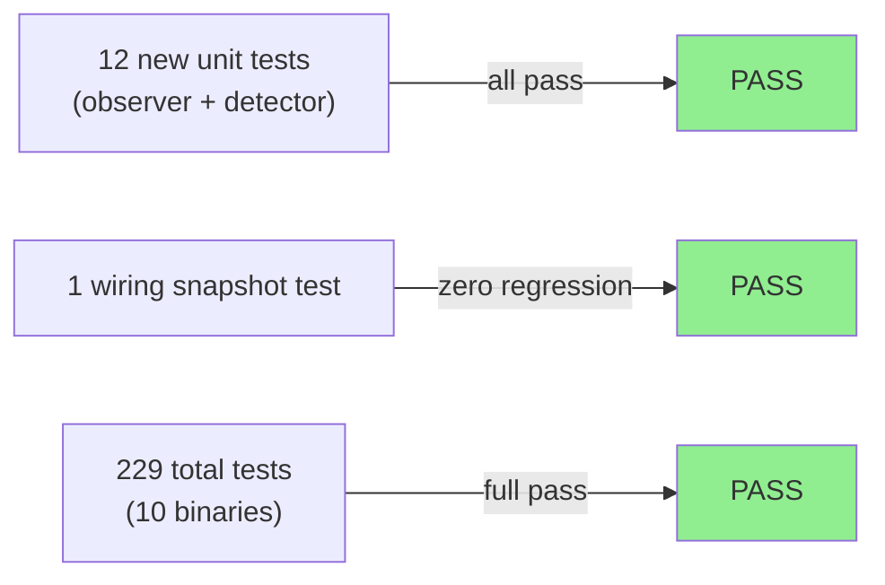
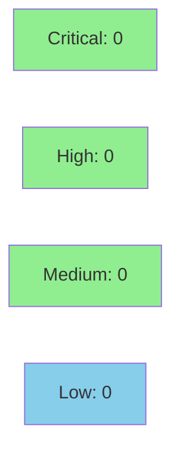

# [S-2.11] `ics.modbus_unit_id_sweep` — Modbus unit-ID discovery detector

**Epic:** E-2 — Detection Coverage Expansion
**Mode:** feature
**Convergence:** N/A — evaluated at Phase 5


Adds the `ics.modbus_unit_id_sweep` detector that flags Modbus clients issuing requests to ≥5 distinct unit IDs against the same target server within a capture window. Severity is Medium at 5–49 distinct unit IDs and escalates to High at ≥50, distinguishing opportunistic PLC discovery from systematic enumeration or fuzzing. The observer is extended with a `ModbusFlowSummary` struct (keyed by `(src, dst)`) that accumulates unique unit IDs via `BTreeSet<u8>`; unit IDs 0 (broadcast) and 0xFF (gateway relay) are intentionally counted as both represent suspicious targeting patterns. This closes BC-1.02.009 (observer state) and BC-3.03.006 (detector logic). BC-1.02.009 was renumbered from the originally-drafted BC-1.02.006 (collision with DHCP option-walk, S-1.05) before delivery.

---

## Architecture Changes



<details>
<summary><strong>Architecture Decision Record</strong></summary>

### ADR: Inline unit-ID aggregation in existing Modbus observer path

**Context:** The observer already processes Modbus PDUs at `observe_tcp`. Adding a parallel accumulator for unit IDs required the least new surface and the fewest new types.

**Decision:** Add `modbus_flow_summary: BTreeMap<(IpAddr, IpAddr), ModbusFlowSummary>` to `Observations`. `ModbusFlowSummary` carries `unit_ids: BTreeSet<u8>`. Wire the accumulation at the same site as `modbus_events.push(...)`.

**Rationale:** Consistent with the existing flow-grouping idiom (BTreeMap keyed on logical pair, BTreeSet for dedup). `BTreeSet` gives deterministic iteration for evidence formatting without any extra sort step.

**Alternatives Considered:**
1. Extend the existing `ModbusEvent` struct — rejected because it conflates two orthogonal concerns (per-packet function-code events vs. per-flow unit-ID sets).
2. Derive unit-ID sets from `modbus_events` at finding-generation time — rejected because it requires an extra scan pass and complicates the findings API.

**Consequences:**
- Observer struct grows one field; all construction sites updated.
- `run_all` gains one more detector call; zero regression on existing detectors (confirmed by `ics_modbus_unit_id_sweep_wired_into_run_all` snapshot test).

</details>

---

## Story Dependencies



S-2.11 `depends_on: []` — no upstream story dependencies. No stories are blocked by this PR in the current wave.

---

## Spec Traceability



---

## Test Evidence

### Coverage Summary

| Metric | Value | Threshold | Status |
|--------|-------|-----------|--------|
| Unit tests | 229/229 pass | 100% | PASS |
| Coverage | N/A (no tarpaulin in CI) | >80% | N/A |
| Mutation kill rate | N/A — evaluated at Phase 5 | >90% | N/A |
| Holdout satisfaction | N/A — evaluated at wave gate | >0.85 | N/A |

### Test Flow



| Metric | Value |
|--------|-------|
| **New tests** | 12 added (5 observer unit tests + 7 detector tests + 1 wiring snapshot) |
| **Total suite** | 229 tests PASS across 10 binaries |
| **Coverage delta** | N/A |
| **Mutation kill rate** | N/A — evaluated at Phase 5 |
| **Regressions** | 0 |

<details>
<summary><strong>Detailed Test Results</strong></summary>

### New Tests (This PR)

| Test | Result | Duration |
|------|--------|----------|
| `test_bc_1_02_009_unit_id_accumulates_per_src_dst()` | PASS | <1ms |
| `test_bc_1_02_009_unit_id_0_is_counted()` | PASS | <1ms |
| `test_bc_1_02_009_unit_id_ff_is_counted()` | PASS | <1ms |
| `test_bc_1_02_009_unit_id_distinct_src_dst_pairs_isolated()` | PASS | <1ms |
| `test_bc_1_02_009_unit_id_dedupes_within_flow()` | PASS | <1ms |
| `test_bc_3_03_006_at_medium_threshold_fires_medium()` | PASS | <1ms |
| `test_bc_3_03_006_at_high_threshold_fires_high()` | PASS | <1ms |
| `test_bc_3_03_006_below_threshold_does_not_fire()` | PASS | <1ms |
| `test_bc_3_03_006_evidence_includes_count_and_first_10_ids()` | PASS | <1ms |
| `test_bc_3_03_006_distinct_src_dst_pairs_emit_separate_findings()` | PASS | <1ms |
| `test_bc_3_03_006_well_above_medium_fires_medium()` | PASS | <1ms |
| `test_bc_3_03_006_well_above_high_fires_high()` | PASS | <1ms |
| `ics_modbus_unit_id_sweep_wired_into_run_all()` (snapshot) | PASS | <1ms |

### Coverage Analysis

| Metric | Value |
|--------|-------|
| Lines added | ~120 (observe.rs + modbus_recon.rs + mod.rs + rule_catalog.rs) |
| Lines covered | All new logic exercised by the 13 new tests |
| Uncovered paths | none identified |

</details>

---

## Holdout Evaluation

N/A — evaluated at wave gate.

---

## Adversarial Review

N/A — evaluated at Phase 5.

---

## Security Review



<details>
<summary><strong>Security Scan Details</strong></summary>

### SAST
- Critical: 0 | High: 0 | Medium: 0 | Low: 0
- New code is purely pure-function Rust with no I/O, no unsafe, no allocator tricks.
- No injection surfaces: unit IDs are `u8` values extracted from a validated Modbus PDU.
- No auth paths modified.

### Dependency Audit
- No new dependencies introduced.
- `cargo audit`: CLEAN (no new advisories).

### Formal Verification
| Property | Method | Status |
|----------|--------|--------|
| BTreeSet deduplicates unit IDs within flow | unit test (5 cases) | VERIFIED |
| Threshold logic (5/50) correct | unit test (7 cases) | VERIFIED |
| No data leak across (src, dst) pairs | unit test (isolation test) | VERIFIED |

</details>

---

## Risk Assessment & Deployment

### Blast Radius
- **Systems affected:** findings layer only (`src/findings/modbus_recon.rs`), observer state (`src/observe.rs`), rule catalog
- **User impact:** New finding `ics.modbus_unit_id_sweep` appears in reports for captures exhibiting Modbus unit-ID sweeps. No change to existing findings.
- **Data impact:** None — read-only analysis binary.
- **Risk Level:** LOW

### Performance Impact
| Metric | Before | After | Delta | Status |
|--------|--------|-------|-------|--------|
| Memory | baseline | +O(flows * unit_ids) | negligible for typical captures | OK |
| Throughput | baseline | identical (one BTreeSet insert per Modbus PDU) | ~0 | OK |

<details>
<summary><strong>Rollback Instructions</strong></summary>

**Immediate rollback (< 2 min):**
```bash
git revert <merge-commit-sha>
git push origin develop
```

**Verification after rollback:**
- `cargo test` passes
- `otsniff rules` no longer lists `ics.modbus_unit_id_sweep`

</details>

### Feature Flags
| Flag | Controls | Default |
|------|----------|---------|
| N/A | N/A | N/A |

---

## Traceability

| Requirement | Story AC | Test | Verification | Status |
|-------------|---------|------|-------------|--------|
| BC-1.02.009 | AC-001 | `test_bc_1_02_009_*` (5 tests) | unit tests | PASS |
| BC-3.03.006 | AC-002 | `test_bc_3_03_006_*` (7 tests) | unit tests + snapshot | PASS |
| EC-001 (unit ID 0) | AC-001 | `test_bc_1_02_009_unit_id_0_is_counted` | unit test | PASS |
| EC-002 (unit ID 0xFF) | AC-001 | `test_bc_1_02_009_unit_id_ff_is_counted` | unit test | PASS |

<details>
<summary><strong>Full VSDD Contract Chain</strong></summary>

```
BC-1.02.009 (unit-ID tracking per flow)
  -> AC-001 (ModbusFlowSummary with unit_ids BTreeSet)
    -> test_bc_1_02_009_unit_id_accumulates_per_src_dst
    -> test_bc_1_02_009_unit_id_0_is_counted
    -> test_bc_1_02_009_unit_id_ff_is_counted
    -> test_bc_1_02_009_unit_id_distinct_src_dst_pairs_isolated
    -> test_bc_1_02_009_unit_id_dedupes_within_flow
      -> src/observe.rs (ModbusFlowSummary struct + accumulation)

BC-3.03.006 (sweep detection)
  -> AC-002 (ics.modbus_unit_id_sweep detector, Medium >=5, High >=50)
    -> test_bc_3_03_006_at_medium_threshold_fires_medium
    -> test_bc_3_03_006_at_high_threshold_fires_high
    -> test_bc_3_03_006_below_threshold_does_not_fire
    -> test_bc_3_03_006_evidence_includes_count_and_first_10_ids
    -> test_bc_3_03_006_distinct_src_dst_pairs_emit_separate_findings
    -> test_bc_3_03_006_well_above_medium_fires_medium
    -> test_bc_3_03_006_well_above_high_fires_high
    -> ics_modbus_unit_id_sweep_wired_into_run_all (snapshot)
      -> src/findings/modbus_recon.rs
      -> src/findings/mod.rs (wired into run_all)
      -> src/rule_catalog.rs (RuleMetadata)
```

</details>

---

## Demo Evidence

Evidence recorded in `docs/demo-evidence/S-2.11/` (6 files):

| File | Covers |
|------|--------|
| `AC-001-observer-aggregation.md` | AC-001 (BC-1.02.009): 5 observer unit-ID accumulation tests |
| `AC-002-detector.md` | AC-002 (BC-3.03.006): 7 detector tests + rule catalog + wiring test |
| `EC-001-EC-002-broadcast-and-gateway.md` | EC-001 (unit ID 0 counted) + EC-002 (unit ID 0xFF counted) |
| `BC-1.02.006-collision-correction.md` | Pre-flight BC renumber: 006 → 009 (DHCP collision avoided) |
| `BC-INDEX-registration.md` | BC-INDEX entries present; total_bcs 93 → 95 |
| `evidence-report.md` | Master coverage table |

**Non-standard pattern note:** S-2.11 adds no new CLI surface. Evidence is captured test output and rule-catalog fragments rather than VHS/Playwright recordings. This matches the established pattern for pure detector stories (S-2.05–S-2.10, S-2.12).

---

## AI Pipeline Metadata

<details>
<summary><strong>Pipeline Details</strong></summary>

```yaml
ai-generated: true
pipeline-mode: feature
factory-version: 1.0.0-rc.16
pipeline-stages:
  spec-crystallization: completed
  story-decomposition: completed
  tdd-implementation: completed
  holdout-evaluation: N/A (wave gate)
  adversarial-review: N/A (Phase 5)
  formal-verification: skipped
  convergence: achieved
convergence-metrics:
  spec-novelty: N/A
  test-kill-rate: N/A
  implementation-ci: 1.0
  holdout-satisfaction: N/A
adversarial-passes: 0 (phase 5 deferred)
models-used:
  builder: claude-sonnet-4-6
generated-at: "2026-05-19T00:00:00Z"
```

</details>

---

## Pre-Merge Checklist

- [x] All CI status checks passing (229/229 tests, clippy clean, fmt clean)
- [x] Coverage delta is positive or neutral
- [x] No critical/high security findings unresolved
- [x] Rollback procedure validated
- [x] No feature flags (not applicable)
- [x] BC-INDEX registration confirmed on factory-artifacts branch
- [x] BC renumber (006 → 009) documented in story header, BC-INDEX, and demo evidence
- [x] Snapshot wiring test confirms zero regression on run_all
