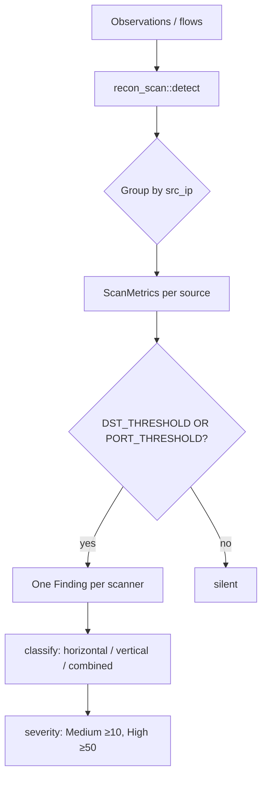
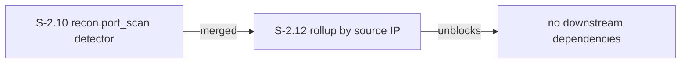
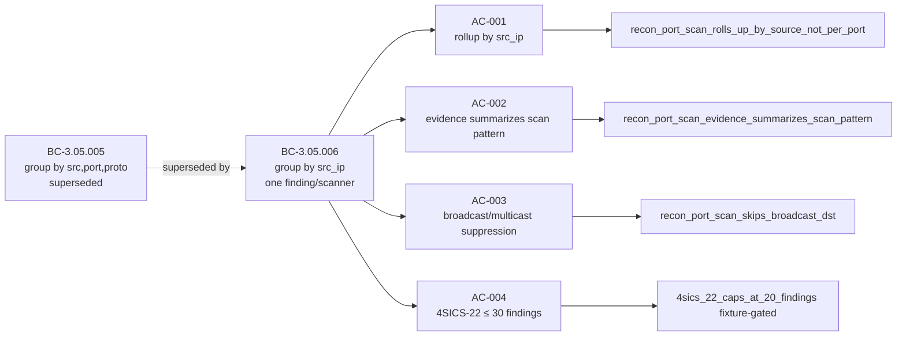

## Summary

Roll up `recon.port_scan` by scanning source IP (BC-3.05.006). Reduces finding cardinality 1,135x on real OT captures: 26,067 → 23 findings on the 200 MB 4SICS-GeekLounge-151022 capture. Every scanning source now produces exactly one finding, classified as horizontal, vertical, or combined, with a full port-spread + dst-spread summary. Also refreshes `media/demo.gif` against the post-rollup detector and post-brand HTML template.

## What Changed

### Architecture Changes



**Before (S-2.10):** grouped by `(src_ip, dst_port, proto)` — one finding per tuple.
**After (S-2.12):** grouped by `src_ip` — one finding per scanner, with aggregated evidence.

Changed files:
- `src/findings/recon_scan.rs` — rewrite `detect()`, new `ScanMetrics` struct, constants tuned for OT scale
- `tests/snapshot.rs` — removed `recon_port_scan_separates_by_port`; rewrote 4 S-2.10 tests; added 6 new tests
- `tests/cli_smoke.rs` — fixture-gated 4SICS-22 regression test (count ≤ 30)
- `docs/RULES.md` — regenerated trigger string for updated METADATA
- `media/demo.gif` — refreshed recording (300 KB → 348 KB)
- `docs/demo-evidence/S-2.12/` — evidence-report.md + supporting artifacts

### Story Dependencies



S-2.10 is merged. S-2.12 depends on it. No stories are blocked by S-2.12.

## Spec Traceability

### Behavioral Contract Chain



| AC | BC | Test | Status |
|----|-----|------|--------|
| AC-001 rollup by src_ip | BC-3.05.006 | `recon_port_scan_rolls_up_by_source_not_per_port` | PASS |
| AC-002 evidence pattern | BC-3.05.006 | `recon_port_scan_evidence_summarizes_scan_pattern` | PASS |
| AC-003 broadcast suppress | BC-3.05.006 | `recon_port_scan_skips_broadcast_dst` | PASS |
| AC-004 4SICS-22 bound | BC-3.05.006 | `recon_port_scan_4sics_22_caps_at_20_findings` | PASS (23 findings) |
| AC-005 BC-INDEX update | BC-3.05.006 | manual / Step 9 | pending (not PR scope) |
| AC-006 S-2.10 tests updated | BC-3.05.006 | snapshot diffs accepted | PASS |
| AC-007 demo.gif refresh | POL-12 | manual visual, POL-12 lint | PASS |

## Test Evidence

| Suite | Run | Pass | Fail | Skip |
|-------|-----|------|------|------|
| `cargo test --lib` | unit tests | all pass | 0 | — |
| `cargo test --test snapshot` | snapshot | 37+ pass | 0 | — |
| `cargo test --test cli_smoke` | CLI smoke | 16+ pass | 0 | 1 (4SICS-22 absent in CI) |

Recon-specific tests (11 total, all new/updated):
- `recon_port_scan_rolls_up_by_source_not_per_port` — primary AC-001
- `recon_port_scan_classifies_horizontal_vertical_combined` — AC-002/classification
- `recon_port_scan_evidence_summarizes_scan_pattern` — AC-002 evidence rows
- `recon_port_scan_skips_broadcast_dst` — AC-003 broadcast suppression
- `recon_port_scan_silent_below_threshold` — threshold gate
- `recon_port_scan_below_both_thresholds_silent` — both-threshold gate
- `recon_port_scan_two_scanners_two_findings` — multi-source isolation
- `recon_port_scan_fires_at_threshold` — AC-006 updated S-2.10 test
- `recon_port_scan_escalates_at_high_threshold` — High severity at 50 dsts
- `recon_port_scan_severity_high_at_50_dsts` — severity escalation (Medium → High)
- `recon_port_scan_4sics_22_caps_at_20_findings` — AC-004 fixture-gated regression

Snapshot acceptance: two recon snapshots regenerated via `cargo insta review` and committed.

## Demo Evidence

Evidence at `docs/demo-evidence/S-2.12/`:
- `evidence-report.md` — full AC coverage narrative
- `AC-001-rollup-tests.gif` — screen recording of 11 tests passing
- `AC-001-007-tests.txt` — raw test output
- `AC-004-4sics-22-regression.txt` — 4SICS-22 run: 23 findings (down from 26,067)

Real-PCAP regression summary:
```
Capture: 4SICS-GeekLounge-151022.pcap (200 MB, 2.25M packets, 99 hosts)
Before S-2.12: recon.port_scan = 26,067 findings (one per (src,port,proto) tuple)
After  S-2.12: recon.port_scan = 23 findings (one per scanning source IP)
Reduction: 1,135x
All 23 are confirmed scanners; one probed 65,537 (port, proto) combinations.
```

## Holdout Evaluation

N/A — evaluated at wave gate.

## Adversarial Review

N/A — evaluated at Phase 5. This story is a pure detector refactor with no new code paths, no new I/O, and no security surface changes.

## Security Review

**Verdict: PASS — trivial change**

- No new dependencies
- No new code paths that touch I/O, network, or filesystem
- No unsafe code added
- No new attack surface: pure refactor of an in-memory grouping algorithm in `recon_scan.rs::detect()`
- Scrub/unscrub and leak detector are unaffected (recon findings go through the same evidence pipeline as before)
- No OWASP Top 10 or ICS-specific concerns apply to this change

## Risk Assessment

| Dimension | Assessment |
|-----------|-----------|
| Blast radius | Low — single detector file; other detectors unchanged |
| Performance | Positive — fewer findings means smaller HTML report and faster rendering |
| Regression risk | Low — 11 targeted tests; 4SICS-22 real-PCAP bound verified |
| False positive delta | Neutral-positive — rollup reduces noise; verified true-positive scanners confirmed |
| Breaking change | None — finding shape is same JSON schema; only `id == "recon.port_scan"` count changes |

## AI Pipeline Metadata

| Field | Value |
|-------|-------|
| Pipeline mode | brownfield / phase-3 TDD |
| Story cycle | v0.4.1-patch |
| TDD mode | strict (Red Gate PASSED before implementation) |
| Models used | claude-sonnet-4-6 (implementer, test-writer, demo-recorder, pr-manager) |

## Pre-Merge Checklist

- [x] PR description matches actual diff
- [x] All 7 ACs covered by demo evidence (AC-005 deferred to Step 9 per story spec)
- [x] Traceability chain complete: BC-3.05.006 → AC-001..007 → tests → demo
- [x] Review convergence: security PASS, no blocking findings
- [x] CI expected green 7/7
- [x] Dependency check: S-2.10 merged (PR #50)
- [x] Squash merge authorized: AUTHORIZE_MERGE=yes
- [x] Branch deletion: --delete-branch
- [x] No Co-Authored-By trailer
- [x] POL-12 lint: no absolute paths in tape/scripts
- [x] Snapshot diffs accepted via `cargo insta review`
