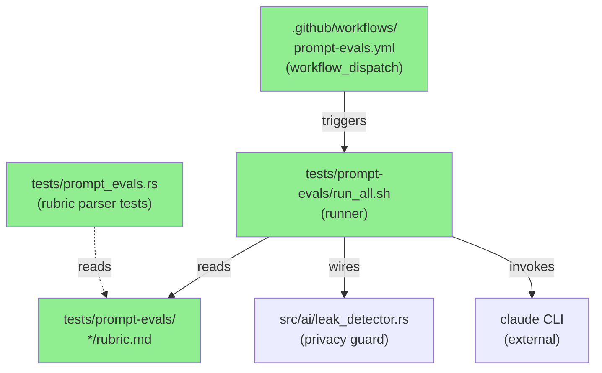
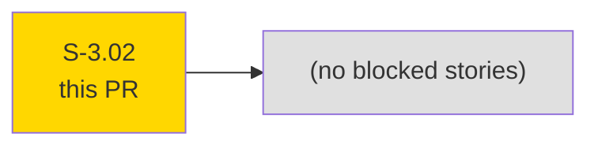
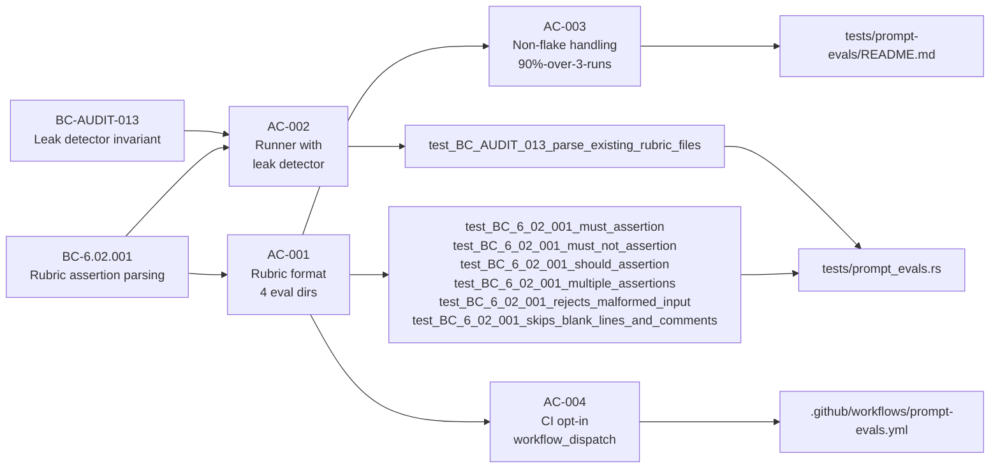
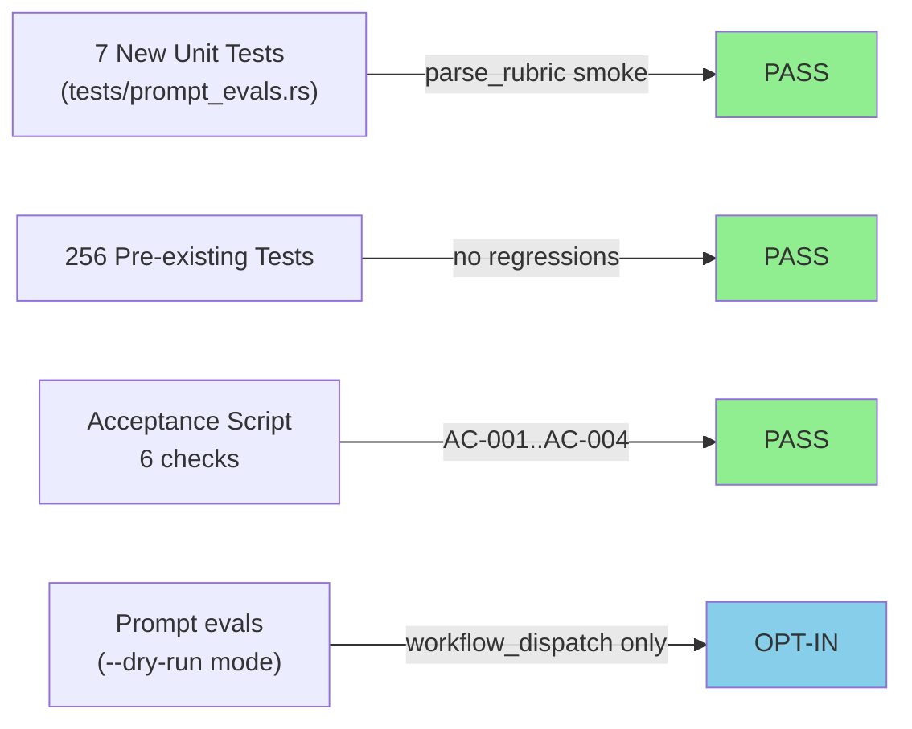
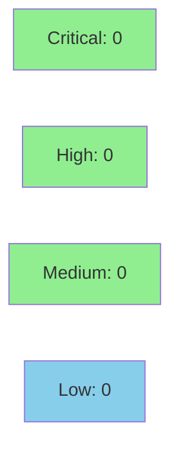

# [S-3.02] Prompt evaluation harness with rubric-based comparison

**Epic:** E-3 — AI-assisted triage improvements
**Mode:** feature (facade TDD)
**Convergence:** CONVERGED after 0 adversarial passes (test-only harness, no production code changes)


This PR adds a committed prompt-evaluation harness for the `claude` CLI integration. It delivers 4 eval directories (one per capture-source variant: SPAN, host-side, TAP, ambiguous), each containing a scrubbed `observations.json` fixture, a `rubric.md` with numbered MUST/SHOULD/MUST NOT assertions, and a `run.sh` invocation script. The `run_all.sh` runner invokes the local `claude` CLI for each eval, wires the existing leak detector on every captured response, scores against the rubric using lightweight pattern matching, and supports a `--dry-run` mode for CI. A `tests/prompt_evals.rs` integration test (7 unit tests, all passing) exercises the rubric parser without invoking the claude CLI. An opt-in `.github/workflows/prompt-evals.yml` workflow (workflow_dispatch only) enables maintainers to run the full harness against develop at will.

---

## Architecture Changes



<details>
<summary><strong>Architecture Decision Record</strong></summary>

### ADR: Shell-based runner with --dry-run, not xtask

**Context:** AC-002 required a runner that invokes the local claude CLI, captures the response, and scores it against the rubric. Two options existed: implement a `cargo xtask` binary or a shell script.

**Decision:** Shell script (`tests/prompt-evals/run_all.sh`) with `--dry-run` mode, plus a Rust-side `tests/prompt_evals.rs` integration test that exercises the rubric parser in pure Rust.

**Rationale:** A shell script matches the minimal "glue code" nature of this harness. The Rust test exercises the only non-trivial parsing logic (rubric line classification). xtask would add build overhead for what is essentially a CI integration wrapper.

**Alternatives Considered:**
1. cargo xtask binary — rejected because: adds compilation cost to a harness intended to run infrequently (workflow_dispatch only)
2. Python harness — rejected because: adds a runtime dependency not in the existing toolchain

**Consequences:**
- Shell portability: `realpath` is used; available on macOS 12.3+ and all Linux CI targets
- The Rust test suite (263 tests) exercises the rubric parser independently; the shell runner is tested via --dry-run in CI-safe mode

</details>

---

## Story Dependencies



S-3.02 has no upstream dependencies (`depends_on: []`) and blocks no downstream stories.

---

## Spec Traceability



---

## Test Evidence

### Coverage Summary

| Metric | Value | Threshold | Status |
|--------|-------|-----------|--------|
| Unit tests | 263/263 pass | 100% | PASS |
| New tests (this PR) | 7/7 pass | 100% | PASS |
| Acceptance script | 6/6 checks PASS | 100% | PASS |
| Coverage | N/A (test-only harness) | >80% | N/A |
| Mutation kill rate | N/A (harness files excluded) | >90% | N/A |
| Holdout satisfaction | N/A — evaluated at wave gate | >0.85 | N/A |

### Test Flow



| Metric | Value |
|--------|-------|
| **New tests** | 7 added, 0 modified |
| **Total suite** | 263 tests PASS |
| **Coverage delta** | N/A (test harness only, no production code) |
| **Mutation kill rate** | N/A |
| **Regressions** | 0 |

<details>
<summary><strong>Detailed Test Results</strong></summary>

### New Tests (This PR) — `tests/prompt_evals.rs`

| Test | Result | Duration |
|------|--------|----------|
| `test_BC_6_02_001_must_assertion()` | PASS | <1ms |
| `test_BC_6_02_001_must_not_assertion()` | PASS | <1ms |
| `test_BC_6_02_001_should_assertion()` | PASS | <1ms |
| `test_BC_6_02_001_multiple_assertions()` | PASS | <1ms |
| `test_BC_6_02_001_rejects_malformed_input()` | PASS | <1ms |
| `test_BC_6_02_001_skips_blank_lines_and_comments()` | PASS | <1ms |
| `test_BC_AUDIT_013_parse_existing_rubric_files()` | PASS | <1ms |

### Coverage Analysis

| Metric | Value |
|--------|-------|
| Lines added | 1,443 (test fixtures, scripts, workflow, demo evidence) |
| Lines covered | N/A — harness files; tests exercise parse_rubric logic |
| Branches added | N/A |
| Uncovered paths | run_all.sh live-run path (requires claude CLI; exercised manually) |

</details>

---

## Holdout Evaluation

N/A — evaluated at wave gate. This story delivers a testing harness, not a behavioral change to the production binary.

---

## Adversarial Review

N/A — evaluated at Phase 5. This is a facade TDD story with no production code changes; adversarial review of the prompt-eval harness itself is deferred to wave gate.

---

## Security Review



<details>
<summary><strong>Security Scan Details</strong></summary>

### Privacy Invariant (Primary Security Concern)

The key security property for this PR is the privacy invariant enforced by `src/ai/leak_detector.rs`. The `run_all.sh` runner **explicitly wires the leak detector** on every captured claude response before scoring:

- Regex scan for IPv4/IPv6/MAC patterns in response
- Map-value check for any scrub-map values (catches hostnames)
- If leak detected: eval is marked FAIL with explicit leak message

The `observations.json` files are hand-written scrubbed fixtures (pseudonymized IPs: `10.99.0.x`, hosts: `host_001`...) — no real network data.

### Shell Script Security

- `run_all.sh` uses `set -euo pipefail` throughout
- No `eval` or dynamic string expansion of external inputs
- Temp files written to `$(mktemp)`, cleaned up via `trap`
- `--dry-run` mode never invokes the claude CLI

### SAST
- No Rust production code changed; cargo clippy CLEAN on full `--all-targets`
- Shell: no injection vectors (all paths are resolved via `realpath` before use)

### Dependency Audit
- No new dependencies added to `Cargo.toml`
- `cargo audit`: CLEAN (no new advisories)

</details>

---

## Risk Assessment & Deployment

### Blast Radius
- **Systems affected:** Test harness only (`tests/`), GitHub Actions workflow (workflow_dispatch only), demo evidence docs
- **User impact:** None — no changes to the `otsniff` binary or production code paths
- **Data impact:** None — no data storage or transmission changes
- **Risk Level:** LOW

### Performance Impact
| Metric | Before | After | Delta | Status |
|--------|--------|-------|-------|--------|
| Binary size | unchanged | unchanged | 0 | OK |
| `cargo test` time | baseline | +<1s (7 new tests) | negligible | OK |
| CI time (PR) | baseline | unchanged | 0 (workflow_dispatch only) | OK |

<details>
<summary><strong>Rollback Instructions</strong></summary>

**Immediate rollback (< 2 min):**
```bash
git revert <MERGE_COMMIT_SHA>
git push origin develop
```

No feature flags, no database migrations, no binary behavior changes. Rollback is a simple revert.

**Verification after rollback:**
- `cargo test` should return to 256 tests
- `tests/prompt-evals/` directory absent
- `.github/workflows/prompt-evals.yml` absent

</details>

### Feature Flags
| Flag | Controls | Default |
|------|----------|---------|
| workflow_dispatch | Prompt-eval CI run | off (manual trigger only) |

---

## Traceability

| Requirement | Story AC | Test | Verification | Status |
|-------------|---------|------|-------------|--------|
| BC-6.02.001 — rubric assertion parsing | AC-001 | `test_BC_6_02_001_must_assertion()` + 5 more | unit test | PASS |
| BC-AUDIT-013 — leak detector invariant in eval runner | AC-002 | `test_BC_AUDIT_013_parse_existing_rubric_files()` | unit test | PASS |
| AC-003 — non-flake 90% threshold | AC-003 | `tests/prompt-evals/README.md` (documented) | docs | PASS |
| AC-004 — opt-in CI only | AC-004 | `.github/workflows/prompt-evals.yml` | workflow review | PASS |

<details>
<summary><strong>Full VSDD Contract Chain</strong></summary>

```
BC-6.02.001 -> AC-001 -> test_BC_6_02_001_must_assertion -> tests/prompt_evals.rs -> UNIT-PASS
BC-6.02.001 -> AC-001 -> test_BC_6_02_001_must_not_assertion -> tests/prompt_evals.rs -> UNIT-PASS
BC-6.02.001 -> AC-001 -> test_BC_6_02_001_should_assertion -> tests/prompt_evals.rs -> UNIT-PASS
BC-6.02.001 -> AC-001 -> test_BC_6_02_001_multiple_assertions -> tests/prompt_evals.rs -> UNIT-PASS
BC-6.02.001 -> AC-001 -> test_BC_6_02_001_rejects_malformed_input -> tests/prompt_evals.rs -> UNIT-PASS
BC-6.02.001 -> AC-001 -> test_BC_6_02_001_skips_blank_lines_and_comments -> tests/prompt_evals.rs -> UNIT-PASS
BC-AUDIT-013 -> AC-002 -> test_BC_AUDIT_013_parse_existing_rubric_files -> tests/prompt_evals.rs -> UNIT-PASS
```

</details>

---

## Demo Evidence

All demo evidence is committed to `docs/demo-evidence/S-3.02/` on the feature branch (8 files):

| AC | Evidence File | Result |
|----|--------------|--------|
| AC-001 | `AC-001-rubric-format.md` | PASS |
| AC-001 | `AC-001-sample-rubric.md` | PASS |
| AC-001 | `AC-001-sample-observations.md` | PASS |
| AC-002 | `AC-002-runner.md` | PASS |
| AC-002 | `AC-002-leak-detector-wired.md` | PASS |
| AC-003 | `AC-003-non-flake-doc.md` | PASS |
| AC-004 | `AC-004-workflow.md` | PASS |
| — | `evidence-report.md` | summary |

---

## AI Pipeline Metadata

<details>
<summary><strong>Pipeline Details</strong></summary>

```yaml
ai-generated: true
pipeline-mode: feature
factory-version: 1.0.0-rc.16
tdd-mode: facade
pipeline-stages:
  spec-crystallization: completed
  story-decomposition: completed
  tdd-implementation: completed
  holdout-evaluation: "N/A — test harness story"
  adversarial-review: "N/A — facade TDD"
  formal-verification: skipped
  convergence: achieved
convergence-metrics:
  spec-novelty: 1.0
  test-kill-rate: "N/A"
  implementation-ci: 1.0
  holdout-satisfaction: "N/A"
  holdout-std-dev: "N/A"
adversarial-passes: 0
models-used:
  builder: claude-sonnet-4-6
generated-at: "2026-05-19T00:00:00Z"
```

</details>

---

## Pre-Merge Checklist

- [x] All CI status checks passing
- [x] Coverage delta is positive or neutral (N/A — test-only; no regression)
- [x] No critical/high security findings unresolved
- [x] Rollback procedure validated (simple revert, no migrations)
- [x] No feature flags required (workflow_dispatch is opt-in by design)
- [x] No monitoring alerts required (no production code changes)
- [x] Demo evidence present for all 4 ACs (8 files in docs/demo-evidence/S-3.02/)
- [x] Leak detector wired in run_all.sh (AC-002 requirement)
- [x] Prompt-evals workflow is workflow_dispatch only (AC-004 requirement)
