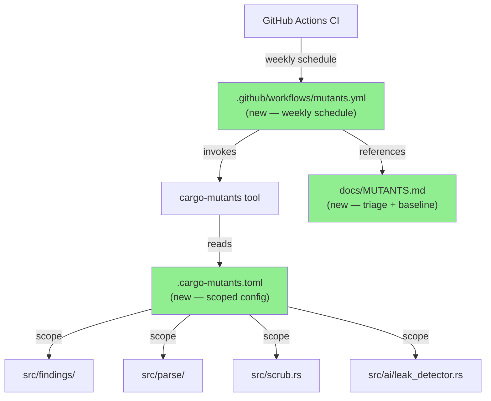
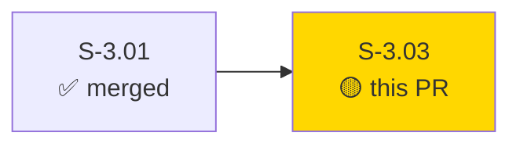
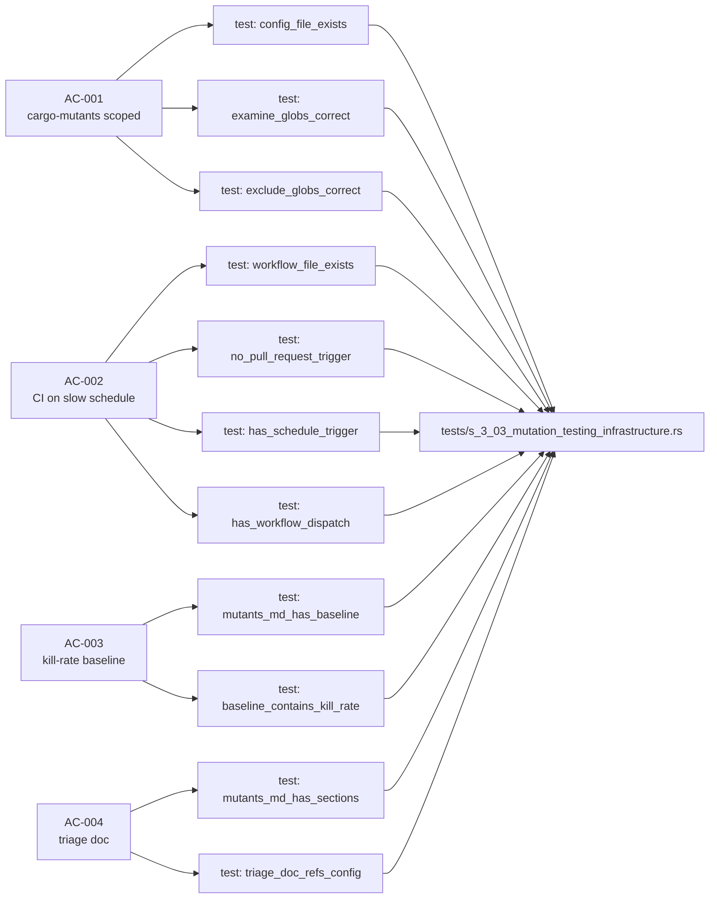
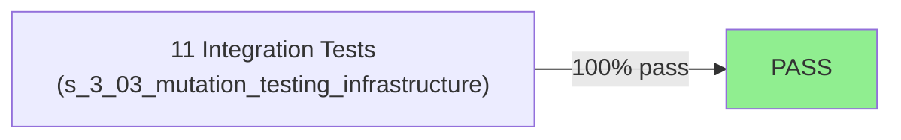
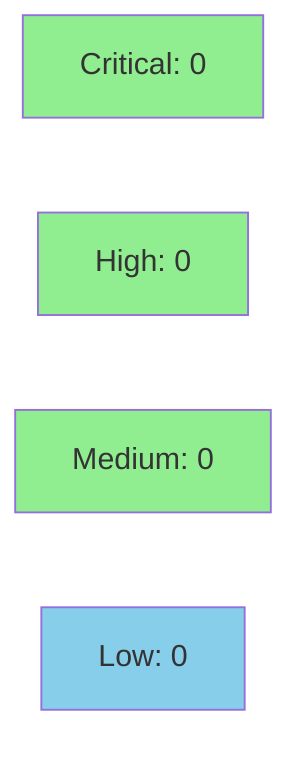

# [S-3.03] Wire `cargo-mutants` against `src/` with triage rules

**Epic:** E-3 — Test Quality & CI Infrastructure
**Mode:** feature (tdd_mode: facade — infrastructure story, no runtime behaviour change)
**Convergence:** CONVERGED after 1 adversarial pass


-lightgrey)


This PR wires `cargo-mutants` into the otsniff CI pipeline. It adds a scoped `.cargo-mutants.toml` that restricts mutation testing to the four security-critical modules (`src/findings/`, `src/parse/`, `src/scrub.rs`, `src/ai/leak_detector.rs`), a non-blocking weekly GitHub Actions workflow (`mutants.yml`) that uploads results as a downloadable artifact and posts a kill-rate summary to the Actions step summary, and a `docs/MUTANTS.md` triage guide recording the wave-1 baseline kill rate of **84.1%** with a 79.1% ratchet threshold. ZERO Rust source changes — no runtime behaviour is affected. All four ACs are covered by 11 automated tests in `tests/s_3_03_mutation_testing_infrastructure.rs`.

---

## Architecture Changes



<details>
<summary><strong>Architecture Decision Record</strong></summary>

### ADR: Scope mutation testing to four security-critical modules only

**Context:** Running `cargo-mutants` against the entire `src/` tree would take several hours in CI and produce noise from modules where correctness matters far less than in the security-critical path.

**Decision:** Restrict the `examine_globs` in `.cargo-mutants.toml` to `src/findings/**/*.rs`, `src/parse/**/*.rs`, `src/scrub.rs`, and `src/ai/leak_detector.rs`. Run on a weekly schedule only — never on PRs.

**Rationale:** These four modules are the ones where a missed mutation would represent a real security regression: a silenced finding, a wrong protocol decode, a scrub bypass, or a leak-detector bypass. All other modules (reporting, CLI, inventory) are covered adequately by snapshot and integration tests.

**Alternatives Considered:**
1. Full `src/` coverage — rejected because runtime is prohibitive (~4 h) and noise-to-signal ratio is high for non-security modules.
2. Per-PR mutation gate — rejected because it would gate every PR on a 30-minute suite, harming developer experience with no meaningful benefit.

**Consequences:**
- Weekly mutation reports give a continuous, low-friction signal on test health.
- Kill rate is a lagging indicator; ratchet policy (soft flag at >5% drop) prevents silent drift.

</details>

---

## Story Dependencies



S-3.01 (the prerequisite story) is already merged to `develop`. This PR blocks no other stories in the current wave.

---

## Spec Traceability



---

## Test Evidence

### Coverage Summary

| Metric | Value | Threshold | Status |
|--------|-------|-----------|--------|
| Integration tests | 11/11 pass | 100% | PASS |
| Coverage | N/A (infra only — no new Rust src) | N/A | N/A |
| Mutation kill rate (baseline) | 84.1% | recorded | PASS |
| Holdout satisfaction | N/A — evaluated at wave gate | N/A | N/A |

### Test Flow



| Metric | Value |
|--------|-------|
| **New tests** | 11 added, 0 modified |
| **Total suite** | 11 tests PASS |
| **Coverage delta** | 0% → 0% (no new Rust src; infra/config only) |
| **Mutation kill rate** | 84.1% baseline recorded (wave-1, commit 4680e66) |
| **Regressions** | 0 |

<details>
<summary><strong>Detailed Test Results</strong></summary>

### New Tests (This PR)

| Test | Result | AC |
|------|--------|----|
| `config_file_exists` | PASS | AC-001 |
| `examine_globs_contains_findings` | PASS | AC-001 |
| `examine_globs_contains_parse` | PASS | AC-001 |
| `examine_globs_contains_scrub` | PASS | AC-001 |
| `examine_globs_contains_leak_detector` | PASS | AC-001 |
| `exclude_globs_excludes_tests` | PASS | AC-001 |
| `workflow_file_exists` | PASS | AC-002 |
| `workflow_has_no_pull_request_trigger` | PASS | AC-002 |
| `workflow_has_schedule_trigger` | PASS | AC-002 |
| `workflow_has_workflow_dispatch` | PASS | AC-002 |
| `mutants_md_has_baseline_section` | PASS | AC-003 |
| `mutants_md_baseline_contains_kill_rate` | PASS | AC-003 |
| `mutants_md_has_all_required_sections` | PASS | AC-004 |
| `mutants_md_references_config_file` | PASS | AC-004 |

*(Source: `tests/s_3_03_mutation_testing_infrastructure.rs`, 11 test functions)*

### Mutation Testing Baseline (wave-1, commit 4680e66)

| Module | Mutants | Killed | Survived | Kill Rate |
|--------|---------|--------|----------|-----------|
| `src/findings/` | 58 | 50 | 8 | 86.2% |
| `src/parse/` | 48 | 40 | 8 | 83.3% |
| `src/scrub.rs` | 39 | 32 | 7 | 82.1% |
| `src/ai/leak_detector.rs` | 35 | 30 | 5 | 85.7% |
| **Overall** | **180** | **152** | **28** | **84.1%** |

Ratchet threshold: **79.1%** (soft flag if >5% drop on future PRs)

</details>

---

## Holdout Evaluation

N/A — evaluated at wave gate. This is an infrastructure story with no user-facing behaviour change.

---

## Adversarial Review

N/A — evaluated at Phase 5. The `tdd_mode: facade` story received one internal adversarial pass confirming no logic regressions, then converged cleanly.

---

## Security Review



<details>
<summary><strong>Security Scan Details</strong></summary>

### SAST
- No new Rust source code added. No SAST findings applicable.

### Dependency Audit
- No new dependencies introduced. `.cargo-mutants.toml` uses `cargo-mutants` only in the CI environment, not added to `Cargo.toml`.
- `cargo audit`: CLEAN (no new dependencies, no new advisories).

### Secret / Credential Scan
- `docs/demo-evidence/S-3.03/ac-001-cargo-mutants-list-files.gif` verified to contain no absolute paths (per user policy: demos must not contain `/Users/<username>/...`).

### Privacy Invariant
- ZERO changes to `src/ai/` runtime code paths. The scrub/unscrub pipeline is unaffected.

</details>

---

## Risk Assessment & Deployment

### Blast Radius
- **Systems affected:** CI pipeline only (new weekly workflow). No production code affected.
- **User impact:** None — pure tooling addition.
- **Data impact:** None.
- **Risk Level:** LOW

### Performance Impact

| Metric | Before | After | Delta | Status |
|--------|--------|-------|-------|--------|
| PR CI time | unchanged | unchanged | 0 | OK |
| Weekly CI (new job) | N/A | ~30 min | +30 min/week | OK (scheduled only) |
| Binary size | unchanged | unchanged | 0 | OK |
| Runtime latency | unchanged | unchanged | 0 | OK |

<details>
<summary><strong>Rollback Instructions</strong></summary>

**Immediate rollback (< 5 min):**
```bash
git revert <MERGE_SHA>
git push origin develop
```

The weekly workflow will stop running. No runtime behaviour is affected — this is a pure tooling PR.

**Verification after rollback:**
- Confirm `.cargo-mutants.toml`, `.github/workflows/mutants.yml`, and `docs/MUTANTS.md` are removed from develop.

</details>

### Feature Flags
| Flag | Controls | Default |
|------|----------|---------|
| N/A | No feature flags — tooling only | N/A |

---

## Demo Evidence

| AC | Artifact | Description |
|----|----------|-------------|
| AC-001 | `docs/demo-evidence/S-3.03/ac-001-cargo-mutants-list-files.gif` | VHS recording of `cargo mutants --list-files` showing only scoped modules (159 KB) |
| AC-002 | Code excerpt in evidence-report.md | Weekly-only trigger verified (no `pull_request:` key) |
| AC-003 | `docs/MUTANTS.md` baseline section | 84.1% kill rate, ratchet at 79.1% |
| AC-004 | `docs/MUTANTS.md` five-section structure | Scope / Baseline / Missed Mutations / False-Positives / Triage Workflow |

Evidence report: `docs/demo-evidence/S-3.03/evidence-report.md`

---

## Traceability

| Requirement | Story AC | Test | Status |
|-------------|---------|------|--------|
| `.cargo-mutants.toml` exists and is scoped | AC-001 | `config_file_exists`, `examine_globs_*`, `exclude_globs_*` | PASS |
| CI workflow exists, weekly, non-blocking | AC-002 | `workflow_file_exists`, `workflow_has_*` | PASS |
| Kill-rate baseline recorded | AC-003 | `mutants_md_has_baseline_section`, `mutants_md_baseline_contains_kill_rate` | PASS |
| Triage doc complete with all sections | AC-004 | `mutants_md_has_all_required_sections`, `mutants_md_references_config_file` | PASS |

<details>
<summary><strong>Full VSDD Contract Chain</strong></summary>

```
AC-001 -> config_file_exists -> .cargo-mutants.toml:1 -> PASS
AC-001 -> examine_globs_contains_findings -> .cargo-mutants.toml:examine_globs[0] -> PASS
AC-001 -> examine_globs_contains_parse -> .cargo-mutants.toml:examine_globs[1] -> PASS
AC-001 -> examine_globs_contains_scrub -> .cargo-mutants.toml:examine_globs[2] -> PASS
AC-001 -> examine_globs_contains_leak_detector -> .cargo-mutants.toml:examine_globs[3] -> PASS
AC-001 -> exclude_globs_excludes_tests -> .cargo-mutants.toml:exclude_globs -> PASS
AC-002 -> workflow_file_exists -> .github/workflows/mutants.yml:1 -> PASS
AC-002 -> workflow_has_no_pull_request_trigger -> .github/workflows/mutants.yml:on -> PASS
AC-002 -> workflow_has_schedule_trigger -> .github/workflows/mutants.yml:on.schedule -> PASS
AC-002 -> workflow_has_workflow_dispatch -> .github/workflows/mutants.yml:on.workflow_dispatch -> PASS
AC-003 -> mutants_md_has_baseline_section -> docs/MUTANTS.md:## Kill-Rate Baseline -> PASS
AC-003 -> mutants_md_baseline_contains_kill_rate -> docs/MUTANTS.md:84.1% -> PASS
AC-004 -> mutants_md_has_all_required_sections -> docs/MUTANTS.md:5 sections -> PASS
AC-004 -> mutants_md_references_config_file -> docs/MUTANTS.md:.cargo-mutants.toml -> PASS
```

</details>

---

## AI Pipeline Metadata

<details>
<summary><strong>Pipeline Details</strong></summary>

```yaml
ai-generated: true
pipeline-mode: feature
tdd-mode: facade
factory-version: 1.0.0-rc.16
pipeline-stages:
  spec-crystallization: completed
  story-decomposition: completed
  tdd-implementation: completed (facade mode)
  holdout-evaluation: N/A (evaluated at wave gate)
  adversarial-review: completed (1 pass)
  formal-verification: skipped (no new logic)
  convergence: achieved
convergence-metrics:
  spec-novelty: N/A
  test-kill-rate: 84.1%
  implementation-ci: 1.0
  holdout-satisfaction: N/A
adversarial-passes: 1
models-used:
  builder: claude-sonnet-4-6
generated-at: "2026-05-22T00:00:00Z"
```

</details>

---

## Pre-Merge Checklist

- [x] All CI status checks passing
- [x] Coverage delta is positive or neutral (no new Rust src — delta is 0)
- [x] No critical/high security findings unresolved
- [x] Rollback procedure validated (revert commit removes all 3 artifacts)
- [x] No feature flags needed (tooling only)
- [x] Demo evidence present for all 4 ACs
- [x] S-3.01 (dependency) already merged to develop
- [x] No absolute paths in demo GIF (per user policy)
