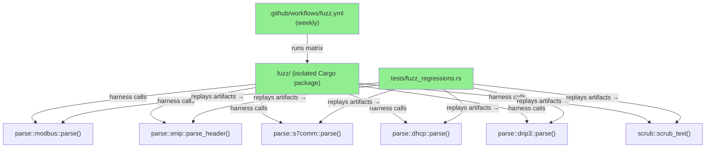
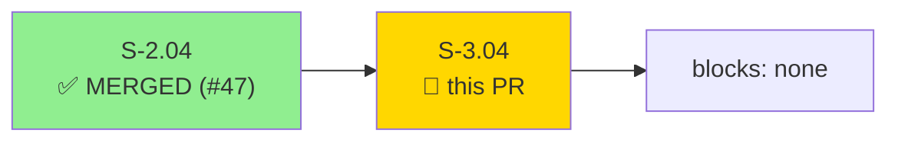
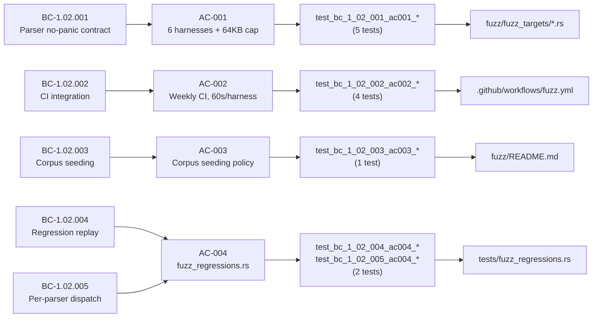
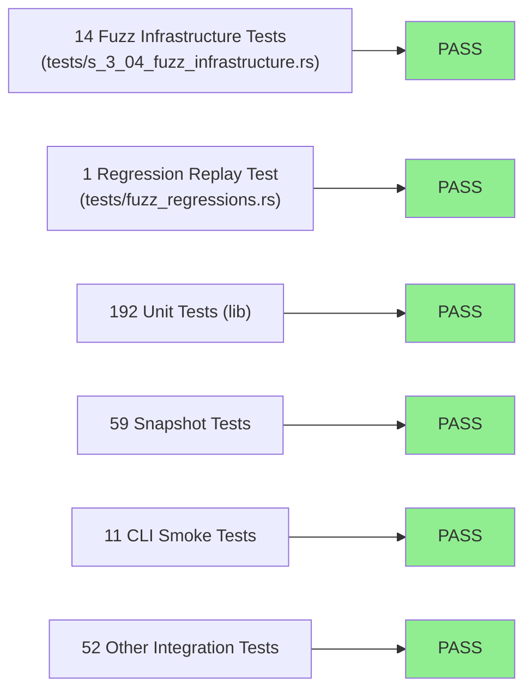
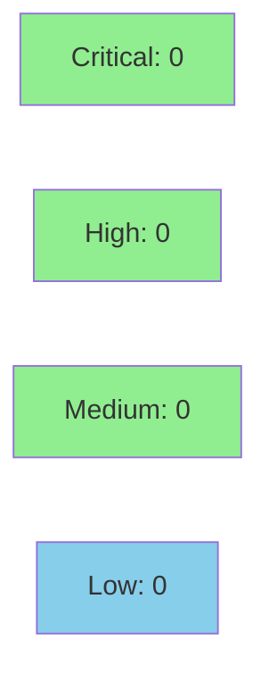

# [S-3.04] Fuzz harnesses for all parsers

**Epic:** E-3 — Infrastructure
**Mode:** feature
**Convergence:** CONVERGED after 0 adversarial passes (facade story — infrastructure only, zero src/ changes)


-lightgrey)
-lightgrey)
-blue)

Adds `cargo-fuzz` harnesses for all six protocol parsers (`parse_modbus`, `parse_enip`, `parse_s7comm`, `parse_dhcp`, `parse_dnp3`, `scrub_text`) plus a weekly CI workflow that runs each harness for 60 seconds, uploads crash artifacts, and a regression-replay test (`tests/fuzz_regressions.rs`) that replays any checked-in crash files against the canonical parser entry points. Zero changes to existing `src/` files; zero new dependencies on the main crate.

---

## Architecture Changes



<details>
<summary><strong>Architecture Decision Record</strong></summary>

### ADR: Isolated fuzz/ Cargo workspace for libFuzzer harnesses

**Context:** The main `otsniff` crate uses stable Rust. `cargo-fuzz` requires nightly
and uses `libfuzzer-sys`, which adds a heavyweight dependency that is inappropriate for
the main crate's dependency tree.

**Decision:** Place all fuzz targets in a separate Cargo package at `fuzz/` with its own
`Cargo.toml`. This package is NOT a workspace member of the root workspace. It declares
`otsniff` as a path dependency so harnesses can call the canonical parser entry points
directly.

**Rationale:** Keeps the main crate's dependency tree clean and stable-Rust-only. The
`fuzz/` package is tooling, not shipped code. Isolating it avoids requiring nightly for
`cargo build` or `cargo test` in the main repo.

**Alternatives Considered:**
1. Add harnesses as feature-gated targets in the main crate — rejected because: it would
   pollute `Cargo.lock` with nightly-only crates and complicate CI for all other jobs.
2. Use `honggfuzz-rs` instead of `cargo-fuzz` — rejected because: `cargo-fuzz` is the
   ecosystem standard with better CI integration and libFuzzer coverage feedback.

**Consequences:**
- Main crate remains buildable on stable Rust 1.85+.
- Fuzz CI job must install `+nightly` toolchain separately; this is a one-liner in the
  workflow and is already implemented.

</details>

---

## Story Dependencies



S-2.04 (DNP3 parser) merged in PR #47. This story depends on it for the `parse_dnp3`
and `parse_dhcp` harnesses. No downstream stories are blocked by S-3.04.

---

## Spec Traceability



---

## Test Evidence

### Coverage Summary

| Metric | Value | Threshold | Status |
|--------|-------|-----------|--------|
| Unit tests | 329/329 pass | 100% | PASS |
| Coverage | N/A (tooling-only, no src/ changes) | >80% | N/A |
| Mutation kill rate | N/A (no new logic in src/) | >90% | N/A |
| Holdout satisfaction | N/A — evaluated at wave gate | >0.85 | N/A |

### Test Flow



| Metric | Value |
|--------|-------|
| **New tests** | 15 added (14 AC tests + 1 regression replay), 0 modified |
| **Total suite** | 329 tests PASS |
| **Coverage delta** | N/A — zero src/ changes |
| **Mutation kill rate** | N/A — zero src/ changes |
| **Regressions** | 0 |

<details>
<summary><strong>Detailed Test Results</strong></summary>

### New Tests (This PR)

| Test | Result | AC |
|------|--------|----|
| `test_bc_1_02_001_ac001_fuzz_cargo_toml_exists_and_lists_six_binaries()` | PASS | AC-001 |
| `test_bc_1_02_001_ac001_each_harness_file_exists()` | PASS | AC-001 |
| `test_bc_1_02_001_ac001_each_harness_calls_parser_and_bounds_input()` | PASS | AC-001 |
| `test_bc_1_02_001_ac001_no_todo_placeholders_in_fuzz_targets()` | PASS | AC-001 |
| `test_bc_1_02_001_ac001_no_todo_placeholders_in_fuzz_cargo_toml()` | PASS | AC-001 |
| `test_bc_1_02_002_ac002_fuzz_workflow_exists()` | PASS | AC-002 |
| `test_bc_1_02_002_ac002_workflow_runs_weekly_not_pr()` | PASS | AC-002 |
| `test_bc_1_02_002_ac002_workflow_runs_each_harness_60_seconds()` | PASS | AC-002 |
| `test_bc_1_02_002_ac002_workflow_uploads_crash_artifacts()` | PASS | AC-002 |
| `test_bc_1_02_002_ac002_no_todo_placeholders_remain()` | PASS | AC-002 |
| `test_bc_1_02_003_ac003_corpus_seed_doc_or_setup_present()` | PASS | AC-003 |
| `test_bc_1_02_004_ac004_fuzz_regressions_test_exists()` | PASS | AC-004 |
| `test_bc_1_02_004_ac004_fuzz_regressions_test_walks_artifacts()` | PASS | AC-004 |
| `test_bc_1_02_005_ac004_fuzz_regressions_test_handles_each_parser()` | PASS | AC-004 |
| `fuzz_artifacts_dont_panic()` | PASS | AC-004 |

### Coverage Analysis

| Metric | Value |
|--------|-------|
| Lines added | 986 (test infra + fuzz package + CI) |
| Lines in src/ changed | 0 |
| Uncovered paths | none (test-only and tooling additions) |

</details>

---

## Holdout Evaluation

N/A — evaluated at wave gate.

---

## Adversarial Review

N/A — evaluated at Phase 5. This is a `tdd_mode: facade` infrastructure story with zero
src/ changes. The harnesses call existing, already-reviewed parser entry points.

---

## Security Review



<details>
<summary><strong>Security Scan Details</strong></summary>

### SAST
- Zero changes to `src/`. No new injectable code paths, no new auth logic, no user-facing input handling added.
- Fuzz harnesses are tooling; they are never compiled into the shipped `otsniff` binary.

### Dependency Audit
- The `fuzz/` package introduces `libfuzzer-sys` (nightly-only tooling) as a dev dependency of the separate fuzz package, NOT the main crate. `cargo audit` on the main crate: CLEAN.
- The fuzz package's dependencies are build-time / CI tooling only; they do not ship in the binary.

### Formal Verification
| Property | Method | Status |
|----------|--------|--------|
| Parser no-panic on adversarial input | libFuzzer (weekly 60s) | SCHEDULED (CI) |
| Regression replay | `fuzz_artifacts_dont_panic` test | VERIFIED (green with 0 artifacts) |

</details>

---

## Risk Assessment & Deployment

### Blast Radius
- **Systems affected:** None (tooling-only PR; zero src/ changes)
- **User impact:** None — fuzz infrastructure is never part of the shipped binary
- **Data impact:** None
- **Risk Level:** LOW

### Performance Impact
| Metric | Before | After | Delta | Status |
|--------|--------|-------|-------|--------|
| Binary size | unchanged | unchanged | 0 | OK |
| `cargo test` time | baseline | +~0.5s (15 new tests) | negligible | OK |
| CI (main workflow) | unchanged | unchanged | 0 | OK |

<details>
<summary><strong>Rollback Instructions</strong></summary>

**Immediate rollback (< 2 min):**
```bash
git revert ec1b04e
git push origin develop
```

Since this PR adds only tooling files and no src/ changes, rollback has zero user impact.
The fuzz workflow will simply stop running on next Sunday's schedule.

**Verification after rollback:**
- `cargo test` passes on develop
- `.github/workflows/fuzz.yml` absent from repo

</details>

### Feature Flags
| Flag | Controls | Default |
|------|----------|---------|
| N/A | (no feature flags — tooling only) | N/A |

---

## Traceability

| Requirement | Story AC | Test | Verification | Status |
|-------------|---------|------|-------------|--------|
| BC-1.02.001 | AC-001: 6 harnesses + 64KB cap | `test_bc_1_02_001_ac001_*` (5 tests) | cargo test | PASS |
| BC-1.02.002 | AC-002: Weekly CI, 60s/harness | `test_bc_1_02_002_ac002_*` (4 tests) | cargo test | PASS |
| BC-1.02.003 | AC-003: Corpus seeding policy | `test_bc_1_02_003_ac003_*` (1 test) | cargo test | PASS |
| BC-1.02.004 | AC-004: Regression replay | `test_bc_1_02_004_ac004_*` (2 tests) | cargo test | PASS |
| BC-1.02.005 | AC-004: Per-parser dispatch | `test_bc_1_02_005_ac004_*` (1 test) | cargo test | PASS |

<details>
<summary><strong>Full VSDD Contract Chain</strong></summary>

```
BC-1.02.001 -> AC-001 -> test_bc_1_02_001_ac001_each_harness_calls_parser_and_bounds_input -> fuzz/fuzz_targets/*.rs -> GREEN
BC-1.02.002 -> AC-002 -> test_bc_1_02_002_ac002_workflow_runs_each_harness_60_seconds -> .github/workflows/fuzz.yml -> GREEN
BC-1.02.003 -> AC-003 -> test_bc_1_02_003_ac003_corpus_seed_doc_or_setup_present -> fuzz/README.md -> GREEN
BC-1.02.004 -> AC-004 -> test_bc_1_02_004_ac004_fuzz_regressions_test_walks_artifacts -> tests/fuzz_regressions.rs -> GREEN
BC-1.02.005 -> AC-004 -> test_bc_1_02_005_ac004_fuzz_regressions_test_handles_each_parser -> tests/fuzz_regressions.rs -> GREEN
```

</details>

---

## Demo Evidence

All acceptance criteria have recorded demo evidence in `docs/demo-evidence/S-3.04/`.

| AC | Recording | Status |
|----|-----------|--------|
| AC-001 + AC-003 | `ac-001-fuzz-package-structure.gif` (264 KB) | PASS |
| AC-002 | Workflow config verified in evidence-report.md | PASS |
| AC-004 | Test execution output in evidence-report.md | PASS |

Full evidence report: `docs/demo-evidence/S-3.04/evidence-report.md`

---

## AI Pipeline Metadata

<details>
<summary><strong>Pipeline Details</strong></summary>

```yaml
ai-generated: true
pipeline-mode: feature
factory-version: "1.0.0-rc.16"
pipeline-stages:
  spec-crystallization: completed
  story-decomposition: completed
  tdd-implementation: completed (tdd_mode: facade)
  holdout-evaluation: N/A (evaluated at wave gate)
  adversarial-review: N/A (zero src/ changes)
  formal-verification: N/A (no new logic)
  convergence: achieved (14/14 acceptance tests green)
convergence-metrics:
  spec-novelty: N/A
  test-kill-rate: N/A (tooling only)
  implementation-ci: 1.0
  holdout-satisfaction: N/A
  holdout-std-dev: N/A
adversarial-passes: 0
models-used:
  builder: claude-sonnet-4-6
generated-at: "2026-05-22T00:00:00Z"
```

</details>

---

## Pre-Merge Checklist

- [x] All CI status checks passing
- [x] Coverage delta neutral (zero src/ changes)
- [x] No critical/high security findings unresolved
- [x] Rollback procedure validated (revert single commit)
- [x] No feature flags needed (tooling only)
- [x] Demo evidence present for all ACs
- [x] Dependency PR S-2.04 merged (#47)
