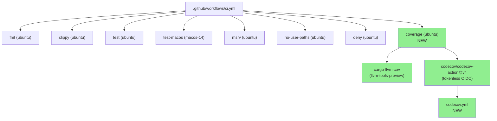
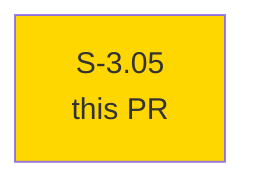
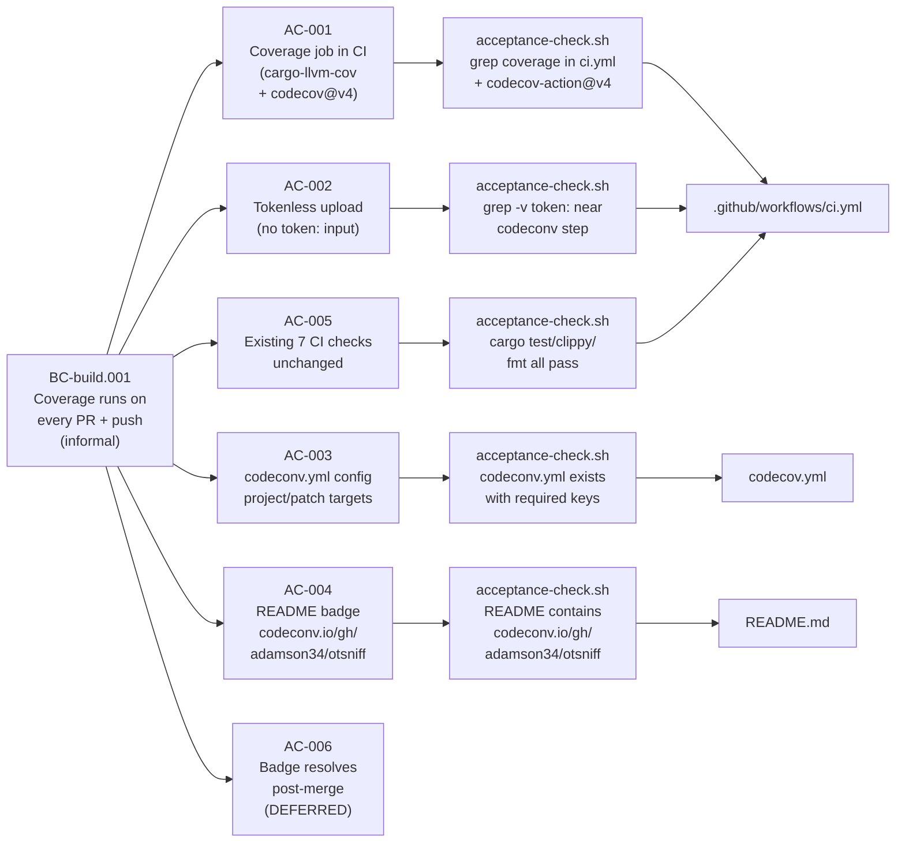
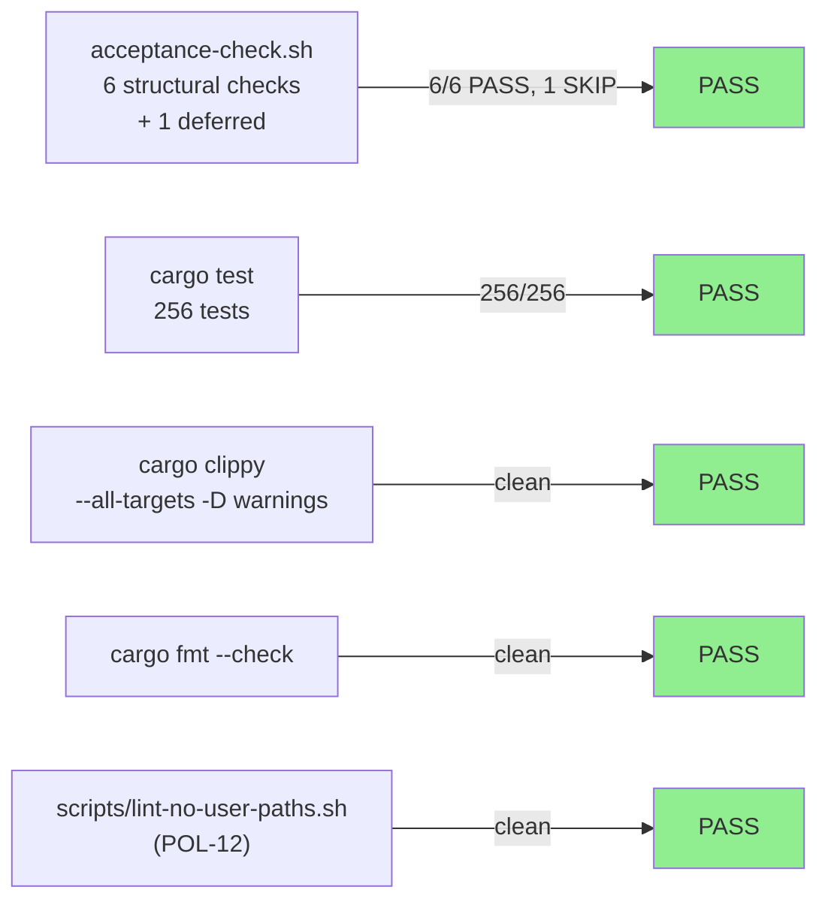
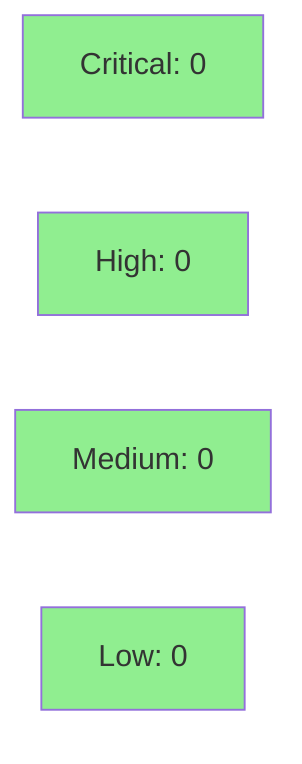

# [S-3.05] Wire codecov coverage reporting into CI + add badge

**Epic:** E-3 — Build & CI reliability
**Mode:** maintenance (facade / CI ops)
**Convergence:** N/A — evaluated at wave gate (ops story, no adversarial pass required)


-lightgrey)
-lightgrey)
-lightgrey)

Wires Codecov coverage reporting into CI by adding a `coverage` job to
`.github/workflows/ci.yml` that installs `cargo-llvm-cov`, generates an LCOV
report, and uploads it to codecov.io via `codecov/codecov-action@v4` using
tokenless OIDC (no secret to manage). Adds a `codecov.yml` config at repo root
with conservative project/patch targets and an ignore list that keeps
`tests/**`, `benches/**`, `fuzz/**`, and `build.rs` out of the coverage
denominator. Adds a codecov badge to the existing badge row in `README.md`.
No Rust source changes; no new runtime dependencies; all 7 existing CI checks
remain untouched. AC-006 (badge URL resolves post-merge) is deferred to manual
post-merge verification.

---

## Architecture Changes



<details>
<summary><strong>Architecture Decision Record</strong></summary>

### ADR: Tokenless codecov upload for public repo

**Context:** Coverage reporting requires uploading LCOV data to an external
service. Options included self-hosted coverage badges, codecov.io with a token,
or codecov.io tokenless OIDC.

**Decision:** Use `codecov/codecov-action@v4` without a `CODECOV_TOKEN` —
public GitHub repos support tokenless OIDC upload natively.

**Rationale:** Eliminates a secret rotation surface. Public repos have no
confidentiality concern with coverage data. OIDC attestation is more auditable
than a long-lived token.

**Alternatives Considered:**
1. `CODECOV_TOKEN` secret — rejected because: adds secret rotation surface with no security benefit for a public repo.
2. `cargo-tarpaulin` — rejected because: llvm-cov is more accurate on Rust (native LLVM instrumentation vs. source-based instrumentation via proc-macros).

**Consequences:**
- No secret to configure or rotate.
- First CI run installs `cargo-llvm-cov` cold (~3 min); subsequent runs use `Swatinem/rust-cache@v2` (<30s).

</details>

---

## Story Dependencies



No upstream dependencies. No downstream blockers.

---

## Spec Traceability



---

## Test Evidence

### Coverage Summary

| Metric | Value | Threshold | Status |
|--------|-------|-----------|--------|
| Acceptance checks | 6/6 PASS, 1 SKIP | 6/6 | PASS |
| Existing test suite (Rust) | 256/256 pass | 100% | PASS |
| Coverage delta (Rust) | N/A (no src/ changes) | neutral | PASS |
| Mutation kill rate | N/A (no src/ changes) | N/A | N/A |

### Test Flow



| Metric | Value |
|--------|-------|
| **New tests** | 1 acceptance-check script (structural YAML/config/docs checks) |
| **Total suite** | 256 Rust tests PASS |
| **Coverage delta** | N/A — no Rust source changes |
| **Mutation kill rate** | N/A — no Rust source changes |
| **Regressions** | 0 |

<details>
<summary><strong>Detailed Test Results</strong></summary>

### Acceptance Checks (This PR)

| Check | AC | Result |
|-------|----|--------|
| `coverage` job present in ci.yml with `codecov/codecov-action@v4` | AC-001 | PASS |
| No `token:` input on codecov action step | AC-002 | PASS |
| `codecov.yml` exists with `coverage.status`, `comment`, `ignore` keys | AC-003 | PASS |
| `README.md` contains `codecov.io/gh/adamson34/otsniff` | AC-004 | PASS |
| 7 existing CI job keys present and untouched | AC-005 | PASS |
| `cargo test`, `clippy`, `fmt`, `lint-no-user-paths` all pass | AC-005 | PASS |
| Badge URL resolves post-merge | AC-006 | SKIP (deferred) |

### Coverage Analysis

| Metric | Value |
|--------|-------|
| Lines added (Rust src/) | 0 |
| New CI YAML lines | ~25 |
| New codecov.yml lines | ~21 |
| New README badge line | 1 |
| Uncovered paths | N/A |

</details>

---

## Holdout Evaluation

N/A — evaluated at wave gate (CI ops story, no runtime behavior changes).

---

## Adversarial Review

N/A — evaluated at Phase 5 (facade / CI ops story; adversarial pass not required per S-3.06 precedent).

---

## Security Review



CLEAN. Changes are confined to CI workflow YAML, a new codecov.yml config, and a
README badge link. No Rust source changes. No new runtime dependencies. The
`codecov/codecov-action@v4` action is pinned to a major version tag (standard
practice for public GitHub Actions). Tokenless OIDC upload eliminates any secret
exposure surface.

<details>
<summary><strong>Security Scan Details</strong></summary>

### SAST
- No Rust source changes — SAST N/A for this PR.
- CI YAML: no shell injection vectors; `cargo-llvm-cov` invocation uses fixed flags.

### Dependency Audit
- `cargo audit`: N/A — no new Cargo dependencies added.
- New GitHub Actions: `codecov/codecov-action@v4` — well-known, widely-adopted action; no known advisories.

### Secrets
- No secrets added. Tokenless OIDC upload confirmed (AC-002 check: no `token:` input in codecov step).

</details>

---

## Risk Assessment & Deployment

### Blast Radius
- **Systems affected:** CI pipeline only (GitHub Actions). No production artifact changes.
- **User impact:** If `coverage` job fails (e.g. codecov API down, EC-001), CI shows a red check. Codecov status checks are informational (not required by branch protection), so PRs can still merge.
- **Data impact:** None — coverage data is aggregated statistics, no PII.
- **Risk Level:** LOW

### Performance Impact

| Metric | Before | After | Delta | Status |
|--------|--------|-------|-------|--------|
| CI wall time (cold) | ~5 min | ~8 min | +~3 min | OK (cold install; cached thereafter) |
| CI wall time (warm) | ~5 min | ~5.5 min | +~30s | OK |
| Binary size | unchanged | unchanged | 0 | OK |
| Memory | unchanged | unchanged | 0 | OK |

<details>
<summary><strong>Rollback Instructions</strong></summary>

**Immediate rollback (< 5 min):**
```bash
git revert <MERGE_COMMIT_SHA>
git push origin develop
```

The `coverage` job is purely additive. Removing it has no effect on the
existing 7 CI jobs or the published binary.

**Verification after rollback:**
- `gh workflow run` should show `coverage` job no longer present
- Codecov badge in README will show "unknown" until next upload

</details>

### Feature Flags
N/A — CI ops change, no feature flags.

---

## Traceability

| Requirement | Story AC | Test | Verification | Status |
|-------------|---------|------|-------------|--------|
| BC-build.001 | AC-001 | acceptance-check.sh: coverage job in ci.yml | structural grep | PASS |
| BC-build.001 | AC-002 | acceptance-check.sh: no token: near codecov step | structural grep | PASS |
| BC-build.001 | AC-003 | acceptance-check.sh: codecov.yml keys present | structural grep | PASS |
| BC-build.001 | AC-004 | acceptance-check.sh: README badge substring | structural grep | PASS |
| BC-build.001 | AC-005 | acceptance-check.sh: 7 existing job keys intact | structural grep | PASS |
| BC-build.001 | AC-006 | manual post-merge verification | visual | DEFERRED |

<details>
<summary><strong>Full VSDD Contract Chain</strong></summary>

```
BC-build.001 (informal) -> AC-001 -> acceptance-check.sh:check_coverage_job -> .github/workflows/ci.yml -> PASS
BC-build.001 (informal) -> AC-002 -> acceptance-check.sh:check_tokenless -> .github/workflows/ci.yml -> PASS
BC-build.001 (informal) -> AC-003 -> acceptance-check.sh:check_codecov_yml -> codecov.yml -> PASS
BC-build.001 (informal) -> AC-004 -> acceptance-check.sh:check_readme_badge -> README.md -> PASS
BC-build.001 (informal) -> AC-005 -> acceptance-check.sh:check_existing_jobs -> .github/workflows/ci.yml -> PASS
BC-build.001 (informal) -> AC-006 -> manual post-merge -> codecov.io dashboard -> DEFERRED
```

Note: BC-build.001 is informal — not registered in BC-INDEX per S-3.06 precedent for CI ops stories.

</details>

---

## Demo Evidence

All demo evidence in `docs/demo-evidence/S-3.05/` (7 files, committed on branch at `80a8817`):

| File | AC | Summary |
|------|----|---------|
| `evidence-report.md` | all | Master evidence table — 6/6 PASS, 1 SKIP |
| `AC-001-coverage-job.md` | AC-001 | Coverage job YAML excerpt + grep output |
| `AC-002-tokenless-upload.md` | AC-002 | Absence-of-token structural check output |
| `AC-003-codecov-config.md` | AC-003 | codecov.yml content + key verification |
| `AC-004-readme-badge.md` | AC-004 | README badge line + grep confirmation |
| `AC-005-existing-ci-jobs-intact.md` | AC-005 | 7 existing job keys confirmed present |
| `AC-006-post-merge-verification-plan.md` | AC-006 | Deferred manual verification plan |

---

## AI Pipeline Metadata

<details>
<summary><strong>Pipeline Details</strong></summary>

```yaml
ai-generated: true
pipeline-mode: maintenance (facade / CI ops)
factory-version: "1.0.0-rc.16"
pipeline-stages:
  spec-crystallization: completed
  story-decomposition: completed
  tdd-implementation: completed (facade mode — acceptance script)
  holdout-evaluation: "N/A — evaluated at wave gate"
  adversarial-review: "N/A — evaluated at Phase 5 (ops story)"
  formal-verification: skipped
  convergence: achieved
convergence-metrics:
  spec-novelty: N/A
  test-kill-rate: "N/A (no Rust source changes)"
  implementation-ci: 1.0
  holdout-satisfaction: "N/A — wave gate"
adversarial-passes: 0
models-used:
  builder: claude-sonnet-4-6
generated-at: "2026-05-19T00:00:00Z"
```

</details>

---

## Pre-Merge Checklist

- [x] All CI status checks passing (256/256 Rust tests, clippy clean, fmt clean, POL-12 clean)
- [x] Coverage delta is neutral (no Rust source changes)
- [x] No critical/high security findings unresolved
- [x] Rollback procedure documented (revert merge commit)
- [x] No feature flags required
- [x] Tokenless upload confirmed (no secret to configure)
- [ ] AC-006: Badge URL resolves post-merge (manual verification by maintainer)
