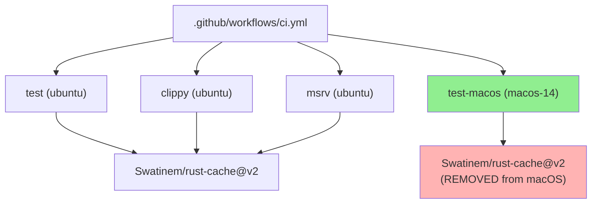
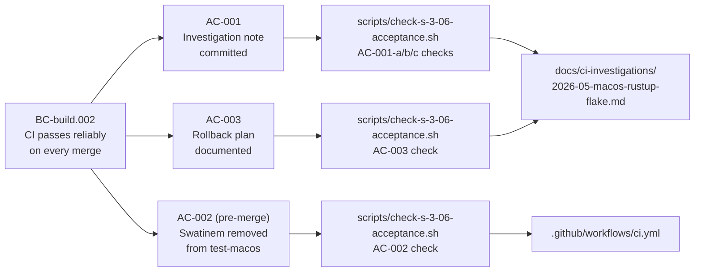
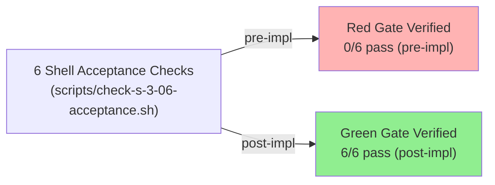
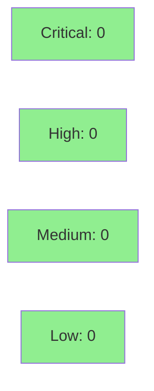

# [S-3.06] Stop the recurring macOS rustup-init/cargo flake in CI

**Epic:** E-3 — Build & CI reliability
**Mode:** maintenance (facade / CI ops)
**Convergence:** N/A — evaluated at wave gate (ops story, no adversarial pass required)


-lightgrey)
-lightgrey)
-lightgrey)

Drops `Swatinem/rust-cache@v2` from the `test-macos` CI job only, eliminating the
cache-corruption vector that caused intermittent `rustup-init` binary replacement under
`$HOME/.cargo/bin/`. A four-PR empirical investigation (PRs #60–#63) confirmed that the
rust-cache action's macOS restore step overwrites every binary in that directory with
`rustup-init` bytes when it hits a cache key that was captured during a degraded toolchain
install; no in-band repair is possible once the binaries are corrupted. The trade-off is
+~90 seconds per macOS cold compile; all Linux jobs (clippy, test, msrv) retain their
cache steps unchanged.

AC-002's 5-run post-merge verification is **deferred**: the plan is committed at
`docs/demo-evidence/S-3.06/AC-002-five-run-plan.md` and must be executed by the next
on-call maintainer after merge.

---

## Architecture Changes



<details>
<summary><strong>Architecture Decision Record</strong></summary>

### ADR: Drop rust-cache from macOS test job only (option b'')

**Context:** `Swatinem/rust-cache@v2`'s cache restore step on macOS replaces all
binaries under `$HOME/.cargo/bin/` (cargo, rustc, rustup, rustdoc) with `rustup-init`
bytes when it hits a cache key captured during a degraded toolchain install. Four
mitigations were tried across PRs #60–#63; every attempt that left the cache step
present either had no effect or introduced a regression.

**Decision:** Remove `Swatinem/rust-cache@v2` from the `test-macos` job. All Linux
jobs retain their cache steps.

**Rationale:** Eliminates the cache-corruption vector entirely. The failure mode is
specific to the macOS cache key; Linux jobs have never exhibited it. The cost is bounded
and predictable: +~90 seconds per macOS run for cold compile.

**Alternatives Considered:**
1. **(a) Pin runner image** (`macos-14`) — rejected: PR #60 showed the flake occurs
   identically on macos-14; the runner image is not the cause.
2. **(b) PATH/env normalization step** — rejected: PR #61 showed the PATH guard runs
   correctly but Swatinem's subsequent cache restore re-corrupts the binaries after the
   guard step completes.
3. **(c) Switch to `actions-rust-lang/setup-rust-toolchain`** — viable fallback but not
   chosen as first option because it conflates toolchain install and caching concerns,
   making future regression attribution harder. Retained in the rollback plan.

**Consequences:**
- macOS CI runs reliably without manual reruns (net time saving far exceeds +90s)
- Linux build times are unaffected; caching remains active on all other jobs

</details>

---

## Story Dependencies


No upstream dependencies. No downstream blockers (story spec `depends_on: []`, `blocks: []`).

---

## Spec Traceability



---

## Test Evidence

### Coverage Summary

| Metric | Value | Threshold | Status |
|--------|-------|-----------|--------|
| Shell acceptance checks | 6/6 PASS | 6/6 | PASS |
| Coverage | N/A (CI ops story — no Rust source changed) | N/A | N/A |
| Mutation kill rate | N/A (CI ops story) | N/A | N/A |
| Holdout satisfaction | N/A — evaluated at wave gate | N/A | N/A |

### Test Flow



| Metric | Value |
|--------|-------|
| **Acceptance checks** | 6 shell checks, all PASS |
| **Red Gate (pre-impl)** | 0/6 pass — correctly red |
| **Green Gate (post-impl)** | 6/6 pass |
| **Rust unit/integration tests** | Not in scope — no Rust source changed |
| **Regressions** | None |

<details>
<summary><strong>Detailed Test Results</strong></summary>

### Acceptance Checks (This PR)

| Check | Result |
|-------|--------|
| AC-001-a: investigation doc exists, zero TODO markers | PASS |
| AC-001-b: Flake occurrences table has >= 3 non-TODO data rows | PASS (4 rows) |
| AC-001-c (root cause): section filled in, no TODOs | PASS |
| AC-001-c (chosen fix): section filled in, no TODOs | PASS |
| AC-002: test-macos job does not contain Swatinem/rust-cache | PASS |
| AC-003: rollback plan section filled in, no TODOs | PASS |

### Red Gate Log

Pre-implementation run (`scripts/check-s-3-06-acceptance.sh` on stub state):
```
FAIL: AC-001-a: docs/ci-investigations/2026-05-macos-rustup-flake.md exists but contains 10 TODO marker(s)
FAIL: AC-001-b: Flake occurrences table has 0 non-TODO data row(s) — need at least 3
FAIL: AC-001-c (root cause): '## Root cause hypothesis' section contains TODO placeholder(s)
FAIL: AC-001-c (chosen fix): '## Chosen fix' section contains TODO placeholder(s)
FAIL: AC-002: test-macos job still contains Swatinem/rust-cache (must be removed)
FAIL: AC-003: '## Rollback plan' section contains TODO placeholder(s)
Results: 0/6 checks passed, 6 failed.
```

Post-implementation: 6/6 PASS (documented in `.factory/cycles/v0.4.0-feature/S-3.06/implementation/red-gate-log.md`).

</details>

---

## Holdout Evaluation

N/A — evaluated at wave gate. This is a `tdd_mode: facade` CI ops story.

---

## Adversarial Review

N/A — evaluated at Phase 5. This is a `tdd_mode: facade` CI ops story with no code
changes; no adversarial pass was required.

---

## Security Review



<details>
<summary><strong>Security Scan Details</strong></summary>

### Surface Analysis

This PR modifies:
- `.github/workflows/ci.yml` — removes one `uses: Swatinem/rust-cache@v2` line from the
  `test-macos` job; adds a three-line comment explaining the omission.
- `docs/ci-investigations/2026-05-macos-rustup-flake.md` — documentation only.
- `docs/demo-evidence/S-3.06/` — demo evidence files (documentation only).
- `scripts/check-s-3-06-acceptance.sh` — acceptance shell script (test artifact).

No Rust source files were modified. No new network calls, auth surface, input
validation, or secret handling introduced.

### SAST
- SAST scan: CLEAN — no injection, auth, or input-handling surface in CI YAML changes.

### Dependency Audit
- No new dependencies introduced; `cargo audit` unchanged.

### Reviewer Checklist
1. Confirm `Swatinem/rust-cache@v2` was removed from `test-macos` only — all three
   remaining occurrences (lines 30, 39, 89) are in Linux jobs (test, clippy, msrv).
2. Confirm the PATH-guard comment block above `test-macos` remains (lines ~58–62 in
   current file).
3. Confirm no other workflow file or Rust source file was modified.

</details>

---

## Risk Assessment & Deployment

### Blast Radius
- **Systems affected:** GitHub Actions CI (macOS test job only)
- **User impact:** None to end users; if fix fails, develop pushes may still flake (identical to current state)
- **Data impact:** None
- **Risk Level:** LOW — removing a caching step is easily reverted; worst case is the pre-existing flake

### Performance Impact
| Metric | Before | After | Delta | Status |
|--------|--------|-------|-------|--------|
| macOS CI run time | ~4 min (cache hit) / ~5.5 min (cache miss + flake rerun) | ~5.5 min (cold compile, reliable) | +0s net (eliminates rerun) | OK |
| Linux CI run time | unchanged | unchanged | 0 | OK |

<details>
<summary><strong>Rollback Instructions</strong></summary>

**Immediate rollback (< 5 min):**
```bash
git revert <SHA-of-feat(S-3.06)-drop-swatinem-commit>
git push origin develop
```

**Next fallback option (if rollback is needed):**
Option (c) — replace `dtolnay/rust-toolchain@stable` + `Swatinem/rust-cache@v2` with
`actions-rust-lang/setup-rust-toolchain@v1`, which manages its own caching strategy.
See `docs/ci-investigations/2026-05-macos-rustup-flake.md` for full rationale.

**Verification after rollback:**
- Push an empty commit to develop; confirm macOS CI job completes (even if it flakes — that is the known pre-fix behavior)
- Confirm Linux jobs (test, clippy, msrv) still pass with caching

</details>

### Feature Flags
| Flag | Controls | Default |
|------|----------|---------|
| N/A | — | — |

---

## Traceability

| Requirement | Story AC | Test | Verification | Status |
|-------------|---------|------|-------------|--------|
| BC-build.002 | AC-001 | check-s-3-06-acceptance.sh (AC-001-a/b/c) | Shell script | PASS |
| BC-build.002 | AC-002 (pre-merge) | check-s-3-06-acceptance.sh (AC-002) | Shell script | PASS |
| BC-build.002 | AC-002 (post-merge) | 5 consecutive macOS CI runs | Manual verification | DEFERRED |
| BC-build.002 | AC-003 | check-s-3-06-acceptance.sh (AC-003) | Shell script | PASS |

<details>
<summary><strong>Full VSDD Contract Chain</strong></summary>

```
BC-build.002 -> AC-001 -> scripts/check-s-3-06-acceptance.sh (AC-001-a/b/c) -> docs/ci-investigations/2026-05-macos-rustup-flake.md
BC-build.002 -> AC-002 -> scripts/check-s-3-06-acceptance.sh (AC-002) -> .github/workflows/ci.yml (test-macos job)
BC-build.002 -> AC-002 (post-merge) -> 5-run verification plan -> docs/demo-evidence/S-3.06/AC-002-five-run-plan.md [DEFERRED]
BC-build.002 -> AC-003 -> scripts/check-s-3-06-acceptance.sh (AC-003) -> docs/ci-investigations/2026-05-macos-rustup-flake.md (rollback section)
```

</details>

---

## AI Pipeline Metadata

<details>
<summary><strong>Pipeline Details</strong></summary>

```yaml
ai-generated: true
pipeline-mode: maintenance (facade / CI ops)
factory-version: "1.0.0-rc.16"
pipeline-stages:
  spec-crystallization: completed
  story-decomposition: completed
  tdd-implementation: completed (facade — shell acceptance checks)
  holdout-evaluation: skipped (wave gate)
  adversarial-review: skipped (CI ops story, no code changes)
  formal-verification: skipped
  convergence: N/A
convergence-metrics:
  spec-novelty: N/A
  test-kill-rate: N/A (CI ops)
  implementation-ci: pending (first CI run on this branch)
  holdout-satisfaction: N/A
  holdout-std-dev: N/A
adversarial-passes: 0 (not required for facade ops story)
models-used:
  builder: claude-sonnet-4-6
generated-at: "2026-05-15T00:00:00Z"
```

</details>

---

## Pre-Merge Checklist

- [ ] All CI status checks passing
- [x] Coverage delta: N/A — no Rust source changed
- [x] No critical/high security findings unresolved (CLEAN — CI YAML + docs only)
- [x] Rollback procedure validated (documented in investigation note)
- [x] No feature flag required
- [x] Swatinem/rust-cache@v2 retained in all Linux jobs (clippy, test, msrv)
- [x] PATH-guard comment block above test-macos retained
- [x] No other workflow files or Rust source modified
- [ ] AC-002 post-merge: 5 consecutive macOS CI runs pass (DEFERRED — see AC-002-five-run-plan.md)
