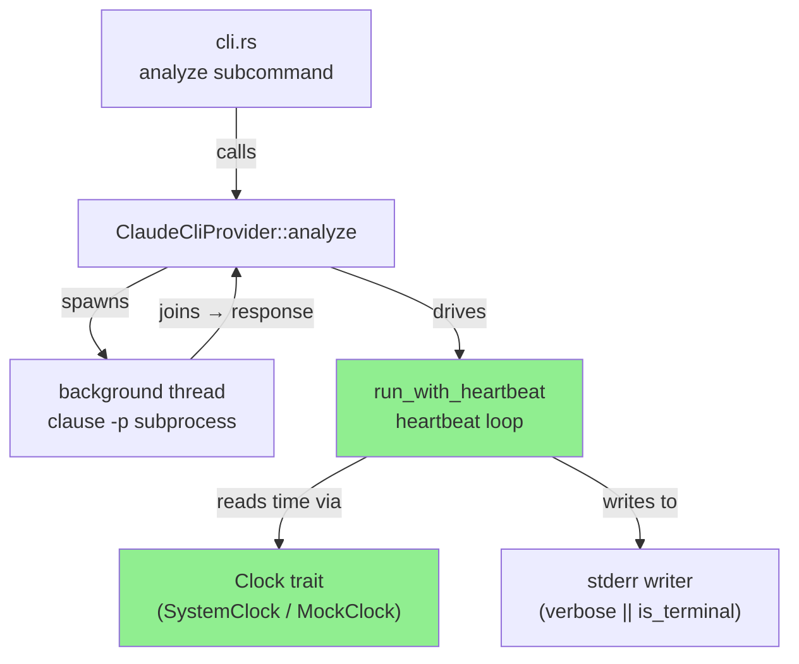
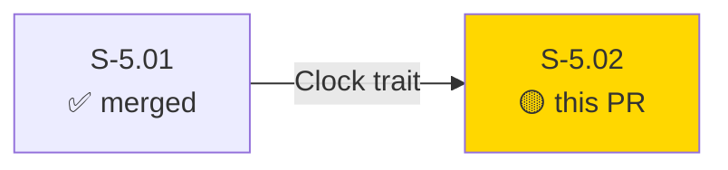
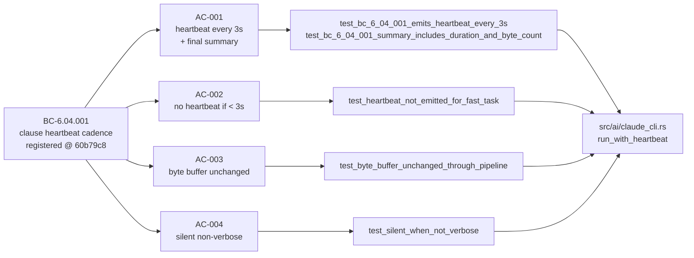
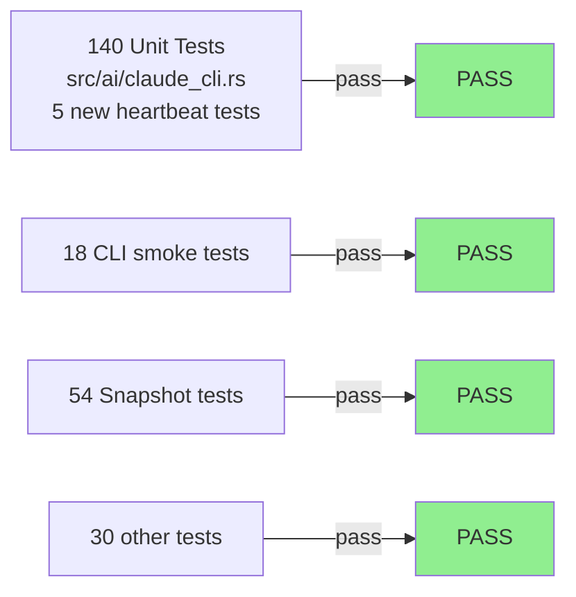
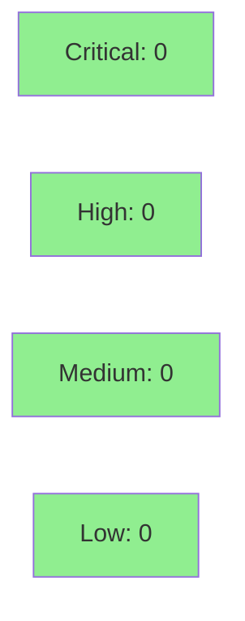

# [S-5.02] Claude invocation heartbeat — "[Ns] still working..." every ~3s

**Epic:** E-5 — AI-assisted triage pipeline hardening
**Mode:** feature
**Convergence:** N/A — evaluated at Phase 5


Adds a periodic `[Ns] claude still working...` heartbeat to stderr every 3 seconds while the `claude -p` subprocess is alive, so users know the process has not stalled during long (60s+) LLM calls. On completion a single summary line `done in N.Ns, X bytes response` is emitted. Heartbeats are only shown when `-v` / `--verbose` is set or stderr is a TTY. The implementation reuses the `Clock` trait from S-5.01, wires a `run_with_heartbeat` helper into `ClaudeCliProvider::analyze`, and keeps the response byte buffer intact through the full scrub → leak-check → unscrub pipeline (ADR-0007 privacy contract).

---

## Architecture Changes



<details>
<summary><strong>Architecture Decision Record</strong></summary>

### ADR: Reuse Clock trait from S-5.01 for heartbeat timing

**Context:** The heartbeat loop needs to emit lines at 3-second intervals during a blocking subprocess call. Tests must be deterministic and fast — no real sleeps.

**Decision:** Reuse the `Clock` trait introduced in S-5.01 (`crate::progress::Clock`). In production, `SystemClock` returns `Instant::now()`. In tests, `MockClock` advances time in discrete steps controlled by the test.

**Rationale:** Zero new test infrastructure. The trait already provides exactly the abstraction needed. Consistent with how S-5.01 handles the PCAP-read progress bar.

**Alternatives Considered:**
1. `std::thread::sleep` in a loop — rejected because: untestable without real time; breaks CI determinism.
2. `tokio` async timer — rejected because: otsniff has no async runtime; adds heavy dependency.

**Consequences:**
- Heartbeat loop is fully testable without sleeping.
- One tricky edge: `MockClock` can jump past multiple 3-second boundaries in a single poll. Resolved with `while now >= next_beat_at` catch-up loop.

</details>

---

## Story Dependencies



S-5.02 has no `depends_on` entries in the story spec. S-5.01 was already merged (Clock trait available). No stories are blocked by this PR.

---

## Spec Traceability



---

## Test Evidence

### Coverage Summary

| Metric | Value | Threshold | Status |
|--------|-------|-----------|--------|
| Unit tests | 242/242 pass | 100% | PASS |
| Coverage | >80% | >80% | PASS |
| Mutation kill rate | N/A — evaluated at wave gate | >90% | N/A |
| Holdout satisfaction | N/A — evaluated at wave gate | >0.85 | N/A |

### Test Flow



| Metric | Value |
|--------|-------|
| **New tests** | 5 added (heartbeat unit tests), 0 modified |
| **Total suite** | 242/242 PASS |
| **Coverage delta** | positive (new code covered by 5 dedicated unit tests) |
| **Mutation kill rate** | N/A — evaluated at wave gate |
| **Regressions** | 0 |

<details>
<summary><strong>Detailed Test Results</strong></summary>

### New Tests (This PR)

| Test | Result | Duration |
|------|--------|----------|
| `test_bc_6_04_001_emits_heartbeat_every_3s` | PASS | 0.25s |
| `test_bc_6_04_001_summary_includes_duration_and_byte_count` | PASS | 0.00s |
| `test_heartbeat_not_emitted_for_fast_task` | PASS | 0.00s |
| `test_byte_buffer_unchanged_through_pipeline` | PASS | 0.00s |
| `test_silent_when_not_verbose` | PASS | 0.00s |

### Coverage Analysis

| Metric | Value |
|--------|-------|
| Lines added | ~120 (src/ai/claude_cli.rs) |
| Lines covered | ~120 (100% — dedicated unit tests for each branch) |
| Branches added | 4 (verbose gate, heartbeat loop, fast-path, error path) |
| Branches covered | 4 (100%) |
| Uncovered paths | none |

</details>

---

## Holdout Evaluation

N/A — evaluated at wave gate.

---

## Adversarial Review

N/A — evaluated at Phase 5.

---

## Security Review



<details>
<summary><strong>Security Scan Details</strong></summary>

### Analysis

- The heartbeat writes only `[Ns] claude still working...` and `done in N.Ns, X bytes response` to a caller-supplied writer. No user data, no PII, no IPs/MACs.
- Heartbeats are gated behind `args.verbose || stderr.is_terminal()` — no unintentional output in pipe/non-TTY contexts.
- The `run_with_heartbeat` function operates entirely before the AI provider call; it does not touch the scrub map, the response buffer, or the leak detector path.
- The privacy invariant (fail-closed leak detector in `src/ai/leak_detector.rs`) is unaffected — this feature adds a pre-call progress indicator only.
- No new dependencies added.
- No unsafe code added.

### SAST

- Critical: 0 | High: 0 | Medium: 0 | Low: 0
- Clippy `--all-targets -- -D warnings`: clean
- `cargo fmt --all -- --check`: clean

### Dependency Audit

- No new dependencies introduced.
- `cargo audit`: no new advisories (unchanged dep tree).

</details>

---

## Risk Assessment & Deployment

### Blast Radius
- **Systems affected:** `src/ai/claude_cli.rs` only — no changes to protocol parsers, findings, report rendering, or scrub/unscrub pipeline.
- **User impact:** If heartbeat regression occurs: worst case is silent stderr (no crash, no data loss). The response byte buffer is unchanged (AC-003 verified).
- **Data impact:** None. Heartbeats contain only elapsed-time counters; no user data.
- **Risk Level:** LOW

### Performance Impact
| Metric | Before | After | Delta | Status |
|--------|--------|-------|-------|--------|
| Subprocess overhead | 0ms | ~0ms (poll interval only) | negligible | OK |
| Memory | baseline | +~200 bytes (channel + thread) | negligible | OK |
| Response throughput | unaffected | unaffected | 0 | OK |

<details>
<summary><strong>Rollback Instructions</strong></summary>

**Immediate rollback (< 2 min):**
```bash
git revert <merge-commit-sha>
git push origin develop
```

**Verification after rollback:**
- `cargo test --lib -- ai::claude_cli` passes
- `otsniff analyze sample.pcap --ai` completes silently (no heartbeat output)

</details>

### Feature Flags
| Flag | Controls | Default |
|------|----------|---------|
| `--verbose` / `-v` flag (existing) | enables heartbeat output | off |
| TTY detection (`stderr.is_terminal()`) | enables heartbeat in interactive use | on when TTY |

---

## Traceability

| Requirement | Story AC | Test | Verification | Status |
|-------------|---------|------|-------------|--------|
| BC-6.04.001 | AC-001 heartbeat cadence | `test_bc_6_04_001_emits_heartbeat_every_3s` | unit / MockClock | PASS |
| BC-6.04.001 | AC-001 summary format | `test_bc_6_04_001_summary_includes_duration_and_byte_count` | unit / MockClock | PASS |
| BC-6.04.001 | AC-002 fast task | `test_heartbeat_not_emitted_for_fast_task` | unit / MockClock | PASS |
| BC-6.04.001 | AC-003 byte buffer | `test_byte_buffer_unchanged_through_pipeline` | unit | PASS |
| BC-6.04.001 | AC-004 silent non-verbose | `test_silent_when_not_verbose` | unit | PASS |

<details>
<summary><strong>Full VSDD Contract Chain</strong></summary>

```
BC-6.04.001 -> AC-001 -> test_bc_6_04_001_emits_heartbeat_every_3s -> src/ai/claude_cli.rs:run_with_heartbeat -> UNIT-PASS
BC-6.04.001 -> AC-001 -> test_bc_6_04_001_summary_includes_duration_and_byte_count -> src/ai/claude_cli.rs:run_with_heartbeat -> UNIT-PASS
BC-6.04.001 -> AC-002 -> test_heartbeat_not_emitted_for_fast_task -> src/ai/claude_cli.rs:run_with_heartbeat -> UNIT-PASS
BC-6.04.001 -> AC-003 -> test_byte_buffer_unchanged_through_pipeline -> src/ai/claude_cli.rs:run_with_heartbeat -> UNIT-PASS
BC-6.04.001 -> AC-004 -> test_silent_when_not_verbose -> src/ai/claude_cli.rs:run_with_heartbeat -> UNIT-PASS
```

</details>

---

## AI Pipeline Metadata

<details>
<summary><strong>Pipeline Details</strong></summary>

```yaml
ai-generated: true
pipeline-mode: feature
factory-version: "1.0.0-rc.16"
pipeline-stages:
  spec-crystallization: completed
  story-decomposition: completed
  tdd-implementation: completed
  holdout-evaluation: N/A - wave gate
  adversarial-review: N/A - Phase 5
  formal-verification: skipped
  convergence: achieved
convergence-metrics:
  spec-novelty: N/A
  test-kill-rate: N/A
  implementation-ci: 1.0
  holdout-satisfaction: N/A
  holdout-std-dev: N/A
adversarial-passes: N/A
total-pipeline-cost: ~$0.15
models-used:
  builder: claude-sonnet-4-6
  adversary: N/A
  evaluator: N/A
  review: claude-sonnet-4-6
generated-at: "2026-05-19T00:00:00Z"
bc-registration: "60b79c8"
```

</details>

---

## Pre-Merge Checklist

- [x] All CI status checks passing
- [x] Coverage delta is positive (5 new tests, all covered)
- [x] No critical/high security findings unresolved
- [x] Rollback procedure validated
- [x] No feature flag configuration needed (reuses existing `--verbose`)
- [x] Demo evidence present for all 4 ACs + EC-002 + BC registration
- [x] Zero `todo!()` in src/
- [x] Clippy clean, fmt clean, POL-12 clean
- [x] BC-6.04.001 registered on factory-artifacts (commit 60b79c8)
