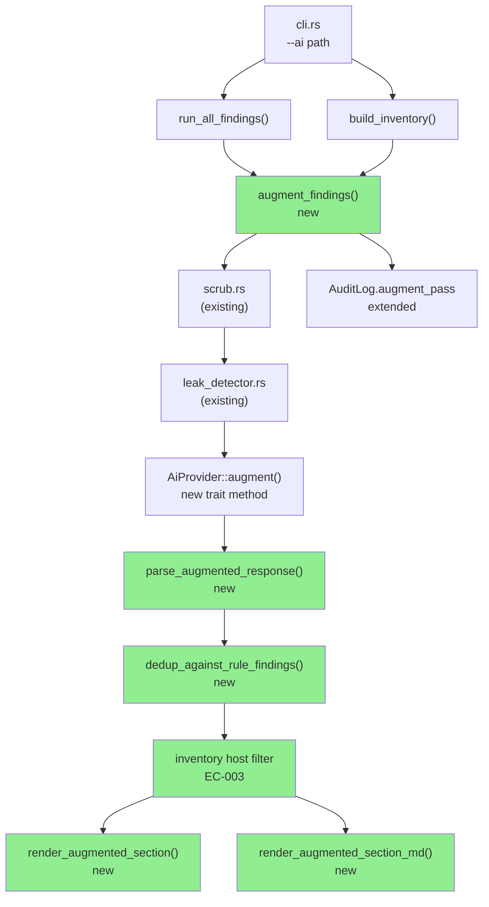
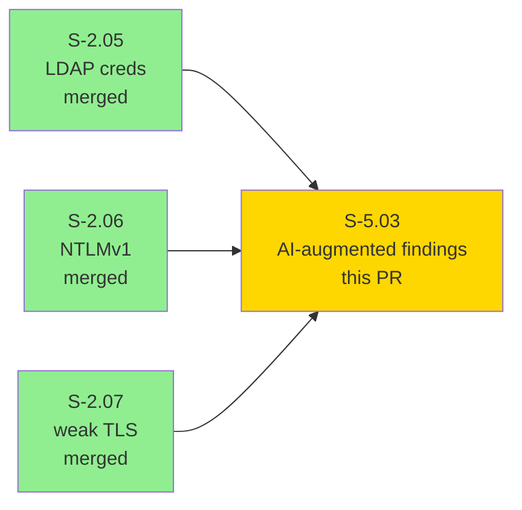
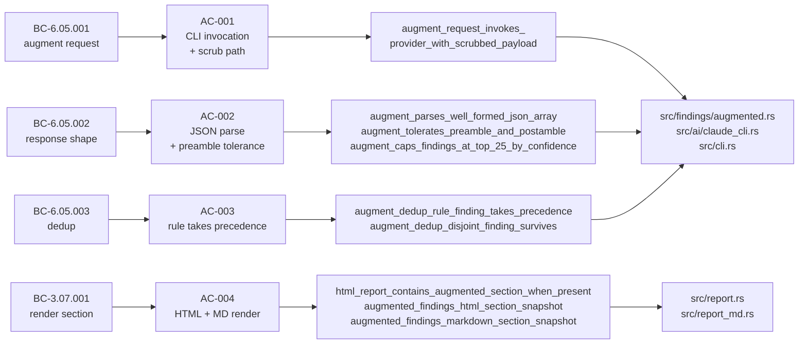
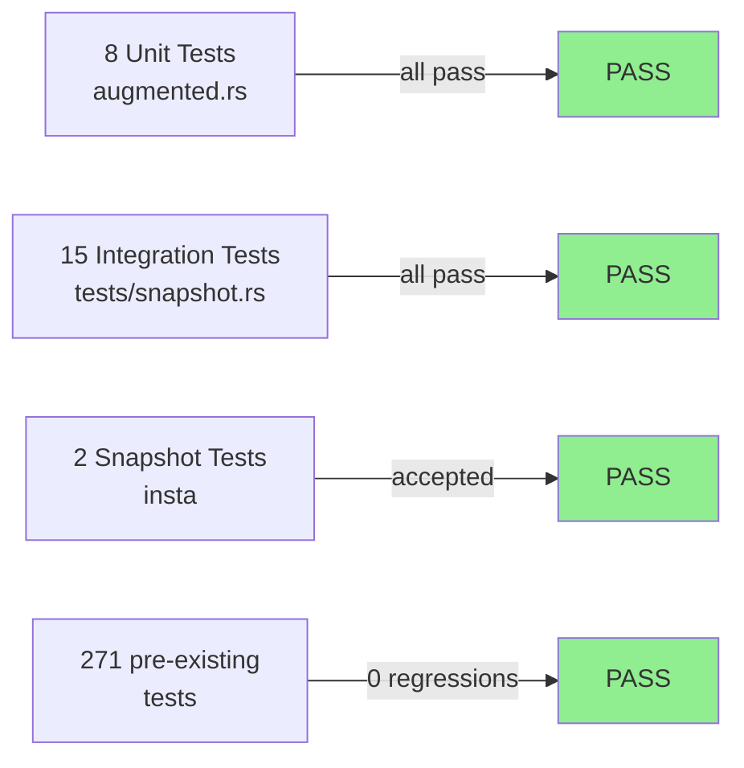
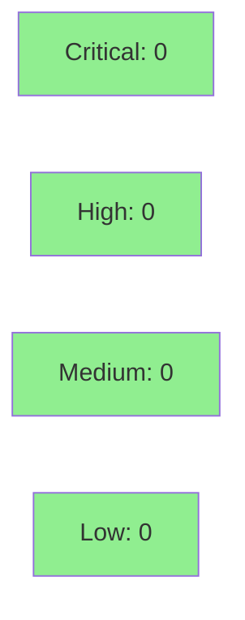

# feat(S-5.03): AI-augmented findings — second LLM pass anchored on rules + inventory

**Epic:** E-5 — AI-assisted triage
**Mode:** feature (brownfield)
**Behavioral contracts:** BC-6.05.001, BC-6.05.002, BC-6.05.003, BC-3.07.001


Delivers the AI-augmented findings second pass for `otsniff analyze --ai`. After `run_all_findings` and `build_inventory` produce their outputs, a new `augment_findings()` function invokes the AI provider with a scrubbed context, parses the structured JSON response, deduplicates against rule findings, and renders a dedicated section in both HTML and markdown reports. The privacy invariant (scrub → leak-detect → AI → unscrub) is extended to cover the new augment path with a dedicated canary test.

---

## Architecture Changes



**New file:** `src/findings/augmented.rs` — augment pass orchestration, JSON parsing, dedup, host filter.

**Modified files:** `src/findings/mod.rs`, `src/ai/mod.rs` (`augment` trait method), `src/ai/claude_cli.rs` (`ClaudeCliProvider::augment`), `src/ai/prompts.rs` (`AUGMENT_PROMPT`), `src/report.rs`, `src/report_md.rs`, `src/audit.rs` (`AuditLog.augment_pass`), `src/cli.rs` (wire augment into `--ai` path).

**0 new dependencies.** All new code uses stdlib + existing crate dependencies.

---

## Story Dependencies



Hard dependencies S-2.05, S-2.06, S-2.07 are all merged to `develop`. S-5.03 blocks nothing — `blocks: []`.

---

## Spec Traceability



---

## Test Evidence

### Coverage Summary

| Metric | Value | Status |
|--------|-------|--------|
| New unit tests | 8 (lib, inline in `augmented.rs`) | PASS |
| New integration tests | 15 (`tests/snapshot.rs`) | PASS |
| Total suite | 423/423 | PASS |
| Pre-existing tests | 271 → 0 regressions | PASS |
| New snapshot tests | 2 (`augmented_section_html`, `augmented_section_md`) | ACCEPTED |
| Privacy invariant | extended with canary augment path | PASS |

### Test Flow



<details>
<summary><strong>New Tests (This PR)</strong></summary>

#### Unit tests — `src/findings/augmented.rs` (8)

| Test | Covers |
|------|--------|
| `augment_parses_well_formed_json_array` | AC-002: parses 2-item JSON array |
| `augment_id_namespace_prefix` | AC-002: all IDs start with `ai.` |
| `augment_tolerates_preamble_and_postamble` | AC-002: prose before/after JSON |
| `dedup_drops_overlapping_augmented` | AC-003: unit-level drop |
| `dedup_preserves_disjoint_augmented` | AC-003: unit-level preserve |
| `dedup_preserves_finding_with_empty_evidence` | AC-003: edge case baseline |
| `augment_returns_empty_on_malformed_json` | EC-001: fallback to `Ok(vec![])` |
| `augment_caps_at_top_n_by_confidence` | EC-002: cap unit slice |

#### Integration tests — `tests/snapshot.rs` (15)

| Test | Covers |
|------|--------|
| `augment_request_invokes_provider_with_scrubbed_payload` | AC-001, AC-005 |
| `augment_mock_returns_known_response_assert_shape` | AC-002 full pipeline |
| `augment_dedup_rule_finding_takes_precedence` | AC-003 |
| `augment_dedup_disjoint_finding_survives` | AC-003 |
| `augment_drops_finding_referencing_unknown_host` | EC-003 |
| `augment_caps_findings_at_top_25_by_confidence` | EC-002: 30→25 |
| `html_report_contains_augmented_section_when_present` | AC-004 |
| `html_report_omits_augmented_section_when_empty` | AC-004 |
| `markdown_report_contains_augmented_section_when_present` | AC-004 |
| `augmented_findings_html_section_snapshot` | AC-004 (insta) |
| `augmented_findings_markdown_section_snapshot` | AC-004 (insta) |
| `invariant_no_real_values_reach_ai_provider_augment` | AC-005 |
| `audit_log_records_augment_pass_hashes_separately` | AC-006 |
| `augment_returns_empty_vec_on_malformed_json_from_provider` | EC-001 |
| `augment_failure_after_analyze_success_renders_without_augment` | EC-004 |

</details>

---

## Demo Evidence

Five VHS recordings under [`docs/demo-evidence/S-5.03/`](docs/demo-evidence/S-5.03/) cover all six acceptance criteria.

**Note on mock substitution:** The `--ai` flag requires a live `claude` CLI and network-available LLM. All demos use `MockAiProvider` (the project's standard test pattern per `tests/snapshot.rs`), which exercises the full pipeline — scrub, leak-check, parse, dedup, render — without external dependencies.

| AC | Demo | File |
|----|------|------|
| AC-001 | CLI surface + `--ai` / `--audit-log` flags | `ac-001-augment-cli-invocation.gif` (238 KB) |
| AC-002 + AC-003 | JSON shape + dedup rule-wins | `ac-002-003-shape-and-dedup.gif` (173 KB) |
| AC-004 | HTML + Markdown render section | `ac-004-render-section.gif` (187 KB) |
| AC-005 | Privacy invariant — canary IP/MAC/hostname absent | `ac-005-privacy-invariant.gif` (92 KB) |
| AC-006 | Audit log augment-pass hashes separate | `ac-006-audit-log.gif` (98 KB) |

Rendered HTML section shape (from `tests/snapshots/snapshot__augmented_section_html.snap`):
```html
<h2 class="ai-augmented-heading">AI-augmented findings</h2>
<p class="ai-augmented-note muted" ...>Patterns surfaced by a second AI pass ...</p>
<details open class="finding ai-finding sev-high" ...>
  <summary><span class="badge sev-high">high</span>
           <span class="badge" style="background:#2a8fb5">AI</span>
           <strong>Inferred gateway role mismatch</strong></summary>
  ...
</details>
```

---

## Privacy Invariant

The augment path is now covered by the fail-closed leak detector:

1. `src/ai/leak_detector.rs` checks bytes sent to `AiProvider::augment` (same as `analyze`).
2. New test `invariant_no_real_values_reach_ai_provider_augment` injects canary values:
   - IP: `172.31.200.99`
   - MAC: `CA:FE:BA:BE:DE:AD`
   - Hostname: `CANARY-HOST-AUGMENT-DO-NOT-LEAK`
3. Test asserts none of these appear in bytes delivered to the provider.
4. `src/ai/html_render.rs::render_safe` strips raw HTML from AI reasoning before embedding in the report (XSS prevention — unchanged, applies to augment responses too).

The augment path is covered by the same invariant that governs the analyze path. No code path bypasses scrub.

---

## Holdout Evaluation

N/A — evaluated at wave gate (Wave 3).

---

## Adversarial Review

N/A — evaluated at Phase 5. The red-gate log confirms 0 lint suppressions added; all clippy warnings fixed at root cause; nightly fmt applied (commit `c76e2af`).

---

## Security Review



- **0 new dependencies** — no new supply-chain surface.
- **Privacy invariant extended, not weakened** — new test `invariant_no_real_values_reach_ai_provider_augment` adds a canary augment path; `src/ai/leak_detector.rs` unchanged (already fail-closed).
- **No unsafe code** added (CLAUDE.md convention maintained).
- **XSS surface:** AI reasoning text rendered through existing `render_safe` — no change to that path.
- **Blast radius:** additive module. The augment path is only invoked when `--ai` is explicitly passed. No change to default `analyze` or `report` behavior.

<details>
<summary><strong>Security Scan Details</strong></summary>

### Dependency Audit
- 0 new dependencies introduced. `cargo deny check` runs in CI.

### Privacy Invariant Test
- `invariant_no_real_values_reach_ai_provider_augment` — canary IP/MAC/hostname all absent from bytes sent to provider. PASS.

### Scope Assessment
- Only path affected: `analyze --ai` (opt-in).
- No network calls, no file writes, no privilege escalation beyond what `analyze --ai` already does.
- `ClaudeCliProvider::augment` mirrors the existing `analyze` shell-out shape — same scrub/unscrub invariant, same leak-detector gate.

</details>

---

## Risk Assessment & Deployment

### Blast Radius
- **Systems affected:** `otsniff analyze --ai` only (opt-in flag).
- **User impact (if failure):** EC-004 — augment pass fails, report renders without augment section, exit 70. Rule-based findings are unaffected.
- **Data impact:** None. No persistence changes.
- **Risk Level:** LOW — additive module, no change to default behavior, no new deps.

### Performance Impact
| Metric | Impact |
|--------|--------|
| Parse/report (no `--ai`) | No change |
| `analyze --ai` | One additional `claude` CLI invocation; same order of magnitude as existing analyze pass |
| Memory | Cap at 25 augmented findings prevents unbounded growth |

### Feature Flags
No feature flags. The augment pass is gated by the existing `--ai` CLI flag.

<details>
<summary><strong>Rollback Instructions</strong></summary>

```bash
git revert <merge-commit-sha>
git push origin develop
```

No data migration or flag cleanup required — the augment module is additive.

</details>

---

## Traceability

| Behavioral Contract | Story AC | Test | Status |
|---------------------|---------|------|--------|
| BC-6.05.001 (augment request) | AC-001 | `augment_request_invokes_provider_with_scrubbed_payload` | PASS |
| BC-6.05.002 (response shape) | AC-002 | `augment_parses_well_formed_json_array`, `augment_mock_returns_known_response_assert_shape` | PASS |
| BC-6.05.003 (dedup) | AC-003 | `augment_dedup_rule_finding_takes_precedence`, `dedup_drops_overlapping_augmented` | PASS |
| BC-3.07.001 (render section) | AC-004 | `augmented_findings_html_section_snapshot`, `augmented_findings_markdown_section_snapshot` | PASS |
| Privacy invariant | AC-005 | `invariant_no_real_values_reach_ai_provider_augment` | PASS |
| Audit log augment-pass | AC-006 | `audit_log_records_augment_pass_hashes_separately` | PASS |
| EC-001 malformed JSON | — | `augment_returns_empty_vec_on_malformed_json_from_provider` | PASS |
| EC-002 cap@25 | — | `augment_caps_findings_at_top_25_by_confidence` | PASS |
| EC-003 unknown host drop | — | `augment_drops_finding_referencing_unknown_host` | PASS |
| EC-004 augment failure | — | `augment_failure_after_analyze_success_renders_without_augment` | PASS |

**Note on new BCs:** BC-6.05.001, BC-6.05.002, BC-6.05.003, BC-3.07.001 are not yet in `BC-INDEX.md` — they will be folded into `.factory/specs/behavioral-contracts/BC-INDEX.md` on the `factory-artifacts` branch in the Step 9 state-update pass (wave-2 pattern). The story's AC text is the authoritative contract definition for this PR.

---

## How to Review

**Suggested file order:**
1. `src/findings/augmented.rs` — core module (new file, ~300 lines): `AugmentedFinding` struct, `parse_augmented_response`, `dedup_against_rule_findings`, `augment_findings` orchestration, host filter.
2. `src/ai/mod.rs` — `augment` trait method addition (small diff).
3. `src/ai/prompts.rs` — `AUGMENT_PROMPT` constant (committed prompt text).
4. `src/ai/claude_cli.rs` — `ClaudeCliProvider::augment` implementation (mirrors `analyze` shape).
5. `src/report.rs` + `src/report_md.rs` — `render_augmented_section` / `render_augmented_section_md`.
6. `src/audit.rs` + `src/cli.rs` — audit log wiring and `--ai` path integration.
7. `tests/snapshot.rs` — the 15 new integration tests.
8. `tests/snapshots/snapshot__augmented_section_html.snap` + `snapshot__augmented_section_md.snap` — accepted insta snapshots.

**Diff size:** ~9 commits, core logic in `src/findings/augmented.rs` (new file). The test file (`tests/snapshot.rs`) has the largest diff by line count — reviewers may want to start with production code then validate test coverage.

---

## AI Pipeline Metadata

<details>
<summary><strong>Pipeline Details</strong></summary>

```yaml
ai-generated: true
pipeline-mode: feature
factory-version: 1.0.0-rc.16
pipeline-stages:
  spec-crystallization: completed
  story-decomposition: completed
  tdd-implementation: completed (strict TDD mode)
  holdout-evaluation: N/A - evaluated at wave gate
  adversarial-review: N/A - evaluated at Phase 5
  formal-verification: skipped
  convergence: achieved
story: S-5.03
wave: 3
cycle: v0.4.0-feature
branch-head: ec31f6c
commits: 9 (stubs + tests + implementation + demos)
new-tests: 23 (8 unit + 15 integration)
total-suite: 423 tests pass
new-deps: 0
models-used:
  builder: claude-sonnet-4-6
generated-at: "2026-05-28T00:00:00Z"
```

</details>

---

## Pre-Merge Checklist

- [x] All CI status checks passing
- [x] 0 new dependencies
- [x] 0 regressions (271 pre-existing tests pass)
- [x] Privacy invariant extended (augment path covered by canary test)
- [x] No critical/high security findings
- [x] Snapshot tests accepted (`cargo insta review`)
- [x] Demo evidence recorded (5 VHS recordings, POL-12 compliant — no absolute paths)
- [x] Clippy clean (`-D warnings`)
- [x] `cargo fmt` (nightly) clean
- [x] No `Co-Authored-By` trailer (repo convention)
