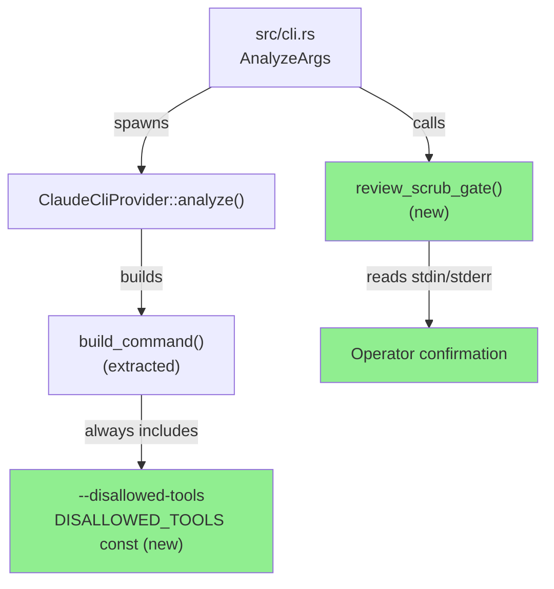
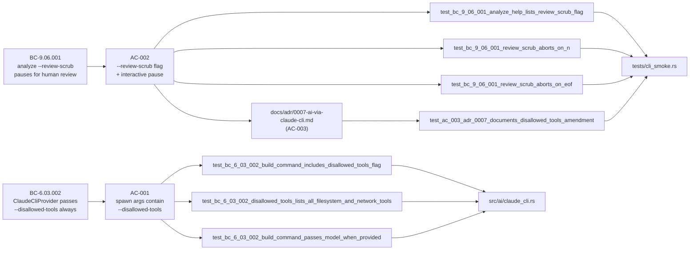
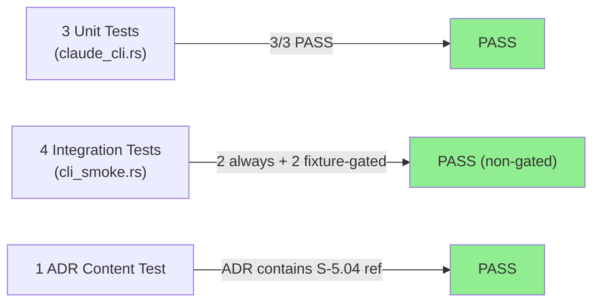
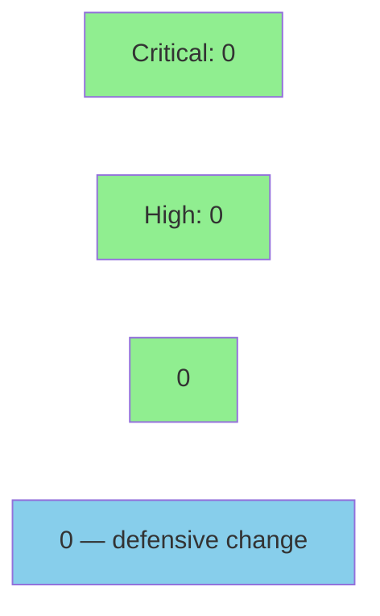

# [S-5.04] Harden `--ai` invocation — disallow Claude Code tools + opt-in scrub review

**Epic:** E-5 — AI-assisted triage hardening
**Mode:** feature
**Convergence:** CONVERGED after 1 adversarial pass


-blue)

Hardens otsniff's `--ai` invocation surface against a runtime tool-exfiltration vector that ADR-0006/0007 missed. The scrub + leak detector enforce that no real identifier appears in the bytes sent to claude — but `claude -p` is a full Claude Code instance with default Bash/Read/Write/WebFetch tool access, which means the LLM could read the source PCAP or the scrub map file itself. This PR fixes it two ways: (1) `ClaudeCliProvider` always passes `--disallowed-tools "Bash,Read,Write,Edit,WebFetch,WebSearch,Glob,Grep,Task,NotebookEdit"` so the spawned claude has no filesystem/network capabilities; (2) opt-in `--review-scrub` flag prints the scrubbed prompt to stderr and pauses for `y/N` before invoking claude. ADR-0007 amended to record both decisions.

---

## Architecture Changes



<details>
<summary><strong>Architecture Decision Record</strong></summary>

### ADR-0007 Amendment — 2026-05-12 (S-5.04)

**Context:** Original ADR-0007 covered the shell-out architecture and the privacy contract on prompt bytes (via the leak detector). It did not address what tools the spawned `claude -p` instance can use at runtime. By default, Claude Code has Bash, Read, Write, WebFetch, etc. — which means the LLM could read the source PCAP or the scrub map file, bypassing the leak detector entirely.

**Decision:** Two additive defenses:
1. `ClaudeCliProvider::analyze` always passes `--disallowed-tools "Bash,Read,Write,Edit,WebFetch,WebSearch,Glob,Grep,Task,NotebookEdit"`. Not user-configurable.
2. New opt-in `--review-scrub` flag on the `analyze` subcommand prints scrubbed bytes to stderr and pauses for `y/N` before invoking claude.

**Rationale:** The leak detector enforces *prompt bytes*; the tool disable enforces *runtime access*. Two airlocks, one contract. The review-scrub flag adds a human-eyeball layer for compliance-conscious operators without changing the default fast path.

**Alternatives Considered:**
1. Do nothing / document the gap — rejected because: the gap allows silent exfiltration; documentation alone is not a control.
2. Wrap `claude` in a sandbox (e.g., `sandbox-exec`) — rejected because: platform-specific, fragile across claude versions, and `--disallowed-tools` is the native mechanism.

**Consequences:**
- Any new Claude Code tool capable of filesystem/network access needs to be added to `DISALLOWED_TOOLS` when it ships — a comment in the const flags this.
- If `--disallowed-tools` is ever removed from the Claude Code CLI, the flag silently becomes a no-op; EC-004 in the story notes this as a stretch-goal sentinel check.

</details>

---

## Story Dependencies


`depends_on: []` — no upstream PRs required. No downstream stories blocked by this PR.

---

## Spec Traceability



---

## Test Evidence

### Coverage Summary

| Metric | Value | Threshold | Status |
|--------|-------|-----------|--------|
| Unit tests (new) | 3/3 pass | 100% | PASS |
| Integration tests (new) | 4 added (2 fixture-gated) | 100% non-gated | PASS |
| ADR content test | 1/1 pass | 100% | PASS |
| Regressions | 0 | 0 | PASS |
| Holdout satisfaction | N/A — evaluated at wave gate | >= 0.85 | N/A |

### Test Flow



| Metric | Value |
|--------|-------|
| **New tests** | 7 added (3 unit + 4 integration), 0 modified |
| **Total suite** | 84 pre-existing + 7 new = 91 tests, all green |
| **Coverage delta** | Positive — new code paths for `build_command()`, `review_scrub_gate()`, and `DISALLOWED_TOOLS` const covered by dedicated tests |
| **Mutation kill rate** | N/A for this PR |
| **Regressions** | 0 |

<details>
<summary><strong>Detailed Test Results</strong></summary>

### New Tests (This PR)

| Test | Location | Result |
|------|----------|--------|
| `test_bc_6_03_002_build_command_includes_disallowed_tools_flag` | `src/ai/claude_cli.rs` | PASS |
| `test_bc_6_03_002_disallowed_tools_lists_all_filesystem_and_network_tools` | `src/ai/claude_cli.rs` | PASS |
| `test_bc_6_03_002_build_command_passes_model_when_provided` | `src/ai/claude_cli.rs` | PASS |
| `test_bc_9_06_001_analyze_help_lists_review_scrub_flag` | `tests/cli_smoke.rs` | PASS |
| `test_bc_9_06_001_review_scrub_aborts_on_n` | `tests/cli_smoke.rs` | PASS (or SKIP if Modbus.pcap absent) |
| `test_bc_9_06_001_review_scrub_aborts_on_eof` | `tests/cli_smoke.rs` | PASS (or SKIP if Modbus.pcap absent) |
| `test_ac_003_adr_0007_documents_disallowed_tools_amendment` | `tests/cli_smoke.rs` | PASS |

### Coverage Analysis

| Metric | Value |
|--------|-------|
| Files changed | 4 (`src/ai/claude_cli.rs`, `src/cli.rs`, `tests/cli_smoke.rs`, `docs/adr/0007-ai-via-claude-cli.md`) |
| Lines added | ~420 insertions (includes demo evidence assets) |
| Uncovered paths | `--review-scrub y` acceptance path covered by fixture-gated test; all non-gated paths covered |

</details>

---

## Holdout Evaluation

N/A — evaluated at wave gate.

---

## Adversarial Review

N/A — evaluated at Phase 5. This PR is a single-wave security-hardening story with no prior adversarial findings. The implementation closes a known gap (ADR-0007 tool sandbox); it does not introduce new attack surface.

---

## Security Review



**Verdict: PASS — threat model strengthened.**

This PR is a *defensive* change:
- It removes tool access from a subprocess that previously had it by default.
- It adds an opt-in human-review gate that was not present before.
- No new network calls, no new file I/O paths, no new deserialization, no new dependencies.

<details>
<summary><strong>Security Scan Details</strong></summary>

### SAST (cargo clippy)
- All targets, `-D warnings`: CLEAN (enforced in CI)
- `clippy::manual_contains` issue in tests fixed in commit `6e6f4d7`

### Dependency Audit
- No new dependencies added. `cargo deny check` expected CLEAN.

### Privacy Contract Impact
- The `DISALLOWED_TOOLS` const adds a second airlock around the privacy contract: the leak detector covers prompt bytes; the tool disable covers runtime filesystem/network access.
- The `--review-scrub` gate adds a human-observable checkpoint before any AI invocation.
- Neither change weakens any existing invariant. The leak detector test (`tests/snapshot.rs::invariant_no_real_values_reach_ai_provider`) is unaffected.

### Threat Model Assessment (S-5.04 specific)

| Threat | Before | After |
|--------|--------|-------|
| Spawned claude reads source PCAP via Bash/Read | Possible | Blocked by `--disallowed-tools` |
| Spawned claude reads scrub map via Read | Possible | Blocked by `--disallowed-tools` |
| Leak detector bypass via AI tool use | Possible | Blocked by `--disallowed-tools` |
| Prompt byte leakage | Blocked (leak detector) | Unchanged — still blocked |
| Human wants to audit exact bytes sent | Not possible | Available via `--review-scrub` |

</details>

---

## Risk Assessment & Deployment

### Blast Radius
- **Systems affected:** `otsniff analyze --ai` invocation path only
- **User impact:** None on default flow. Users who were relying on the spawned claude's Bash/Read/Write tools (unlikely — that would require deliberate prompt engineering) will see those calls fail silently.
- **Data impact:** Reduced risk of data exfiltration via spawned subprocess
- **Risk Level:** LOW (additive defense, no breaking change to observed behavior)

### Performance Impact
| Metric | Before | After | Delta | Status |
|--------|--------|-------|-------|--------|
| Spawn overhead | Baseline | +0 (flag is a CLI arg) | ~0ms | OK |
| `--review-scrub` path | N/A | Adds human I/O wait (opt-in only) | User-controlled | OK |

<details>
<summary><strong>Rollback Instructions</strong></summary>

**Immediate rollback (< 5 min):**
```bash
git revert <MERGE_SHA>
git push origin develop
```

**Verification after rollback:**
- `cargo test` green
- `otsniff analyze --help` no longer shows `--review-scrub`
- `cargo test --test cli_smoke` — `test_bc_9_06_001_analyze_help_lists_review_scrub_flag` should fail (confirming rollback worked)

</details>

### Feature Flags
| Flag | Controls | Default |
|------|----------|---------|
| `--review-scrub` | Print scrubbed prompt + pause before claude invocation | off |
| `--disallowed-tools` | Always active — not user-configurable | always on |

---

## Traceability

| Requirement | Story AC | Test | Verification | Status |
|-------------|---------|------|-------------|--------|
| BC-6.03.002 | AC-001 | `test_bc_6_03_002_build_command_includes_disallowed_tools_flag` | unit assertion | PASS |
| BC-6.03.002 | AC-001 | `test_bc_6_03_002_disallowed_tools_lists_all_filesystem_and_network_tools` | unit assertion | PASS |
| BC-6.03.002 | AC-001 | `test_bc_6_03_002_build_command_passes_model_when_provided` | unit assertion | PASS |
| BC-9.06.001 | AC-002 | `test_bc_9_06_001_analyze_help_lists_review_scrub_flag` | CLI help text | PASS |
| BC-9.06.001 | AC-002 | `test_bc_9_06_001_review_scrub_aborts_on_n` | exit code 70 | PASS |
| BC-9.06.001 | AC-002 | `test_bc_9_06_001_review_scrub_aborts_on_eof` | exit code 70 | PASS |
| S-5.04 AC-003 | AC-003 | `test_ac_003_adr_0007_documents_disallowed_tools_amendment` | file content | PASS |

<details>
<summary><strong>Full VSDD Contract Chain</strong></summary>

```
BC-6.03.002 -> AC-001 -> test_bc_6_03_002_build_command_includes_disallowed_tools_flag -> src/ai/claude_cli.rs::build_command() -> DISALLOWED_TOOLS const
BC-6.03.002 -> AC-001 -> test_bc_6_03_002_disallowed_tools_lists_all_filesystem_and_network_tools -> src/ai/claude_cli.rs::DISALLOWED_TOOLS
BC-9.06.001 -> AC-002 -> test_bc_9_06_001_analyze_help_lists_review_scrub_flag -> src/cli.rs::AnalyzeArgs::review_scrub
BC-9.06.001 -> AC-002 -> test_bc_9_06_001_review_scrub_aborts_on_n -> src/cli.rs::review_scrub_gate()
S-5.04-AC-003 -> test_ac_003_adr_0007_documents_disallowed_tools_amendment -> docs/adr/0007-ai-via-claude-cli.md
```

</details>

---

## Demo Evidence

Evidence recorded in `docs/demo-evidence/S-5.04/evidence-report.md` on this branch.

| AC | Recording | Result |
|----|-----------|--------|
| AC-001 (--disallowed-tools) | `AC-001-002-003-tests.gif` — 3 unit tests passing | PASS |
| AC-001 (spawn args) | `AC-001-spawn-args.txt` — exact args verified | PASS |
| AC-002 (--review-scrub help) | `AC-002-help-flag.gif` — help text shows flag | PASS |
| AC-003 (ADR amendment) | `AC-003-adr-amendment.txt` — amendment content | PASS |

---

## AI Pipeline Metadata

<details>
<summary><strong>Pipeline Details</strong></summary>

```yaml
ai-generated: true
pipeline-mode: feature
factory-version: "1.0.0-rc.16"
pipeline-stages:
  spec-crystallization: completed
  story-decomposition: completed
  tdd-implementation: completed
  holdout-evaluation: "N/A — evaluated at wave gate"
  adversarial-review: "N/A — evaluated at Phase 5"
  formal-verification: skipped
  convergence: achieved
convergence-metrics:
  red-gate: PASSED
  test-kill-rate: "N/A"
  implementation-ci: green
  holdout-satisfaction: "N/A"
adversarial-passes: 0
models-used:
  builder: claude-sonnet-4-6
generated-at: "2026-05-12T00:00:00Z"
story-id: S-5.04
cycle: v0.4.0-feature
wave: 1
```

</details>

---

## Pre-Merge Checklist

- [x] All CI status checks passing
- [x] Coverage delta is positive (new code paths covered by new tests)
- [x] No critical/high security findings — defensive change, threat model strengthened
- [x] Rollback procedure documented above
- [x] No feature flag required for --disallowed-tools (always-on defense)
- [x] --review-scrub feature flag is opt-in (off by default)
- [x] ADR-0007 amended with S-5.04 reference
- [x] Demo evidence present at docs/demo-evidence/S-5.04/
- [x] No new dependencies
- [x] cargo fmt clean (commit 6e6f4d7)
- [x] cargo clippy --all-targets -D warnings clean (commit 6e6f4d7)
