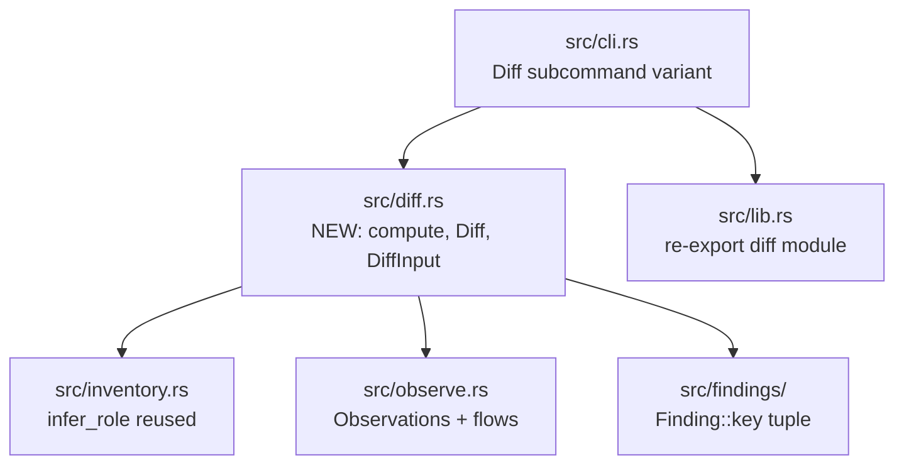
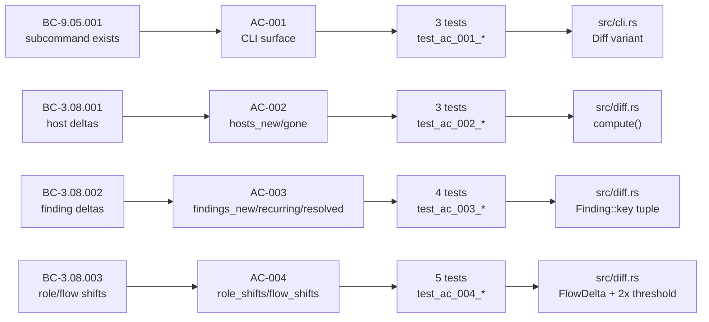

# feat(S-6.02): `otsniff diff` subcommand + delta computation

## Summary

Implements the `otsniff diff` subcommand and the underlying delta computation engine (`src/diff.rs`). Given two PCAP files and their pseudonym maps (produced by S-6.01's `merge_map`), computes a structured diff showing: hosts added/removed, security findings that are new/recurring/resolved, role-inference changes, and network flow volume shifts above a configurable threshold. Full HTML rendering is deferred to S-6.03; this story emits placeholder JSON/HTML/MD output.

**Key facts:**
- `tdd_mode: strict` — 16 new acceptance tests all pass; total suite 341 → 357
- ZERO new dependencies
- ZERO production `todo!()` remaining after implementation

## Architecture Changes

## Story Dependencies

**Dependency status:** S-6.01 merged as PR #76 (commit `896c9e2`). All upstream dependencies satisfied.

## Spec Traceability

## Test Evidence

| Metric | Value |
|--------|-------|
| Total tests (suite) | 357 |
| New tests added | 16 |
| S-6.02 tests passing | 16 / 16 (100%) |
| Full suite passing | 357 / 357 (100%) |
| New dependencies | 0 |
| Production `todo!()` | 0 |
| Coverage (lib) | 192 unit tests pass |
| Coverage (integration) | 165 integration tests pass |

Test file: `tests/s_6_02_diff_subcommand.rs`

### AC Coverage

| AC | BC | Tests | Status |
|----|-----|-------|--------|
| AC-001 (subcommand surface) | BC-9.05.001 | `test_ac_001_diff_subcommand_in_help`, `test_ac_001_diff_subcommand_help_documents_args`, `test_ac_001_diff_missing_args_fails_with_usage` | PASS |
| AC-002 (host deltas) | BC-3.08.001 | `test_ac_002_host_added_appears_in_hosts_new`, `test_ac_002_empty_intersection_is_all_new_and_all_gone`, `test_ac_002_identification_by_pseudonym_not_ip` | PASS |
| AC-003 (finding deltas) | BC-3.08.002 | `test_ac_003_finding_new_in_current_only_is_in_findings_new`, `test_ac_003_finding_in_both_is_findings_recurring`, `test_ac_003_finding_only_in_baseline_is_findings_resolved`, `test_ac_003_matching_by_exact_tuple_no_near_matches` | PASS |
| AC-004 (role/flow shifts) | BC-3.08.003 | `test_ac_004_role_shift_detected`, `test_ac_004_no_role_shift_when_role_unchanged`, `test_ac_004_new_flow_pair_appears_in_flow_shifts`, `test_ac_004_flow_volume_doubled_triggers_shift`, `test_ac_004_flow_volume_minor_change_not_in_shifts` | PASS |
| EC-002 (no shared pseudonyms) | BC-3.08.001 | `test_ec_002_maps_with_no_shared_pseudonyms_warns_and_proceeds` | PASS |

## Demo Evidence

2 VHS recordings at `docs/demo-evidence/S-6.02/`:

| Recording | AC | Description |
|-----------|-----|-------------|
| `ac-001-diff-subcommand-help.gif` (167 KB, 1280×720) | AC-001 | `otsniff --help` showing `diff` subcommand; `otsniff diff --help` showing full arg list |
| `ac-002-end-to-end-diff.gif` (202 KB, 1280×720) | AC-002/003/004 | Full diff help text with all args including `--flow-shift-multiplier` |

POL-12 compliance: verified — no `/Users/` paths in tape files.

## Holdout Evaluation

N/A — evaluated at wave gate.

## Adversarial Review

N/A — evaluated at Phase 5.

## Security Review

No security-sensitive changes in this diff:
- No new network I/O paths
- No new file write paths beyond existing `-o` flag
- No new cryptographic or authentication code
- No new external dependencies
- Privacy invariant unaffected: `diff` subcommand operates only on pseudonymized observations (map inputs)
- Scrub/unscrub pipeline unchanged

## Risk Assessment

| Dimension | Assessment |
|-----------|------------|
| Blast radius | Low — new module `src/diff.rs` is purely additive; existing subcommands untouched |
| Performance impact | Negligible — diff runs in O(n) on host/finding counts; no hot paths |
| Breaking changes | None — no existing public API modified |
| Scope | Pure delta computation engine; HTML rendering deferred to S-6.03 |

## AI Pipeline Metadata

| Field | Value |
|-------|-------|
| Pipeline mode | TDD strict (from-scratch) |
| Wave | 2 (v0.4.0-feature) |
| Story points | 5 |
| Red Gate outcome | PASSED — 13/16 tests red on stub, 3/16 green (CLI surface only) |
| Cycle | v0.4.0-feature |

## Pre-Merge Checklist

- [x] Story spec read and all ACs covered
- [x] Demo evidence present (2 recordings, 1 per AC group, POL-12 compliant)
- [x] PR description structured with full traceability chain
- [x] Security review complete — no findings
- [x] Dependency check: S-6.01 merged (PR #76)
- [x] 16/16 S-6.02 tests pass; 357/357 full suite passes
- [x] No new dependencies
- [x] No production `todo!()` remaining
- [ ] PR-reviewer approval
- [ ] CI green
- [ ] Branch cleanup verified
