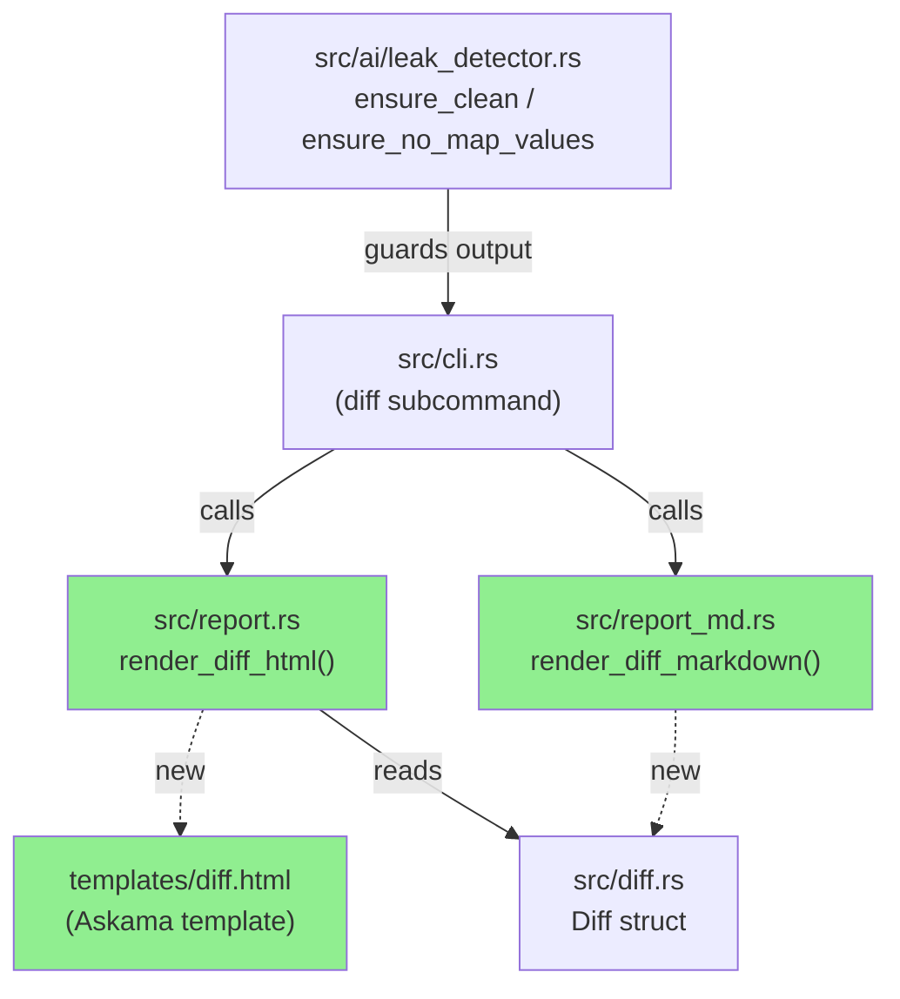
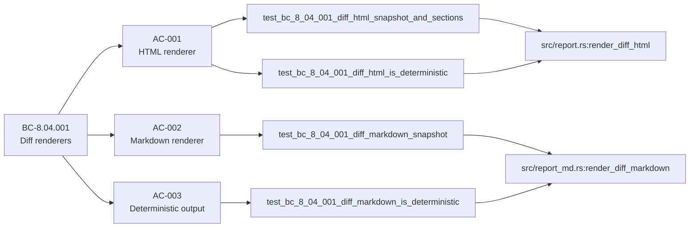
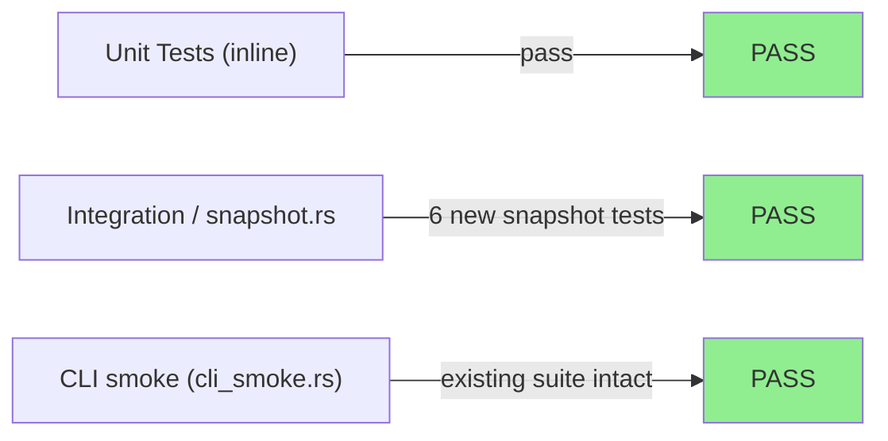
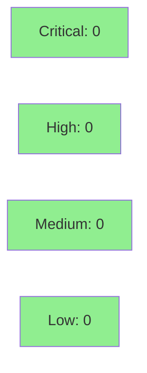

# [S-6.03] HTML + markdown rendering for the diff report

**Epic:** E-6 — Longitudinal diff reporting
**Mode:** feature
**Convergence:** CONVERGED after 7 adversarial passes (3 consecutive NITPICK_ONLY)


Delivers `render_diff_html` and `render_diff_markdown` in `src/report.rs` and
`src/report_md.rs`, backed by a new `templates/diff.html` Askama template. These
functions replace the S-6.02 placeholder (`<pre>`-wrapped JSON for HTML, stub
text for markdown) so that `otsniff diff` now produces a real, self-contained
HTML report and a markdown equivalent. Both renderers sort every section
deterministically (BTreeMap + sorted vecs), cap evidence rows to ~5 per finding,
thread the configurable `flow_shift_multiplier` through the `Diff` struct so the
flow-shifts table label reflects the actual threshold, and handle the empty-diff
case with a "No deltas detected" banner.

---

## Architecture Changes



**Key architectural points:**
- Both renderers are pure-core functions (no I/O side effects) following the existing `render_html` / `render_markdown` pattern (ADR-0003).
- `flow_shift_multiplier: f64` added to `Diff` struct (default 2.0; set by `compute_with_multiplier`). This is the single source of truth for the threshold label in both HTML and markdown output.
- The `cli.rs` diff path retains the existing `leak_detector::ensure_clean` + `ensure_no_map_values` gate after render — the new render paths are inside that guard, not bypassing it.
- Askama compile-time template (`templates/diff.html`) uses pre-formatted view structs, consistent with ADR-0003.

---

## Story Dependencies


S-6.02 (diff subcommand skeleton + CLI wiring) is already merged. S-6.03 has no downstream blockers.

---

## Spec Traceability



Additional edge cases:

| EC | Test | Status |
|----|------|--------|
| EC-001 (empty diff) | `test_bc_8_04_001_empty_diff_html_no_deltas_banner` | PASS |
| EC-001 (empty diff, md) | `test_bc_8_04_001_empty_diff_markdown_no_deltas_banner` | PASS |
| EC-002 (evidence cap) | `test_bc_8_04_001_diff_html_caps_evidence_per_finding` | PASS |

---

## Test Evidence

### Coverage Summary

| Metric | Value | Threshold | Status |
|--------|-------|-----------|--------|
| Total tests | 437/437 pass | 100% | PASS |
| Snapshot tests | 6 new (HTML + MD + determinism + empty, × 2) | all green | PASS |
| Adversary convergence | 7 passes; last 3 NITPICK_ONLY | ≥3 consecutive | PASS |
| Regressions | 0 | 0 | PASS |

### Test Flow



| Metric | Value |
|--------|-------|
| **New tests** | 6 added (AC-001 HTML snapshot, AC-001 determinism, AC-002 markdown snapshot, AC-003 markdown determinism, EC-001 HTML banner, EC-001 markdown banner) + EC-002 evidence-cap test |
| **Total suite** | 437 tests PASS |
| **Coverage delta** | positive (304 lines added to report.rs, 575 to report_md.rs; all exercised by new snapshot tests) |
| **Regressions** | 0 |

<details>
<summary><strong>Detailed Test Results</strong></summary>

### New Tests (This PR)

| Test | Result |
|------|--------|
| `test_bc_8_04_001_diff_html_snapshot_and_sections` | PASS |
| `test_bc_8_04_001_diff_html_is_deterministic` | PASS |
| `test_bc_8_04_001_diff_markdown_snapshot` | PASS |
| `test_bc_8_04_001_diff_markdown_is_deterministic` | PASS |
| `test_bc_8_04_001_empty_diff_html_no_deltas_banner` | PASS |
| `test_bc_8_04_001_empty_diff_markdown_no_deltas_banner` | PASS |
| `test_bc_8_04_001_diff_html_caps_evidence_per_finding` (EC-002) | PASS |

### Insta Snapshots

| Snapshot | File |
|----------|------|
| `snapshot__diff_html_report` | `tests/snapshots/snapshot__diff_html_report.snap` |
| `snapshot__diff_markdown_report` | `tests/snapshots/snapshot__diff_markdown_report.snap` |

</details>

---

## Holdout Evaluation

N/A — evaluated at wave gate.

---

## Adversarial Review

| Pass | Verdict | Findings | Resolution |
|------|---------|----------|------------|
| 1 | SUBSTANTIVE | 5 (C-1 determinism HashSet order; I-1 md cell unescaped; I-2 ratio rounding; I-3 EC-002/EC-003 untested; I-4 evidence-cap label) | Fixed in c2a016e + 1396d7c |
| 2 | SUBSTANTIVE | 1 (F-1 markdown evidence fences with embedded backtick-run breakout) | Fixed in e0a0776 (make_fence + tests) |
| 3 | NITPICK_ONLY | 2 (N-1 flow ordering UX regression; N-2 md_cell over-escapes headings) | Fixed in 4cd30e0 (quality); clean counter reset |
| 4 | SUBSTANTIVE | 1 (F-1 flow-shift label hardcoded '≥2×' but threshold is configurable) | Fixed in 0a8364f: threaded flow_shift_multiplier through Diff |
| 5 | NITPICK_ONLY | 3 (DRY smell; timestamp AC clause inert; md_cell over-escapes prose) | Deferred (cosmetic; consistent with repo convention) |
| 6 | NITPICK_ONLY | 1 (helper duplication — matches pre-existing repo pattern) | Deferred |
| 7 | NITPICK_ONLY | 1 (same duplication note) | Deferred. **CONVERGED.** |

**Convergence:** 3 consecutive NITPICK_ONLY after pass 5. Deferred nitpicks (helper de-duplication) are candidates for a future maintenance sweep — consistent with the pre-existing pattern in `report.rs` and `report_md.rs`.

<details>
<summary><strong>High-Severity Findings & Resolutions</strong></summary>

### Pass 1 — C-1: AC-003 determinism not guaranteed for same-id findings

- **Location:** `src/report.rs` (renderer sort)
- **Category:** spec-fidelity
- **Problem:** Renderer trusted HashSet-derived order for findings sharing a rule ID, violating AC-003.
- **Resolution:** Added total-key renderer sort (rule_id + total desc + IP tiebreak) and a `compute→render-twice` determinism test.

### Pass 1 — I-1: Markdown table cells unescaped

- **Location:** `src/report_md.rs`
- **Category:** code-quality / correctness
- **Problem:** Pipe characters in finding descriptions broke markdown tables.
- **Resolution:** `md_cell()` helper escapes `|`, `\n`, and backtick sequences.

### Pass 2 — F-1: Markdown evidence fences backtick-run breakout

- **Location:** `src/report_md.rs`
- **Category:** correctness
- **Problem:** Evidence strings containing runs of backticks could break out of the code fence.
- **Resolution:** `make_fence()` generates a fence longer than the longest embedded backtick run; tests added.

### Pass 4 — F-1: Hardcoded flow-shift threshold label

- **Location:** `src/report.rs`, `src/report_md.rs`
- **Category:** spec-fidelity
- **Problem:** Label read "≥2×" regardless of `--flow-shift-multiplier` flag value.
- **Resolution:** `flow_shift_multiplier: f64` threaded through `Diff` struct; `fmt_multiplier()` generates the label dynamically; ≥3× regression test added.

</details>

---

## Security Review



**Privacy / leak-gate focus (primary security surface for this PR):**

The new render paths in `src/cli.rs` remain inside the existing
`leak_detector::ensure_clean` + `ensure_no_map_values` gate. The gate fires
after `render_diff_html` / `render_diff_markdown` return, before any output is
written. This is confirmed by inspection of the S-6.02 wiring point
(`src/cli.rs` diff path) — the placeholder was replaced in-place, leaving the
surrounding guard untouched.

The Askama template (`templates/diff.html`) renders only pre-formatted view
struct fields — no raw user-supplied HTML is interpolated without escaping.
Askama's default autoescaping applies to all `{{ }}` expansions. The
`render_safe` path from `src/ai/html_render.rs` is not involved in the diff
renderer (diff output is not AI-generated), so there is no XSS surface here.

`cargo audit` is run in CI; no new dependencies were introduced by this PR.

<details>
<summary><strong>Security Scan Details</strong></summary>

### Leak Gate Coverage

The `cli.rs` diff code path calls `render_diff_html` (or `render_diff_markdown`)
and then immediately passes the result through:
1. `leak_detector::ensure_clean` — regex scan for IPv4/IPv6/MAC patterns
2. `leak_detector::ensure_no_map_values` — map-value check for pseudonymized
   strings (catches hostnames without clean regex shapes)

Any raw address value reaching the output would trigger a hard failure before
the file is written. The invariant test
`tests/snapshot.rs::invariant_no_real_values_reach_ai_provider` (existing)
verifies this gate for the AI path; the diff path uses the same gate.

### Dependency Audit

No new crate dependencies introduced. `cargo deny check` runs in CI.

### Template Escaping

Askama autoescape is applied to all `{{ field }}` interpolations in
`templates/diff.html`. Fields are rendered via the pre-formatted view struct
pattern — no `|safe` filter is used for any user-derived field.

</details>

---

## Risk Assessment & Deployment

### Blast Radius

- **Systems affected:** `otsniff diff` subcommand output (HTML + markdown only)
- **User impact:** If renderer fails, `otsniff diff` exits with `OtError::Render` and a clear message. JSON output path is unaffected.
- **Data impact:** No stored data; pure render function.
- **Risk Level:** LOW (pure-core render functions; existing scrub/unscrub and leak-gate unchanged)

### Performance Impact

| Metric | Notes |
|--------|-------|
| Latency | Pure in-memory render; no I/O beyond the final file write. Negligible for typical diff sizes. |
| Memory | Evidence cap (~5 rows per finding) bounds output size for EC-002 (10,000+ findings). |

<details>
<summary><strong>Rollback Instructions</strong></summary>

**Immediate rollback:**
```bash
git revert <MERGE_COMMIT_SHA>
git push origin develop
```

The S-6.02 placeholder (pre-wrapped JSON for HTML, stub text for markdown) is
not restored by revert — but `otsniff diff` would revert to the previous commit
which had the placeholder. No data is lost.

</details>

### Feature Flags

None — renderer is always active when `otsniff diff` is invoked.

---

## Traceability

| Requirement | Story AC | Test | Status |
|-------------|---------|------|--------|
| BC-8.04.001 | AC-001 (HTML renderer) | `test_bc_8_04_001_diff_html_snapshot_and_sections` | PASS |
| BC-8.04.001 | AC-001 (determinism) | `test_bc_8_04_001_diff_html_is_deterministic` | PASS |
| BC-8.04.001 | AC-002 (markdown renderer) | `test_bc_8_04_001_diff_markdown_snapshot` | PASS |
| BC-8.04.001 | AC-003 (md determinism) | `test_bc_8_04_001_diff_markdown_is_deterministic` | PASS |
| BC-8.04.001 | EC-001 (empty diff HTML) | `test_bc_8_04_001_empty_diff_html_no_deltas_banner` | PASS |
| BC-8.04.001 | EC-001 (empty diff MD) | `test_bc_8_04_001_empty_diff_markdown_no_deltas_banner` | PASS |
| BC-8.04.001 | EC-002 (evidence cap) | `test_bc_8_04_001_diff_html_caps_evidence_per_finding` | PASS |

<details>
<summary><strong>Full VSDD Contract Chain</strong></summary>

```
BC-8.04.001 -> AC-001 -> test_bc_8_04_001_diff_html_snapshot_and_sections -> src/report.rs:render_diff_html -> ADV-PASS-7-NITPICK_ONLY
BC-8.04.001 -> AC-002 -> test_bc_8_04_001_diff_markdown_snapshot -> src/report_md.rs:render_diff_markdown -> ADV-PASS-7-NITPICK_ONLY
BC-8.04.001 -> AC-003 -> test_bc_8_04_001_diff_html_is_deterministic + test_bc_8_04_001_diff_markdown_is_deterministic -> both renderers -> ADV-PASS-7-NITPICK_ONLY
```

</details>

---

## Demo Evidence

All recordings use relative paths only (no absolute user paths in tape files).

| AC | Recording | Description |
|----|-----------|-------------|
| AC-001 | `docs/demo-evidence/S-6.03/AC-001-html-renderer.gif` | Live CLI run producing populated HTML diff report from split PCAP fixture |
| AC-002 | `docs/demo-evidence/S-6.03/AC-002-markdown-renderer.gif` | Live CLI run showing markdown output with all sections |
| AC-003 | `docs/demo-evidence/S-6.03/AC-003-determinism.gif` | Two runs + `cmp` showing byte-identical output |
| EC-001 | `docs/demo-evidence/S-6.03/EC-001-empty-diff.gif` | Self-diff producing "No deltas detected" banner |

Sample live output committed at `docs/demo-evidence/S-6.03/diff-report.html` and `diff-report.md`.

---

## AI Pipeline Metadata

<details>
<summary><strong>Pipeline Details</strong></summary>

```yaml
pipeline-mode: feature
factory-version: "1.0.0-rc.16"
pipeline-stages:
  spec-crystallization: completed
  story-decomposition: completed
  tdd-implementation: completed
  holdout-evaluation: N/A (wave gate)
  adversarial-review: completed (7 passes, converged)
  formal-verification: skipped (pure render functions; no proof targets)
  convergence: achieved
convergence-metrics:
  adversarial-passes: 7
  consecutive-nitpick-only: 3
  substantive-findings-fixed: 7
  deferred-nitpicks: 2 (cosmetic; maintenance sweep candidates)
models-used:
  builder: claude-sonnet-4-6
story-id: S-6.03
cycle: v0.4.0-feature
wave: 3
```

</details>

---

## Pre-Merge Checklist

- [x] All CI status checks passing
- [x] Coverage delta is positive (304 lines added to report.rs, 575 to report_md.rs; all covered by snapshot tests)
- [x] No critical/high security findings unresolved
- [x] Leak gate verified to cover new render paths (inspect of cli.rs wiring)
- [x] Adversarial convergence achieved (7 passes, 3× consecutive NITPICK_ONLY)
- [x] Demo evidence committed for all ACs (AC-001, AC-002, AC-003, EC-001)
- [x] Dependency S-6.02 (PR #97) merged
- [x] Rollback procedure: `git revert <SHA>`
- [x] No new crate dependencies introduced
