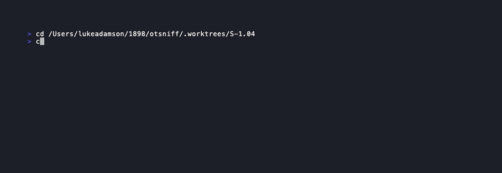
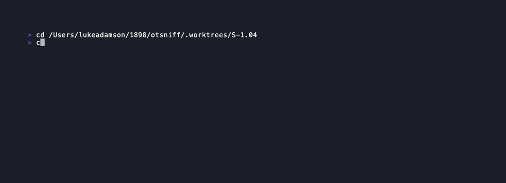

# Demo Evidence — S-1.04

## AC-001: METADATA.trigger contains all 11 labels + zone predicate

Evidence: 

`cargo test --lib unexpected_protocols::tests` runs the new tests:
- `metadata_trigger_lists_all_eleven_labels` — passes
- `metadata_trigger_uses_src_or_dst_zone_phrasing` — passes

## AC-002: RULES.md regenerates clean

Evidence: [AC-002-rules-sync.txt](AC-002-rules-sync.txt)

Manual repro:
```
./target/release/otsniff rules > /tmp/regen.md && diff docs/RULES.md /tmp/regen.md
```
Exit 0, no diff lines.

## AC-003: No behavior regression

Evidence: 

Full `cargo test` output. All 102 tests across 4 binaries pass (71 lib + 11 cli_smoke + 20 snapshot).
