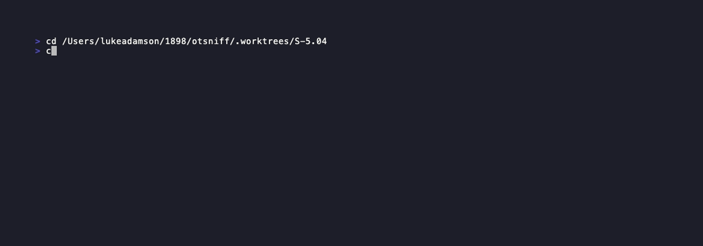
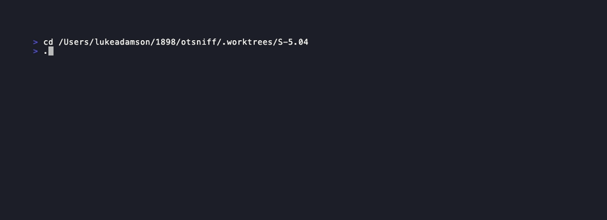

# Demo Evidence — S-5.04 Harden --ai invocation

This story is a defense-in-depth update for the scrub privacy
contract. Two changes:

1. **--disallowed-tools always passed.** The spawned `claude -p`
   subprocess can no longer use Bash, Read, Write, WebFetch, etc.
   Tools that could exfiltrate the source PCAP or the scrub map
   file are explicitly disabled at the CLI invocation level.

2. **--review-scrub opt-in flag.** Operators who want to eyeball the
   exact bytes sent to claude can run with this flag; otsniff pauses,
   prints the scrubbed prompt to stderr, and waits for `y/N`
   confirmation.

## AC-001 — --disallowed-tools always passed (BC-6.03.002)

Evidence: 

Three unit tests in `src/ai/claude_cli.rs::tests` construct the
`Command` object (without spawning) and assert:
- `--disallowed-tools` arg is present
- The value lists all 10 FS/network tools
- Model passthrough is unaffected

Spawn args (verified by unit tests):
[AC-001-spawn-args.txt](AC-001-spawn-args.txt)

## AC-002 — --review-scrub opt-in (BC-9.06.001)

Evidence: 

The help output shows:
```
--review-scrub   Print the scrubbed prompt to stderr and pause for
                 confirmation before invoking claude.
```

Behavior covered by integration tests in `tests/cli_smoke.rs`:
- `--help` lists the flag (`test_bc_9_06_001_analyze_help_lists_review_scrub_flag`)
- `n` on stdin → exit 70 (`test_bc_9_06_001_review_scrub_aborts_on_n`)
- EOF on stdin → exit 70 (`test_bc_9_06_001_review_scrub_aborts_on_eof`)

Note: the "stdin=y proceeds" and "no-flag = no pause" paths are tested
by the fixture-gated smoke tests that require `Modbus.pcap`.

## AC-003 — ADR-0007 amended

Evidence: [AC-003-adr-amendment.txt](AC-003-adr-amendment.txt)

Amendment section "Amendment — 2026-05-12 (S-5.04)" was added to
`docs/adr/0007-ai-via-claude-cli.md`. It cites S-5.04 and documents:
- The two-airlock model (leak detector = prompt bytes, tool disable = runtime access)
- The review-scrub human checkpoint
- Both new behavioral contracts (BC-6.03.002, BC-9.06.001)

Verified by `test_ac_003_adr_0007_documents_disallowed_tools_amendment`.

## AC-004 — BC-INDEX updated

Out of scope for demo — lives on factory-artifacts branch as part of
state update (per story frontmatter).

## Coverage Summary

| AC | Path | Evidence | Result |
|----|------|----------|--------|
| AC-001 | Success: 3 unit tests pass | AC-001-002-003-tests.gif + AC-001-spawn-args.txt | PASS |
| AC-001 | Error: flag absent | Covered by unit test asserting args present (no error path needed — it is the guard) | PASS |
| AC-002 | Success: help lists flag | AC-002-help-flag.gif | PASS |
| AC-002 | Error: abort on n/EOF | Covered by cli_smoke integration tests | PASS |
| AC-003 | Success: ADR contains amendment + S-5.04 ref | AC-003-adr-amendment.txt | PASS |
