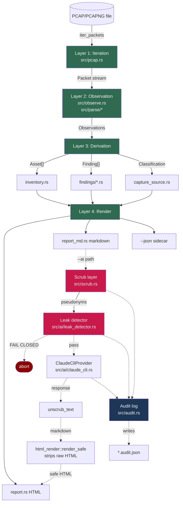

# Pass 1 — Architecture

## Architectural style

**Pipeline architecture with a single-pass accumulator.** Data flows
in one direction: PCAP bytes → packet stream → observations → derived
artifacts (inventory + findings) → rendered output. No loops, no
callbacks, no event bus. Each layer reads from the prior layer's
output and writes to the next.

The privacy contract crosses layers: the **scrub layer** sits between
"derived artifacts" and "AI-bound bytes" with a fail-closed leak
detector enforcing the invariant.

## Layer map

## Module boundaries

### `src/cli.rs` — Orchestration
Owns the four subcommands: `analyze`, `scrub`, `unscrub`, `rules`. Wires
arguments to the lower-level pipeline functions. Knows the shape of the
flags (`--ai`, `--source-type`, `--ot-subnet`, `--audit-log`, `--md`,
`--json`, `--map`, `--model`) but never touches PCAP parsing or rendering
directly. Each `run_*` function is the orchestrator for its mode.

### `src/pcap.rs` — Layer 1 (Iteration)
`Packet` struct (owned: timestamp, MACs, IPs, ports, transport, payload).
`PacketIter` yields `Result<Packet>` items. Decodes L2 (Ethernet) + L3
(IPv4/IPv6) + L4 (TCP/UDP) via `etherparse`. Wraps `pcap-parser` for the
file format.

Critical design: **owned payloads**, not borrowed slices (ADR-0004).
Simplifies the rest of the pipeline — no lifetime contagion through 30+
files. Cost: per-packet allocation. Justification: PCAP sizes are
bounded (a few GB at most for v0.1 scope), the alloc isn't the bottleneck.

### `src/parse/{modbus,enip,s7comm,dhcp}.rs` — Layer 2 helpers
Pure functions that take a `&[u8]` payload and return an `Option<T>` if
it parses as the given protocol. **Function-code-level fidelity only**
(ADR-0002) — no full PDU decoding. Each parser knows its protocol's
framing, magic bytes, and the function codes the findings layer needs.

| File | Recognizes | What it extracts |
|---|---|---|
| `modbus.rs` | MBAP-framed Modbus PDUs | Function code + engineering-class flag |
| `enip.rs` | EtherNet/IP encapsulation header + CIP service heuristic | Command, command label, CIP service if engineering-class |
| `s7comm.rs` | S7Comm PDUs over TPKT | Function code + label, engineering/read class |
| `dhcp.rs` | DHCPv4 magic-cookie + option 12 | Hostname + IP association |

### `src/observe.rs` — Layer 2 accumulator
`Observer::observe(&Packet)` runs once per packet. Updates:
- `obs.hosts: HashMap<IpAddr, HostObs>` — per-host state (MACs, protocols, byte/packet counts, timestamps, in-OT-zone)
- `obs.flows: HashMap<String, FlowObs>` — logical-flow grouping by (src, dst, dst_port, proto). **Drops ephemeral src_port** to avoid noise (per `docs/specs/flow-grouping.md`).
- `obs.modbus_events / enip_events / s7_events / cred_events` — `Vec<Event>` per protocol class
- `obs.external_flows` — egress out of OT subnets
- `obs.smbv1_packets / tls_client_hellos / hostnames` — per-pair counters
- `obs.mac_frame_counts / broadcast_frames` — capture-source heuristic inputs

The observer is **stateful** in `Observer` but exposes the final
`Observations` struct via `Observer::finish()`. After that, observations
are pure data — every consumer reads, none writes.

### `src/inventory.rs` — Layer 3 derivation: assets
Maps each `HostObs` to an `Asset` with inferred role
(PLC / HMI / Engineering Workstation / Historian / Network Infra /
IT Endpoint / Unknown). Role inference uses protocol presence + OUI
vendor.

### `src/findings/*.rs` — Layer 3 derivation: detections
Twelve detectors organized as pure functions over `Observations`. Each
`detect(obs[, ot_subnets]) -> Vec<Finding>`.

Module breakdown:
| Module | Fired finding IDs |
|---|---|
| `plaintext_creds.rs` | `creds.ftp`, `creds.telnet`, `creds.http_basic`, `creds.snmp` |
| `internet_egress.rs` | `egress.ot_to_internet` |
| `engineering_commands.rs` | `ics.modbus_writes`, `ics.cip_engineering`, `ics.s7_engineering` |
| `unexpected_protocols.rs` | `ot.unexpected_protocols` |
| `smbv1.rs` | `compat.smbv1` |
| `stale_tls.rs` | `compat.stale_tls` |
| `dns_resolver.rs` | `boundary.dns_resolver` |

The module-to-finding-ID mapping is **not 1:1**. `plaintext_creds.rs`
returns one Finding per CredKind seen (up to 4); `engineering_commands.rs`
returns up to 3.

`findings/mod.rs` defines:
- `Finding` (id, severity, title, summary, evidence, recommendation, playbook)
- `RuleMetadata` (id, title, severity, trigger, data_source, references)
- `catalog()` — returns all 12 rule metadata blocks in stable order
- `metadata_for(id)` — render-time lookup
- `host_label(ip, obs)` — shared helper that renders `HOSTNAME (1.2.3.4)` when DHCP gave us a name, otherwise just the IP
- `run_all(obs, ot_subnets)` — sequences the 7 module-level detectors and sorts by severity

### `src/capture_source.rs` — Layer 3 derivation: provenance
Heuristic classification of `Observations` into `CaptureSource` enum
(`Span`, `HostSide`, `Tap`, `Ambiguous`) based on MAC frame distribution
and broadcast presence. `DeclaredSource` enum is the user-declared
override (`--source-type`); when set, `report_line()` and
`ai_qualifier_tag()` use it. `guard_warning()` returns a warning
string when declared and heuristic disagree.

### `src/report.rs` — Layer 4 render: HTML
askama-templated. Pre-formats view structs (`AssetView`, `FindingView`,
`TopFlow`) in Rust before passing to the template — keeps the template
to plain interpolation + control flow (ADR-0003). `render_html(&[Asset],
&[Finding], &Observations, input_label, generated_at, capture_source,
ai_section)` — takes `ai_section: Option<String>` for the AI section.

### `src/report_md.rs` — Layer 4 render: markdown
Plain string formatting via `std::fmt::Write` — no template engine.
Produces the AI-bound payload (`analyze --ai`) and the optional `--md`
sidecar.

### `src/rule_catalog.rs` — Layer 4 render: rule catalog
Renders `findings::catalog()` as markdown or JSON. Powers `otsniff rules`
and the committed `docs/RULES.md`.

### `src/scrub.rs` — Cross-cutting: privacy
`ScrubMap` (pseudonym → real value, three classes: `host_NNN`, `mac_NNN`,
`name_NNN`). `build_map(&Observations)` mints pseudonyms from observed
identifiers. `scrub_text(&str, &map)` substitutes real → pseudonym.
`unscrub_text(&str, &map)` substitutes pseudonym → real on the AI's
response.

The scrub layer is **never bypassed** when `--ai` is on. ADR-0006 +
ADR-0007 describe the design. The pseudonym format is regex-safe and
the vocabulary is part of the public contract.

### `src/ai/leak_detector.rs` — Cross-cutting: fail-closed
Two checks:
1. `ensure_clean(&str)` — regex scan for IPv4/IPv6/MAC patterns. Defense
   in depth.
2. `ensure_no_map_values(&str, &ScrubMap)` — verifies no real value
   in the scrub map appears verbatim. Primary enforcement for hostnames
   (which have no clean regex shape).

Both return `Result<()>` — fail-closed via `OtError::Parse` on any leak.

### `src/audit.rs` — Cross-cutting: chain-of-custody
`AuditLog` struct serializes a per-run JSON artifact: counts, SHA-256
hashes of input PCAP + system prompt + user message + AI response,
elapsed time, scrub map sizes, leak check verdicts. Never contains
real identifiers — sentinel-tested.

### `src/ai/*.rs` — AI orchestration

- `mod.rs`: `AiProvider` trait
- `claude_cli.rs`: `ClaudeCliProvider` — shells out to `claude -p`. Captures stdout, returns the response as a String. No HTTP, no SDK.
- `prompts.rs`: committed system prompt + default task. Snapshot-tested. The system prompt has per-source-type variants (span / host-side / tap / ambiguous) appended as qualifiers.
- `html_render.rs`: `render_safe(&str) -> String` via pulldown-cmark with `Event::Html` and `Event::InlineHtml` filtered. XSS defense for the AI section in the rendered HTML report.

### `src/oui.rs` — Vendor lookup
Embedded OT-vendor OUI table (~50 entries currently; P0-6 to expand to ~3000). `lookup(&[u8; 6])` returns `Option<&'static str>`.

### `src/error.rs` — Error taxonomy
`OtError` enum with `thiserror` derivation. Each variant maps to a
sysexits-style exit code via `OtError::exit_code()`. Variants:
- `InputOpen { path, source }` → exit 2
- `BadInput { path, reason }` → exit 2 (malformed PCAP, etc.)
- `WriteOutput { path, source }` → exit 1
- `Parse(String)` → exit 1 (covers leak-detector aborts, JSON parse failures)
- `Json(serde_json::Error)` → exit 1
- `Template(askama::Error)` → exit 1
- `AiProvider(String)` → exit 1 (claude CLI failures)

## Cross-cutting concerns

| Concern | Where it lives | Notes |
|---|---|---|
| **Privacy invariant** | `src/scrub.rs` + `src/ai/leak_detector.rs` | Load-bearing. Tested by `invariant_no_real_values_reach_ai_provider`. |
| **XSS defense for AI section** | `src/ai/html_render.rs` | Strips raw HTML events from pulldown-cmark output. Tested by `ai_section_in_html_strips_script_tags_from_claude_response`. |
| **Audit chain-of-custody** | `src/audit.rs` | Sentinel-tested: `audit_log_rendered_for_an_analyze_run_carries_no_real_identifiers`. |
| **Determinism** | Everywhere: `BTreeMap` over `HashMap` where order matters | Snapshot tests depend on this. |
| **CIP-011 BCSI handling** | `docs/audits/scrub-audit-cip011.md` audit | Documents field-by-field BCSI classification. |
| **Error code stability** | `src/error.rs::exit_code` | Sysexits-style; CLI smoke tests assert specific codes. |

## Deployment topology

**Single static binary.** Built by `cargo build --release` with `lto =
"thin"`, `codegen-units = 1`, `strip = true`. CI builds for four
targets: `aarch64-apple-darwin`, `x86_64-apple-darwin`,
`x86_64-pc-windows-msvc`, `x86_64-unknown-linux-gnu`.

Distribution paths:
1. `curl … install.sh | sh` — fetches the right tar.gz from the GitHub
   release, verifies SHA-256, drops binary to `~/.local/bin/otsniff`
2. `cargo install --path .` — from-source install
3. Manual download from GitHub releases

No agents, no daemon, no live capture, no Elasticsearch.

## What's deliberately NOT in the architecture

- **No live capture.** Offline PCAP only.
- **No streaming pipeline.** Whole PCAP is observed before findings run.
- **No cross-detector correlation.** Each detector reads its event stream independently.
- **No plugin system for rules.** Adding a rule means writing a new Rust file in `src/findings/`.
- **No alerting / SIEM integration.** Output is HTML, markdown, JSON. Integration is the user's job.
- **No async I/O.** Synchronous throughout.
- **No internal IPC.** Single process, single thread.

These absences are intentional and documented in the README's "Out of
scope" section + ADR-0001 (no Zeek) + ADR-0002 (minimal parsers) +
ADR-0006 (no embedded AI client) + ADR-0007 (no HTTP/SDK to AI vendor).

## Data flow narrative (typical `analyze --ai` invocation)

1. **CLI parse** — `clap` deserializes the command line into `AnalyzeArgs`.
2. **PCAP iteration** — `iter_packets(input)` opens the file and yields a stream of `Packet`s.
3. **Observation** — `Observer::observe(&pkt)` runs per packet. Side-effects accumulate in `Observations`.
4. **Inventory** — `inventory::build(&obs)` derives `Vec<Asset>`.
5. **Findings** — `findings::run_all(&obs, &ot_subnets)` returns `Vec<Finding>`.
6. **Classification** — `capture_source::classify_with_guard(&obs, args.source_type)` returns `Classification`; emits stderr warning if declared and heuristic disagree.
7. **Markdown render** — `render_markdown(inventory, findings, obs, …)` produces the rules-based markdown (real values).
8. **Branch on `--ai`**
   - **Not set:** `render_html(…, ai_section: None)` → write `output.html`. Exit.
   - **Set:** continue below.
9. **Scrub** — `build_map(&obs)` then `scrub_text(&raw_md, &map)`.
10. **Leak check** — `ensure_clean` + `ensure_no_map_values` on the scrubbed markdown and the assembled user message. Abort on any leak.
11. **Claude invocation** — `ClaudeCliProvider::analyze(system_prompt, user_message)` shells out, captures response.
12. **Unscrub** — `unscrub_text(&response, &map)` restores real values.
13. **AI HTML render** — `ai::html_render::render_safe(&unscrubbed_response)` strips raw HTML.
14. **HTML render** — `render_html(…, ai_section: Some(ai_html))` → write `output.html`.
15. **Optional artifacts** — write `--md`, `--json`, `--map` if requested.
16. **Audit log** — assemble `AuditLog`, leak-check the serialized JSON, write to derived `output.audit.json` (or `--audit-log` override).
17. **Exit summary** to stderr.

## Architectural decisions catalog (existing ADRs)

| ADR | Decision | Status |
|---|---|---|
| 0001 | Pure Rust, no Zeek | Accepted |
| 0002 | Hand-rolled minimal protocol parsers (function-code only) | Accepted |
| 0003 | askama compile-time templating with pre-formatted view structs | Accepted |
| 0004 | Owned packet payloads in `Packet` struct | Accepted |
| 0005 | Embedded OT-vendor OUI table | Accepted |
| 0006 | Scrub/unscrub for AI-assisted triage | Accepted (amended for CIP-011 + name_NNN class) |
| 0007 | AI via Claude Code CLI (shell-out, no HTTP/SDK) | Accepted |

What's missing as a formal ADR (but baked into the code):
- The decision to NOT use async — implicit
- The decision to drop ephemeral src_port from flow keys — captured in `docs/specs/flow-grouping.md` but not an ADR
- The `analyze` unification (v0.3) — captured in the v0.3.0 release notes but not an ADR
- The choice of pulldown-cmark for AI markdown rendering — captured in code comments in `src/ai/html_render.rs` but not an ADR

## Purity boundary

**Pure core** (deterministic, no I/O, no side effects):
- `parse/*` — pure byte → optional struct
- `findings/*` — pure `Observations → Vec<Finding>`
- `inventory.rs::build` — pure `&Observations → Vec<Asset>`
- `capture_source::classify` — pure `&Observations → Classification`
- `scrub::{build_map, scrub_text, unscrub_text}` — pure
- `ai::leak_detector::{ensure_clean, ensure_no_map_values, scan}` — pure
- `ai::html_render::render_safe` — pure
- `audit::{sha256_hex, sha256_file_hex}` — `sha256_hex` is pure; `sha256_file_hex` is I/O
- `report::render_html`, `report_md::render_markdown`, `rule_catalog::render` — pure
- All of `findings/*::metadata_for`, `catalog()` etc.

**Effectful shell**:
- `cli::*` — I/O (read PCAP, write outputs, stderr)
- `pcap::iter_packets` — file I/O
- `ai::claude_cli::ClaudeCliProvider` — subprocess
- `audit::sha256_file_hex` — file I/O

The boundary is clean. Roughly **80% of LoC is pure**.
