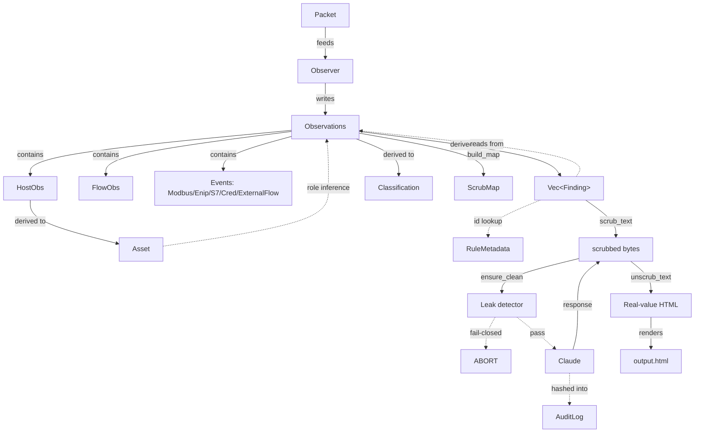
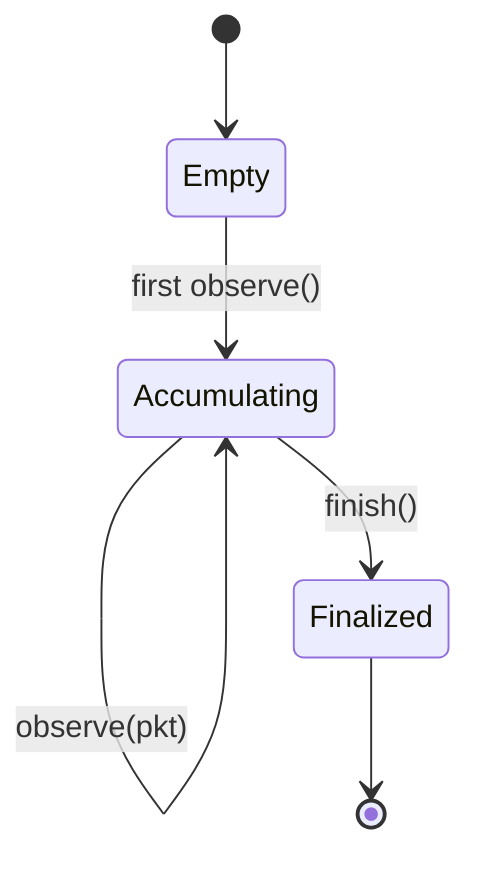
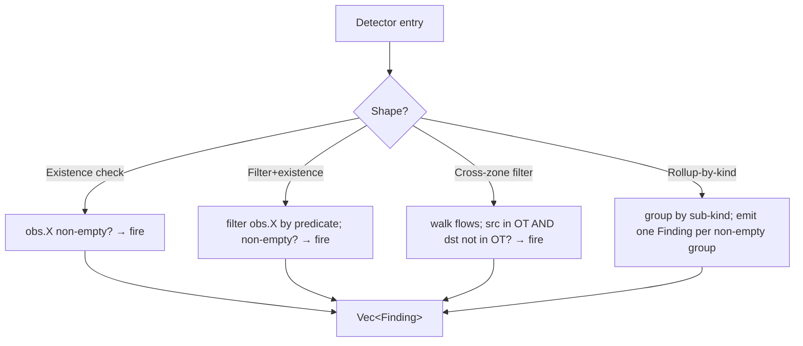
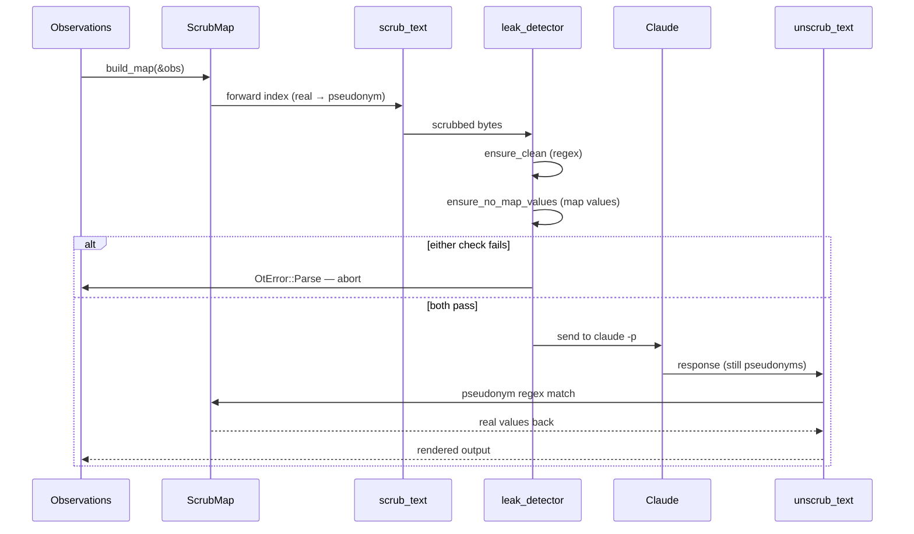
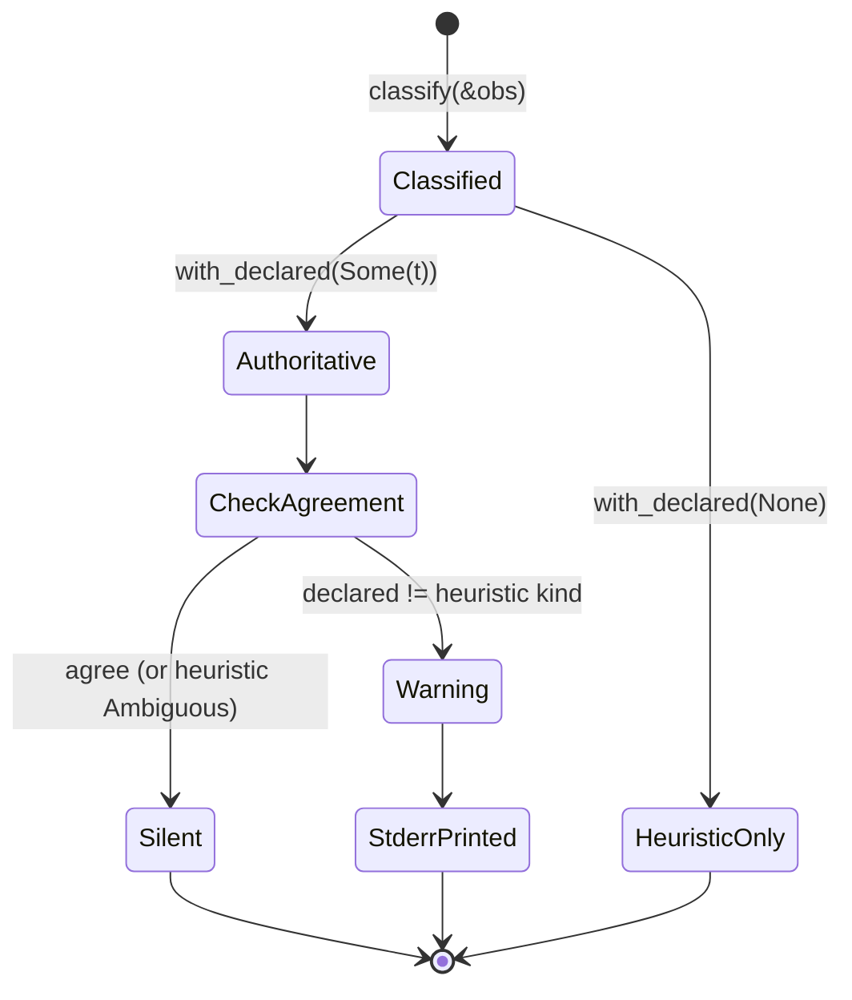

# Pass 2 — Domain Model

Two sub-passes per protocol: 2a structural (entities, relationships,
enums) and 2b behavioral (operations, rules, state machines, events).

---

## 2a — Structural

### Bounded contexts

otsniff has **three bounded contexts** that share a thin interface:

1. **Observation context** — packets and accumulator state. Lives in `src/pcap.rs` + `src/parse/*` + `src/observe.rs`. Vocabulary: Packet, Transport, Flow, Event.
2. **Analysis context** — derived findings, inventory, classification, rules. Lives in `src/findings/*` + `src/inventory.rs` + `src/capture_source.rs` + `src/rule_catalog.rs`. Vocabulary: Finding, Severity, Asset, Role, RuleMetadata, Classification.
3. **Privacy + rendering context** — scrub layer, leak detector, audit log, render. Lives in `src/scrub.rs` + `src/ai/*` + `src/audit.rs` + `src/report*.rs`. Vocabulary: ScrubMap, AuditLog, pseudonym classes.

The boundaries are visible in the code: `Observations` flows from context 1 → 2; `Vec<Finding>` + `Vec<Asset>` + `Classification` + `Observations` flow from context 2 → 3.

### Entities

#### Observation context

```
Packet (value object, immutable per packet)
├── ts: DateTime<Utc>
├── src_mac, dst_mac: [u8; 6]
├── src_ip, dst_ip: IpAddr
├── src_port, dst_port: u16
├── transport: Transport { Tcp, Udp, Other(u8) }
└── payload: Vec<u8>  (owned — ADR-0004)

Observations (aggregate root, mutable during observation)
├── hosts: HashMap<IpAddr, HostObs>
├── flows: HashMap<String, FlowObs>  (key is stringified FlowKey)
├── modbus_events: Vec<ModbusEvent>
├── enip_events: Vec<EnipEvent>
├── s7_events: Vec<S7Event>
├── cred_events: Vec<CredEvent>
├── external_flows: HashMap<String, ExternalFlow>
├── smbv1_packets: HashMap<(IpAddr, IpAddr, u16), u64>
├── tls_client_hellos: HashMap<(IpAddr, IpAddr, u16, u16), u64>
│       ^ key is (src, dst, dst_port, legacy_version)
├── hostnames: BTreeMap<IpAddr, String>
├── mac_frame_counts: BTreeMap<[u8; 6], u64>
├── broadcast_frames: u64
├── first_ts, last_ts: Option<DateTime<Utc>>
├── total_packets, total_bytes: u64
└── ot_subnets: Vec<IpNet>  (passed in by Observer::new; not serialized)

HostObs (value object — per host)
├── ip: IpAddr  (also the map key)
├── macs: Vec<[u8; 6]>  (a host can have multiple over time)
├── protocols: HashSet<String>  (port-derived labels: modbus, enip, http, ...)
├── first_seen, last_seen: DateTime<Utc>
├── packets, bytes: u64
└── in_ot_zone: bool  (computed once based on ot_subnets)

FlowObs (value object — per logical flow)
├── key: FlowKey { src, dst, dst_port, proto }
├── packets, bytes: u64
├── first_seen, last_seen: DateTime<Utc>
├── label: Option<String>  (e.g. "modbus", "http")
└── unique_src_ports: HashSet<u16>
        ^ tracks distinct connections within the logical flow

ModbusEvent (event — per Modbus PDU)
├── ts: DateTime<Utc>
├── src, dst: IpAddr
├── function_code: u8
├── label: String  (e.g. "Write Single Coil")
└── engineering_class: bool

EnipEvent (event — per ENIP encap)
├── ts, src, dst
├── command: u16
├── command_label: String  (e.g. "SendRRData")
├── cip_service: Option<String>  (only if engineering)
└── engineering_class: bool

S7Event (event — per S7Comm PDU)
├── ts, src, dst
├── function_code: u8
├── label: String
├── engineering_class: bool
└── read_class: bool  (distinct from engineering — informational)

CredEvent (event — per credential observation)
├── ts, src, dst, dst_port
├── kind: CredKind { FtpAuth, TelnetSession, HttpBasic, Snmpv1v2c }
└── note: String  [#[serde(skip)] — High-BCSI, never renders]

ExternalFlow (egress observation)
├── src, dst: IpAddr  (src must be in an OT subnet; dst must be public)
├── dst_port: u16
├── proto: u8  (6=TCP, 17=UDP, else IP)
└── packets, bytes: u64
```

#### Analysis context

```
Asset (derived — one per host with role inference)
├── ip: IpAddr
├── hostname: Option<String>  (from obs.hostnames lookup)
├── mac: Option<String>  (formatted colon-hex)
├── vendor: Option<String>  (OUI lookup)
├── role: Role
├── protocols: Vec<String>  (sorted for determinism)
├── packets, bytes: u64
└── in_ot_zone: bool

Role (enum) {
  Plc                       // PLC / controller
  Hmi                       // Human-Machine Interface
  EngineeringWorkstation
  Historian                 // Data sink / historian
  NetworkInfra
  ItEndpoint
  Unknown
}

Finding (derived — per fired detection)
├── id: &'static str  (e.g. "creds.ftp", "ics.modbus_writes")
├── severity: Severity { Info, Medium, High, Critical }
├── title: String
├── summary: String
├── evidence: Vec<String>  (formatted lines, capped at 15)
├── recommendation: &'static str
└── playbook: Vec<String>  (per-finding action steps)

Severity (enum, totally ordered)
  Info < Medium < High < Critical

RuleMetadata (static — one per rule, never owned by a Finding)
├── id: &'static str
├── title: &'static str
├── severity: Severity
├── trigger: &'static str  (plain English; renderer "Detection criteria")
├── data_source: &'static [&'static str]
└── references: &'static [Reference]

Reference
├── kind: ReferenceKind { MitreIcsAttack, Rfc, Cwe, Cve, Spec, Vendor }
├── label: &'static str
└── url: Option<&'static str>

Classification (derived — capture-source verdict)
├── source: CaptureSource { Span, HostSide, Tap, Ambiguous }
├── confidence: Confidence { High, Medium, Low }
├── frames_analyzed: u64
└── declared: Option<DeclaredSource>  (user --source-type flag)

DeclaredSource (enum) — user-facing override
  Span | HostSide | Tap

CaptureSource (heuristic verdict — has data fields per variant)
  Span { distinct_macs: usize, broadcasts: u64 }
  HostSide { dominant_mac: [u8;6], appearance_pct: f32 }
  Tap { endpoint_a: [u8;6], endpoint_b: [u8;6], coverage_pct: f32 }
  Ambiguous { reason: String }
```

#### Privacy + rendering context

```
ScrubMap (deanonymization key — produced per run)
├── version: u32  (schema version; bump on shape change)
├── created_at: DateTime<Utc>
├── ips: BTreeMap<String, String>     (host_NNN → "1.2.3.4")
├── macs: BTreeMap<String, String>    (mac_NNN → "AA:BB:...")
└── names: BTreeMap<String, String>   (name_NNN → "LINE-3-PLC")

AuditLog (per-run chain-of-custody — only when --ai is on)
├── schema_version: u32
├── otsniff_version: String
├── timestamp: DateTime<Utc>
├── input_pcap: InputDescriptor { path, size_bytes, sha256 }
├── scrub: ScrubSummary { ip_pseudonyms, mac_pseudonyms, hostname_pseudonyms }
├── leak_check: LeakCheckSummary
│   ├── regex: LeakCheckResult { passed, items_checked }
│   └── map_value: LeakCheckResult { passed, items_checked }
├── ai_provider: AiInvocationSummary
│   ├── command, model
│   ├── system_prompt_bytes, system_prompt_sha256
│   ├── user_message_bytes, user_message_sha256
│   ├── response_bytes, response_sha256
│   └── elapsed_seconds: f64
└── unscrub: UnscrubSummary { pseudonyms_replaced, pseudonyms_unmapped }

OtError (variants with sysexits-style exit codes)
├── InputOpen { path, source }     → exit 2
├── BadInput { path, reason }      → exit 2
├── WriteOutput { path, source }   → exit 1
├── Parse(String)                  → exit 1  [includes leak-detector aborts]
├── Json(serde_json::Error)        → exit 1
├── Template(askama::Error)        → exit 1
└── AiProvider(String)             → exit 1
```

### Relationships



### Ubiquitous language

| Term | Meaning |
|---|---|
| **Observation** | A fact extracted from one or more packets without interpretation. Counts, presence, raw labels. |
| **Finding** | An interpreted observation that warrants operator action. Carries severity, evidence, playbook. |
| **Flow** | Logical aggregation of packets by (src, dst, dst_port, proto). NOT the same as a TCP connection — drops ephemeral src_port. |
| **Connection** | A single (src_port, dst_port) tuple within a flow. Counted as `flow.unique_src_ports.len()`. |
| **Event** | A point-in-time protocol-specific observation: Modbus PDU, ENIP command, S7 function call, cred line. |
| **Engineering-class** | A function code or service that writes / changes / stops device state. Used to filter detector input. |
| **Scrub** | Pseudonymize observed identifiers before they reach an AI provider. |
| **Pseudonym class** | `host_NNN`, `mac_NNN`, `name_NNN`. Format is part of the public contract. |
| **OT zone** | A user-declared CIDR range (`--ot-subnet`). Default is RFC1918. Used by cross-zone rules. |
| **BCSI** | "BES Cyber System Information" — NERC CIP-011 term for plant-identifying data. otsniff aligns its scrub stance to BCSI categories. |
| **Privacy invariant** | "No real value reaches the AI provider." Enforced by fail-closed leak detector; tested by `invariant_no_real_values_reach_ai_provider`. |
| **Capture source** | SPAN / host-side tcpdump / TAP / ambiguous. Different sources need different interpretation. |
| **Asset** | A host with inferred role and rolled-up metadata. The inventory table is `Vec<Asset>`. |
| **Rule catalog** | The metadata block per rule (12 today). Surfaced via `otsniff rules`, `docs/RULES.md`, and inline "Detection criteria." |

---

## 2b — Behavioral

### Process: `analyze` (no AI)

```
1. parse CLI args
2. open PCAP
3. for each packet: Observer::observe(&pkt)
4. obs = Observer::finish()
5. classification = classify(&obs).with_declared(args.source_type)
6. inventory = build(&obs)
7. findings = run_all(&obs, &ot_subnets)
8. raw_md = render_markdown(...)  # real values, never sent anywhere
9. html = render_html(inventory, findings, obs, ..., ai_section: None)
10. write_to(args.output, html)
11. optional: write_to(args.md, raw_md), write_to(args.json, ...)
12. exit 0
```

### Process: `analyze --ai` (adds the AI loop)

```
1-7. same as above
8.   raw_md = render_markdown(...)  # source of truth (real values)
9.   map = build_map(&obs)
10.  scrubbed_md = scrub_text(&raw_md, &map)
11.  ensure_clean(&scrubbed_md)?              # regex leak check
12.  ensure_no_map_values(&scrubbed_md, &map)? # map-value leak check
13.  system_prompt = prompts::system_prompt_for(classification.ai_qualifier_tag())
14.  user_message = "${DEFAULT_TASK}\n\n${scrubbed_md}"
15.  ensure_clean(&user_message)?              # belt-and-braces
16.  ensure_no_map_values(&user_message, &map)?
17.  start_time = now()
18.  scrubbed_response = ClaudeCliProvider::analyze(system_prompt, user_message)
19.  elapsed = now() - start_time
20.  (unscrubbed_response, replaced, unmapped) = unscrub_text(&scrubbed_response, &map)
21.  ai_html = ai::html_render::render_safe(&unscrubbed_response)
22.  html = render_html(..., ai_section: Some(ai_html))
23.  write_to(args.output, html)
24.  optional: --md, --json, --map sidecars
25.  audit_path = args.audit_log or derived from -o
26.  audit_log = AuditLog { ...counts, ...sha256s... }
27.  audit_json = serde_json::to_string_pretty(&audit_log)
28.  ensure_clean(&audit_json)?                # belt-and-braces
29.  ensure_no_map_values(&audit_json, &map)?
30.  write_to(audit_path, audit_json)
31.  exit 0
```

### State machine: Observer

Observer is mostly a single state ("accumulating"), but each packet's
contribution depends on transport + ports + protocol recognition. The
state transitions are per-packet, not session-wide.



After `finish()`, the resulting `Observations` is immutable — every
downstream consumer reads, none writes.

### State machine: Detection (per detector)

Each detector's `detect(obs[, ot_subnets]) -> Vec<Finding>` is
**stateless across calls**. Internal state during a call is shape-1 of
four canonical shapes:



| Shape | Example detectors |
|---|---|
| Existence | `compat.smbv1` (`obs.smbv1_packets` non-empty), `egress.ot_to_internet` (`obs.external_flows` non-empty) |
| Filter + existence | `ics.modbus_writes` (filter `modbus_events` by `engineering_class=true`), `compat.stale_tls` (filter `tls_client_hellos` by version ≤ 0x0302) |
| Cross-zone filter | `boundary.dns_resolver`, `ot.unexpected_protocols` |
| Rollup-by-kind | `plaintext_creds::detect` returns 0–4 findings keyed by `CredKind` |

### Process: Scrub round-trip (deterministic)



Pseudonym format is `<class>_<index>` where class ∈ `{host, mac, name}`
and index is zero-padded decimal. Regex: `\b(?:host|mac|name)_[0-9a-f]+\b`.

### Invariants

| Invariant | Where enforced | Test |
|---|---|---|
| **Privacy invariant.** No real value (IP, MAC, hostname) appears in any byte sent to the AI provider. | `ai/leak_detector.rs` (regex + map-value) | `invariant_no_real_values_reach_ai_provider` |
| **Scrub round-trip.** `unscrub(scrub(x, map), map) == x`. | `scrub.rs` | `unscrub_reverses_scrub`, `unscrub_round_trip_recovers_real_values` |
| **Determinism.** Same PCAP + same flags → byte-identical output. | `BTreeMap` over `HashMap` for ordered iteration; `sort_by` everywhere | All snapshot tests |
| **Rule catalog completeness.** Every fired Finding's id appears in `findings::catalog()`. | `findings::run_all` + `RuleMetadata` | `every_finding_id_appears_in_the_rule_catalog` |
| **Playbook coverage.** Every detector emits non-empty playbook entries. | Each `findings/*::detect` | `every_finding_has_a_non_empty_playbook` |
| **`docs/RULES.md` synchronization.** Committed file matches `findings::catalog()`. | `rule_catalog::render_markdown` | `rule_catalog_matches_committed_rules_md` |
| **Audit log no-leak.** Per-run audit JSON never contains real identifiers. | `audit::*` + `ensure_clean` + `ensure_no_map_values` | `audit_log_rendered_for_an_analyze_run_carries_no_real_identifiers` |
| **AI HTML safety.** Markdown-to-HTML conversion drops raw HTML events. | `ai/html_render::render_safe` | `ai_section_in_html_strips_script_tags_from_claude_response` |
| **CredEvent.note containment.** Never reaches HTML, markdown, JSON, or scrubbed payload. | `#[serde(skip)]` + render-path discipline | `cred_event_note_must_not_reach_any_rendered_output` |
| **Hostname surface.** When hostnames are known, finding evidence carries them. | `findings::host_label` helper | `finding_evidence_surfaces_hostnames_when_we_know_them` |
| **Capture-source guard.** When `--source-type` disagrees with heuristic, stderr emits a warning. | `Classification::guard_warning` | `declared_source_disagreeing_with_heuristic_produces_warning` |

### Business rules (not invariants — judgment calls baked in)

| Rule | Where | Rationale |
|---|---|---|
| **Drop ephemeral source ports from flow keys.** | `observe.rs::FlowKey` | TCP/UDP src ports are random; including them produces a noisy comms matrix (`docs/specs/flow-grouping.md`). |
| **Roll up plaintext-cred findings by CredKind.** | `findings/plaintext_creds.rs` | 4,700 Telnet packets across 12 hosts should produce 1 finding with 12 evidence rows, not 12+ findings (`docs/specs/finding-dedup.md`). |
| **Cap evidence at 15 lines per finding.** | All detectors | Reports stay readable. Aggregate counts are preserved in the summary. |
| **OT subnet default is RFC1918.** | `cli::ot_or_default` | Sensible default that fires the cross-zone findings on typical plant captures. |
| **Severity bands: Info < Medium < High < Critical.** | `findings::Severity` | Qualitative. No CVSS-style scoring (would be wrong shape for triage). |
| **Function-code-level protocol fidelity.** | `parse/*` | ADR-0002. Enough for the findings layer; doesn't pay full-parser cost. |
| **Single sweeping `Observations` struct over distributed per-subsystem state.** | `observe.rs::Observations` | One privacy chokepoint. Easier to reason about. (Cost: growing god-struct.) |

### State machine: Classification + Guard



### Domain events that DON'T exist (informational gaps)

- **No "config reload" event.** otsniff is one-shot. No HUP, no live config.
- **No "rule subscription" event.** Findings aren't pub/sub-able. Adding a new rule is a code change.
- **No "AI mid-stream" event.** The privacy contract requires the full response before any unscrub or render — partial AI output is not exposed.
- **No "analysis cancelled" event.** Long PCAPs run to completion; SIGINT just exits.
- **No "user feedback" event.** Detector accuracy is judged by tests, not by user thumbs-up/down.

These absences are deliberate — keeping the surface area small is part
of the project's "single-binary triage tool" identity.
