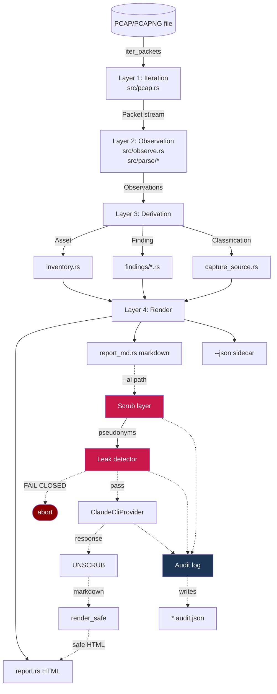

# Architecture — Master Index

Sharded architecture document per VSDD pattern. The system overview
+ layer map live here at the index level; detailed shards follow as
separate files in this directory.

## Architectural style

**Pipeline architecture with a single-pass typed accumulator.** Data
flows one direction: PCAP bytes → packet stream → observations →
derived artifacts → rendered output. No loops, no callbacks, no
event bus. The privacy contract crosses layers via a fail-closed
chokepoint between "derived artifacts" and "AI-bound bytes."

## System overview

## Shard map

| Shard file | Content |
|---|---|
| `SS-system-overview.md` | Layer model + cross-cutting concerns + data flow narrative |
| `SS-module-decomposition.md` | Per-module responsibility + boundary description |
| `SS-dependency-graph.md` | Module dependency edges + 3rd-party crate dependency tree |
| `SS-purity-boundary-map.md` | Pure core / effectful shell classification (~80% pure) |
| `SS-tooling-selection.md` | Justification for each direct dependency |
| `SS-verification-architecture.md` | What's proved by which test or proof (current + planned) |
| `SS-verification-coverage-matrix.md` | BC → test matrix |
| `decisions/` | ADRs (existing 7 + 5 backfill candidates from L-P1-005) |

## ADR catalog

All ADRs in `docs/adr/`:

| ADR | Title | Status |
|---|---|---|
| ADR-0001 | Pure Rust, no Zeek dependency | Accepted |
| ADR-0002 | Hand-rolled minimal protocol parsers | Accepted |
| ADR-0003 | askama compile-time templating with pre-formatted view structs | Accepted |
| ADR-0004 | Owned packet payloads in `Packet` struct | Accepted |
| ADR-0005 | Embedded OT-vendor OUI table | Accepted |
| ADR-0006 | Scrub/unscrub for AI-assisted triage | Accepted (amended for CIP-011) |
| ADR-0007 | AI via Claude Code CLI (no HTTP/SDK) | Accepted |
| ADR-0008 | Sync throughout — no async runtime | Accepted |
| ADR-0009 | Drop ephemeral src_port from flow key (logical-flow grouping) | Accepted |
| ADR-0010 | Roll up plaintext-cred findings by kind | Accepted |
| ADR-0011 | pulldown-cmark with raw-HTML event filter for AI markdown | Accepted |
| ADR-0012 | Audit log auto-derives path from `-o` | Accepted |

## Component inventory (top-level)

| Component | Module | Role |
|---|---|---|
| Packet iterator | `src/pcap.rs` | L2–L4 decoding via etherparse + pcap-parser |
| Observer + accumulator | `src/observe.rs` | Single-pass state building |
| Protocol parsers | `src/parse/{modbus,enip,s7comm,dhcp}.rs` | Function-code-level recognition |
| Findings layer | `src/findings/*.rs` | 7 detector modules, 12 fired finding IDs |
| Inventory | `src/inventory.rs` | Asset derivation + role inference |
| Capture-source | `src/capture_source.rs` | Heuristic + DeclaredSource override |
| Scrub | `src/scrub.rs` | Pseudonym minting + round-trip substitution |
| Leak detector | `src/ai/leak_detector.rs` | Fail-closed regex + map-value check |
| AI provider | `src/ai/claude_cli.rs` | Subprocess shell-out to `claude -p` |
| AI HTML render | `src/ai/html_render.rs` | pulldown-cmark with raw-HTML filter |
| AI prompts | `src/ai/prompts.rs` | System prompt + per-source-tag variants |
| Audit log | `src/audit.rs` | Per-run chain-of-custody artifact |
| HTML render | `src/report.rs` + `templates/report.html` | askama-templated |
| Markdown render | `src/report_md.rs` | std::fmt::Write |
| Rule catalog render | `src/rule_catalog.rs` | docs/RULES.md generator |
| CLI orchestration | `src/cli.rs` | 4 subcommands (analyze, scrub, unscrub, rules) |
| OUI lookup | `src/oui.rs` | Embedded vendor OUI table |
| Error taxonomy | `src/error.rs` | OtError + exit codes |

## Cross-cutting concerns

| Concern | Where | Notes |
|---|---|---|
| Privacy invariant | `scrub` + `leak_detector` | Load-bearing. Sentinel-tested. |
| XSS defense | `ai/html_render` | Raw-HTML events stripped. |
| Audit chain-of-custody | `audit` | Per-run JSON, no real identifiers. |
| Determinism | Everywhere | `BTreeMap` + `sort_by` where order matters. |
| CIP-011 BCSI handling | `docs/audits/scrub-audit-cip011.md` | Field-by-field audit. |
| Error code stability | `error::exit_code` | Sysexits-style; CLI smoke tests assert codes. |

## Deployment topology

Single static binary. Built by `cargo build --release` with
`lto = "thin"`, `codegen-units = 1`, `strip = true`. CI builds for 4
targets: `aarch64-apple-darwin`, `x86_64-apple-darwin`,
`x86_64-pc-windows-msvc`, `x86_64-unknown-linux-gnu`.

Distribution: curl-pipe-sh installer (`install.sh` →
`~/.local/bin/otsniff`), `cargo install --path .`, manual GitHub
release download. No daemon, no agent, no live capture.
