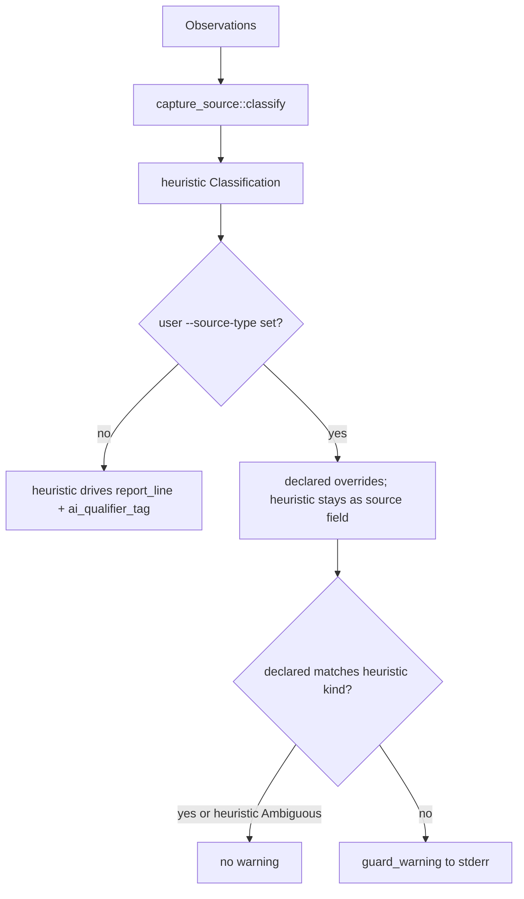

# Domain shard: Analysis context

The Analysis context turns `Observations` into prioritized,
operator-readable artifacts: assets with inferred roles, findings
with playbooks, capture-source classification, and the rule catalog.

## Capabilities served

- CAP-004 — Capture-source heuristic classification + explicit override
- CAP-005 — Asset inventory with role inference
- CAP-006 — Rule catalog produces prioritized findings
- CAP-012 — Rule catalog accessible in three forms

## Entities

### `Asset` (value object — one per host)

```
Asset
├── ip: IpAddr
├── hostname: Option<String>       — lookup from obs.hostnames
├── mac: Option<String>            — formatted colon-hex uppercase
├── vendor: Option<String>         — OUI lookup result
├── role: Role                     — inferred
├── protocols: Vec<String>         — sorted for determinism
├── packets, bytes: u64
└── in_ot_zone: bool
```

### `Role` (enum)

```
Role ::= Plc                       — controller (Siemens, AB, Schneider, ...)
       | Hmi                       — human-machine interface
       | EngineeringWorkstation
       | Historian                 — data sink
       | NetworkInfra              — Cisco / Hirschmann / Moxa OUI
       | ItEndpoint
       | Unknown
```

Inference heuristics in `src/inventory.rs::infer_role`. Strong PLC
signal: speaks Modbus + has PLC-vendor OUI, OR speaks ENIP/S7/DNP3.

### `Finding` (value object — per fired detection)

```
Finding
├── id: &'static str               — e.g. "creds.ftp"
├── severity: Severity             — Critical / High / Medium / Info
├── title: String
├── summary: String
├── evidence: Vec<String>          — capped at 15 lines
├── recommendation: &'static str   — single sentence
└── playbook: Vec<String>          — multi-step actions tied to evidence
```

### `Severity` (enum, totally ordered)

```
Severity ::= Info < Medium < High < Critical
```

No numeric scoring (CVSS-style). Triage tool, not vulnerability assessment.

### `RuleMetadata` (static — one per rule, never owned by a Finding)

```
RuleMetadata
├── id: &'static str
├── title: &'static str
├── severity: Severity             — default; may escalate per-finding
├── trigger: &'static str          — plain-English firing condition
├── data_source: &'static [&'static str]
└── references: &'static [Reference]
```

### `Reference`

```
Reference { kind: ReferenceKind, label, url: Option }

ReferenceKind ::= MitreIcsAttack | Rfc | Cwe | Cve | Spec | Vendor
```

### `Classification` (derived — capture-source verdict)

```
Classification
├── source: CaptureSource          — heuristic
├── confidence: Confidence         — High / Medium / Low
├── frames_analyzed: u64
└── declared: Option<DeclaredSource>   — user override via --source-type

CaptureSource ::= Span { distinct_macs, broadcasts }
                | HostSide { dominant_mac, appearance_pct }
                | Tap { endpoint_a, endpoint_b, coverage_pct }
                | Ambiguous { reason }

DeclaredSource ::= Span | HostSide | Tap
```

When `declared` is set, it's authoritative for the report's first
line and the AI prompt qualifier; the heuristic verdict is preserved
on `source` for the guard warning.

## Relationships

```
Observations ─derived to─▶ Vec<Asset>
                ├─uses─▶ OUI lookup table  (src/oui.rs)
                └─uses─▶ Role inference rules

Observations ─derived to─▶ Vec<Finding>  via each detector in findings/
                ├─uses─▶ catalog() for metadata
                └─uses─▶ ot_subnets for cross-zone filters

Observations ─derived to─▶ Classification ─decorated with─▶ DeclaredSource
```

## Processes

### Detection (per detector, stateless)

Each detector takes `(obs[, ot_subnets])` and returns `Vec<Finding>`. Four firing shapes per Pass 2 § 2b:

| Shape | Example |
|---|---|
| Existence check | `compat.smbv1` |
| Filter + existence | `ics.modbus_writes` (filter by `engineering_class=true`) |
| Cross-zone filter | `boundary.dns_resolver`, `egress.ot_to_internet`, `ot.unexpected_protocols` |
| Rollup by kind | `plaintext_creds::detect` (one finding per `CredKind` seen) |

### Severity ordering at output

`findings::run_all` sorts by `severity DESC then id ASC`. Renderers
consume the sorted list verbatim.

### Classification authority



## Invariants

| Invariant | Source |
|---|---|
| Findings sorted by severity DESC then id ASC | BC-3.06.001 |
| Every fired finding's id appears in `findings::catalog()` | BC-3.06.002 / sentinel test |
| Every fired finding's `playbook` is non-empty | BC-3.06.003 / sentinel test |
| Hostnames surface in evidence via `host_label(ip, obs)` when known | BC-3.06.004 / sentinel test |
| Modbus / ENIP / S7 engineering severity escalates from High → Critical if any source IP is outside `--ot-subnet` | BC-3.03.001 + ICS detector logic |
| Capture-source guard warning fires on declared/heuristic disagreement (except heuristic Ambiguous) | BC-4.02.002 |

## Open issues

- **OQ-3 — Cross-event correlation.** Detectors today read their own event stream; no "Modbus write within 30s after FTP login" correlation. Adding this would extend the Finding data model to carry references to other Findings. Pass 6 architecture review concluded: defer until a real correlation requirement is documented.
