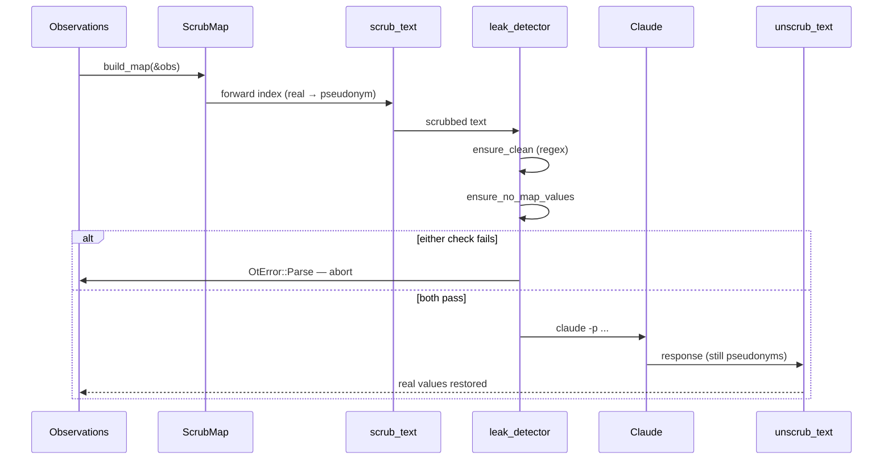

# Domain shard: Privacy + AI orchestration

The Privacy context owns the load-bearing security claim of otsniff:
*no real identifier reaches the AI provider*. It also owns the
chain-of-custody audit log that proves the claim for any given run.

## Capabilities served

- CAP-007 — Pseudonymize all observed identifiers
- CAP-008 — Fail-closed enforcement of the privacy invariant
- CAP-009 — Invoke a user-local AI provider with scrubbed payload, restore real values on response
- CAP-010 — Per-run chain-of-custody audit log

## Entities

### `ScrubMap` (deanonymization key — produced per run)

```
ScrubMap
├── version: u32
├── created_at: DateTime<Utc>
├── ips: BTreeMap<String, String>     — host_NNN → "1.2.3.4"
├── macs: BTreeMap<String, String>    — mac_NNN → "AA:BB:CC:DD:EE:FF"
└── names: BTreeMap<String, String>   — name_NNN → "LINE-3-PLC"
```

Format invariants:
- Pseudonym pattern: `<class>_<3-digit-index>`. Class ∈ `{host, mac, name}`. Index zero-padded.
- Regex (public contract): `\b(?:host|mac|name)_[0-9a-f]+\b`. The `0-9a-f` is forward-compatible for future hex indices but unused today.
- Assignment is deterministic — sorted by real value at map-build time, so the same `Observations` always produces the same `ScrubMap`.

### `AuditLog` (per-run chain-of-custody artifact)

```
AuditLog
├── schema_version: u32
├── otsniff_version: String
├── timestamp: DateTime<Utc>
├── input_pcap: InputDescriptor
│   ├── path: String                  — verbatim input path
│   ├── size_bytes: u64
│   └── sha256: String                — file digest, streamed (64 KB chunks)
├── scrub: ScrubSummary
│   ├── ip_pseudonyms: usize
│   ├── mac_pseudonyms: usize
│   └── hostname_pseudonyms: usize
├── leak_check: LeakCheckSummary
│   ├── regex: { passed, items_checked }
│   └── map_value: { passed, items_checked }
├── ai_provider: AiInvocationSummary
│   ├── command: String                — e.g. "claude -p --model X"
│   ├── model: String
│   ├── system_prompt_bytes, _sha256
│   ├── user_message_bytes, _sha256
│   ├── response_bytes, _sha256
│   └── elapsed_seconds: f64
└── unscrub: UnscrubSummary
    ├── pseudonyms_replaced: usize
    └── pseudonyms_unmapped: usize
```

The log **never contains real identifiers** — only counts and
SHA-256 digests of the exchanged bytes. Sentinel-tested.

### `AiProvider` (trait)

```rust
trait AiProvider {
    fn name(&self) -> &str;
    fn analyze(&self, system_prompt: &str, scrubbed_md: &str) -> Result<String>;
}
```

Implementations must not modify the pseudonym vocabulary the caller
depends on for unscrub. v0.3 ships one: `ClaudeCliProvider` —
shells out to `claude -p` as a subprocess. No HTTP, no SDK.

### Leak detector verdict types

```
Leak { kind: LeakKind, pattern: String, byte_offset: usize }

LeakKind ::= Ipv4 | Ipv6 | Mac
```

Returned from `scan(text)`. `ensure_clean(text)` returns
`Result<()>` — `Ok(())` on no leak, `Err(OtError::Parse(...))` on
any leak.

`ensure_no_map_values(text, &ScrubMap)` is the second-layer check:
iterates every real value in the map and verifies none appear in
`text`. Catches hostname-class leaks the regex can't recognize.

## Processes

### Scrub round-trip



### Privacy invariant — the load-bearing claim

> **No real value (IP, MAC, hostname) appears in any byte sent to the AI provider.**

Enforced by:

1. `src/scrub.rs::scrub_text` — substitution pass, real → pseudonym.
2. `src/ai/leak_detector.rs::ensure_clean` — regex scan, IPv4/IPv6/MAC patterns.
3. `src/ai/leak_detector.rs::ensure_no_map_values` — exact match of every real value in the map. Primary defense for hostnames (no clean regex shape).

Both checks run on the **scrubbed report** AND on the **assembled
user message** (`{DEFAULT_TASK}\n\n{scrubbed_md}`) AND on the
**audit log JSON** before write — three checkpoints, fail-closed at
each.

Tested by `tests/snapshot.rs::invariant_no_real_values_reach_ai_provider`.

### Audit log production

The audit log is **always** written when `--ai` is on. Default
path: derived from the report output (`report.html` →
`report.audit.json`); override via `--audit-log <PATH>`. The audit
log itself passes through `ensure_clean` + `ensure_no_map_values`
before write.

### AI invocation (via `ClaudeCliProvider`)

1. Assemble `system_prompt` (committed string + capture-source qualifier from `Classification::ai_qualifier_tag`)
2. Assemble `user_message = DEFAULT_TASK + "\n\n" + scrubbed_md`
3. `ensure_clean` + `ensure_no_map_values` on both
4. Spawn `claude -p [--model X]` subprocess; pass prompts via stdin/args; capture stdout
5. Return response

## Invariants

| Invariant | Tested by |
|---|---|
| **Privacy invariant** holds on snapshot fixture | `invariant_no_real_values_reach_ai_provider` |
| **Scrub round-trip exact** for any text containing only mapped pseudonyms | `unscrub_reverses_scrub` |
| **Scrub doesn't touch unobserved values** (no IP-shaped substring rewriting) | `scrub_does_not_touch_unobserved_values` |
| **Map-value check catches hostname leaks regex misses** | `ensure_no_map_values_catches_hostname_leak_that_regex_misses` |
| **Audit log carries no real identifiers** | `audit_log_rendered_for_an_analyze_run_carries_no_real_identifiers` |
| **CredEvent.note never reaches HTML/markdown/JSON** | `cred_event_note_must_not_reach_any_rendered_output` |
| **`#[serde(skip)]` on `CredEvent.note`** | Per-event JSON serialization assertion in the same sentinel test |

## CredEvent.note containment

`CredEvent.note` is a string captured from the wire that may contain
High-BCSI bytes (literal `USER` lines, b64-encoded HTTP Basic
credentials). The field is:

- `#[serde(skip)]` → never serializes
- Never referenced by any rendering path
- Sentinel-tested: a canary string in `note` does NOT appear in HTML, markdown, scrubbed-markdown, or per-event JSON

This is the lockdown for an internal-only diagnostic field. Future
features that surface usernames must use a new pseudonym class
(`user_NNN`), not the `note` field.

## Open issues

- **OQ-4 — Kani proofs.** The privacy invariant is currently
  enforced by code + tested by one sentinel on one fixture. Kani
  proofs would prove the invariant *for all inputs of a given
  shape*. Highest-leverage verification artifact for otsniff (see
  L-P1-004). v0.4 deliverable or deferred?
