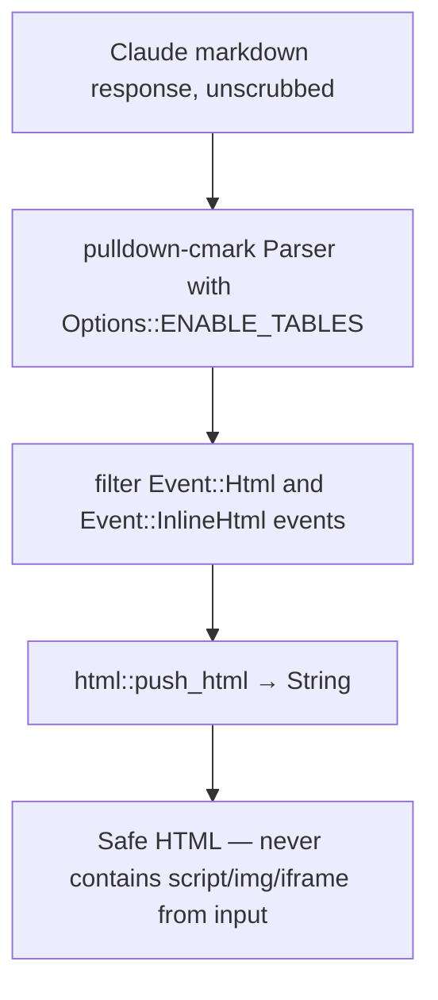

# Domain shard: Rendering

The Rendering context turns the derived artifacts (assets, findings,
classification, optionally an AI response) into the operator-facing
outputs: HTML report, markdown sidecar, JSON sidecar, scrub map
JSON, and audit log JSON.

## Capabilities served

- CAP-011 — Render observations + findings + asset inventory + (optional) AI analysis into a self-contained HTML report

(Other CAP outputs — markdown, JSON, scrub map, audit log — are
handled by the renderers under this context's purview as sidecars.)

## Entities

### `ReportView` (askama template input)

Pre-formatted view struct fed to `templates/report.html`. The view
struct does NOT contain raw `Asset` / `Finding` types — it contains
strings already formatted in Rust (severity labels, byte
humanization, role labels, etc.). This is the ADR-0003 design:
the template only does plain `{{ field }}` interpolation; no
custom-filter fragility.

```
ReportView
├── input, generated, version: String
├── total_packets, total_bytes, span: String
├── capture_source: Option<String>
├── finding_count, asset_count, ot_asset_count: usize
├── findings: Vec<FindingView>
├── assets: Vec<AssetView>
├── top_flows: Vec<TopFlow>
└── ai_section: Option<String>          — pre-rendered safe HTML
```

### `FindingView`

```
FindingView
├── id, severity_label, severity_class, title, summary: String
├── evidence: Vec<String>, evidence_count: usize
├── recommendation: String
├── playbook: Vec<String>, playbook_count: usize
└── trigger: String                     — looked up via metadata_for(id)
```

### `AssetView`

```
AssetView { ip, hostname, mac, vendor, role, protocols, packets, bytes, in_ot_zone }
```

`hostname` is either `"HOSTNAME"` (when known) or the em-dash `"—"`
sentinel. `in_ot_zone` drives a colored badge in the template.

### `TopFlow`

```
TopFlow { src, dst, label, connections, packets, bytes }
```

## Renderers

| Output | Module | Input |
|---|---|---|
| HTML | `src/report.rs` + `templates/report.html` | `[&Asset]`, `[&Finding]`, `&Observations`, optional Classification, optional `ai_section` |
| Markdown | `src/report_md.rs` | Same as HTML; renders via `std::fmt::Write` (no template engine) |
| Rule catalog (md / json) | `src/rule_catalog.rs` | `findings::catalog()` only |
| AI markdown → safe HTML | `src/ai/html_render.rs::render_safe` | A Claude response string |
| Scrub map JSON | `src/scrub.rs` serialization | `&ScrubMap` |
| Audit log JSON | `src/audit.rs` serialization | `&AuditLog` |

## Processes

### HTML report construction (no AI)

1. `render_markdown(...)` produces the rules-based markdown (real values).
2. `render_html(inventory, findings, obs, input_label, generated_at, capture_source, ai_section: None)` constructs the `ReportView` and invokes askama.
3. Write to `args.output`.

### HTML report with `--ai` (the AI section embedded)

1. Same as steps 1–2 above, but the markdown is *also* used as the AI's input.
2. Scrub → leak-check → invoke claude → unscrub (Privacy context).
3. `ai::html_render::render_safe(&unscrubbed_response)` converts Claude's markdown to HTML with raw HTML events stripped.
4. `render_html(..., ai_section: Some(ai_html))` constructs the full report.
5. Write to `args.output`. Audit log also written alongside.

### AI markdown → safe HTML



A Claude response containing `<script>alert(1)</script>` or `` does NOT survive into the rendered HTML. Tested by
`ai_section_in_html_strips_script_tags_from_claude_response`.

## Invariants

| Invariant | Tested by |
|---|---|
| `render_html` is deterministic per inputs | All snapshot tests (`html_report_snapshot`, etc.) |
| `rule_catalog::render_markdown` matches committed `docs/RULES.md` | `rule_catalog_matches_committed_rules_md` |
| AI section strips raw HTML events | `ai_section_in_html_strips_script_tags_from_claude_response` |
| Markdown report contains no real identifier when scrubbed | `scrubbed_markdown_snapshot_does_not_leak_real_values` |
| Hostnames surface in evidence rendering | `finding_evidence_surfaces_hostnames_when_we_know_them` |

## Trade-offs and notes

- **Custom-filter fragility avoided.** All formatting (severity labels, byte humanization, role labels, "—" for missing fields) is done in Rust before the template sees it. No askama filters beyond `|safe` for the pre-vetted AI HTML.
- **No streaming render.** Whole `Observations` is built before any rendering happens. This trades off larger memory peak for simpler reasoning and deterministic output.
- **One template.** `templates/report.html` is the only askama template. Markdown is generated via `std::fmt::Write`. Splitting templates would require additional `Template` derive macros.
- **CSS is inline.** Template embeds CSS in `<style>` block. Single-file artifact, no external dependencies on link / network.
- **`|safe` is used only for `ai_section`.** Sound only because of the prior `render_safe` filter strip. Documented in `report.html` template + `report.rs` struct doc.

## Open issues

None specific to rendering. The streaming-AI question (OQ in P1-2)
intersects with this context: streaming Claude's response would
require chunked unscrub + chunked safe-HTML rendering. Current
all-at-end approach is simpler and sound.
